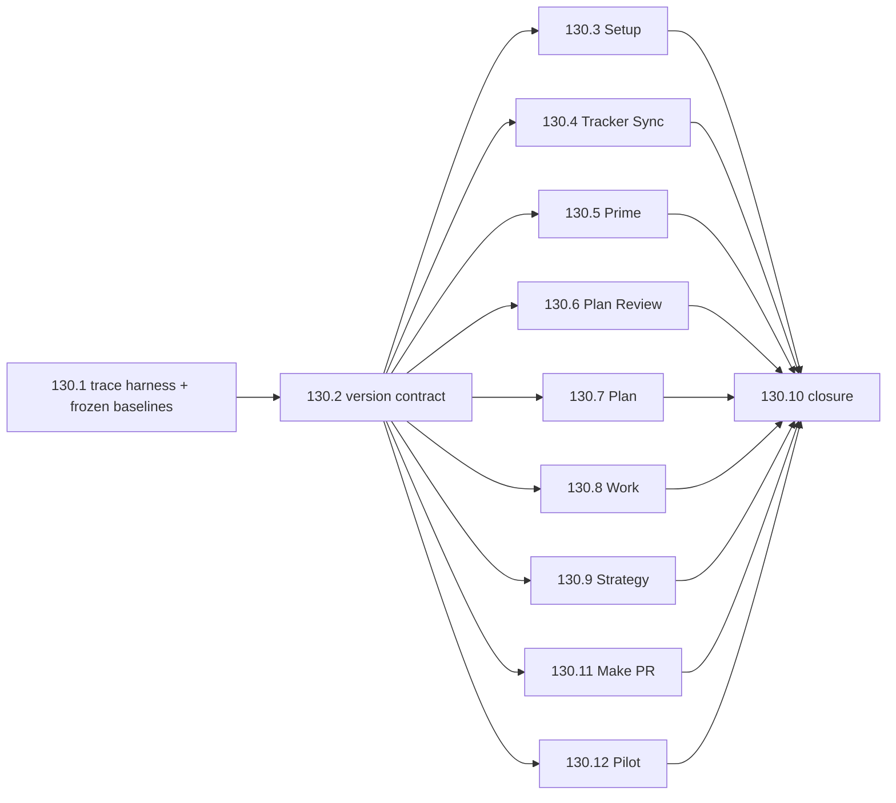

# fn-130 Reached-path skill prompt optimization

## Goal & Context
<!-- scope: business -->

Flow-Next's remaining prompt-efficiency opportunity is not generic copyediting: it is the amount of instruction text loaded on the branch a user actually executes. Several mature skills now have compact entrypoints but force-load large workflows or every mutually exclusive backend/provider path. The current worst cases include Setup, Tracker Sync, Prime, and Plan Review; duplicated setup-version ceremony also adds 73,300 source characters across 18 skills and creates cross-host behavior that is difficult to keep correct.

This spec continues the completed fn-54 → fn-84/fn-85 optimization program. It applies the repo's eval-driven ratchet to **reached-path loading**, preserving every observable behavior, frozen grammar, tool/side-effect contract, and user-authored spec override while reducing default or selected-path instruction weight. The only intentional user-visible behavior change is version drift handling: a concise copy-mode check remains in Plan; other skills stop running the duplicated precheck; documentation becomes the primary update contract.

Success means measured reached-path reductions with no accuracy or functionality loss—not a smaller directory, a shorter diff, or a cache-counter fluctuation.

## Architecture & Data Models
<!-- scope: technical -->

### Reached-path optimization model

Each target is treated as a router plus directly loaded references:

1. Resolve deterministic mode/config/host/backend/provider state.
2. Keep every-run safety and action-site guardrails beside the phase that consumes them.
3. Load only the direct reference required for a default-OFF or mutually exclusive path.
4. On unknown/malformed state, fail open toward the safe/common instructions; never silently skip required behavior.
5. Keep references one level below the skill root and commit a router plus its reference atomically.

A new `optimization/reached-path/` harness records, per fixture:

- baseline commit and prompt-file hashes;
- host, activation form, model/effort, CLI version, date, and fixture hash;
- expected required and forbidden reference reads;
- deterministic reached-path characters and chars/4 token-equivalent;
- backend-reported input/output/cache telemetry and wall time as separate, non-interchangeable measures;
- accuracy/coverage/format oracles and observable side effects;
- baseline/candidate/discard result with provenance.

Deterministic reached-path characters use one frozen algorithm: normalize counted prompt files to LF; count the complete root `SKILL.md` once; count each successfully reached direct reference's complete content once, deduplicated by normalized repo-relative path plus content hash; treat a range/subset read as activation of the complete referenced file; exclude failed/repeated reads, catalog metadata, tool output, and host-injected text. Codex fixtures count actual regenerated mirror content. Raw trace spans remain separate evidence.

Baselines are chained. Task 130.1 freezes original-main `B0`. Task 130.2 applies only the fleet version mutation, reruns every cluster, and freezes hash-addressed `V1/B1`. Tasks 130.3–130.9, 130.11, and 130.12 must verify their input prompt hashes against `B1` and compare structural candidates to `B1`, never directly to `B0`.

The harness extends `agent_docs/optimizing-skills.md`, `optimization/worker-anchor/`, `optimization/review-prompt/`, and existing per-skill suites. It does not create a new runtime command, hook, or flowctl subsystem.

### Mutation clusters and fixture matrices

| Cluster | Frozen fixtures | Required proof |
|---|---|---|
| Version contract | copy match; interactive mismatch choosing Refresh; interactive mismatch choosing Continue; autonomous/Ralph/receipt mismatch; missing metadata; missing manifest/version; plugin mode; unavailable `jq`; prior acknowledgement fields | exact question/options/continuation; Plan alone asks or warns; unavailable evidence is silent; other skills carry no legacy ceremony; direct non-Plan invocation intentionally does not preflight |
| Setup | first copy install; copy refresh; plugin mode; customized snippet Keep/Overwrite; malformed metadata; autonomous setup; Claude, Codex, Droid, Cursor, Grok; model-routing accepted/skipped; Ralph available/unsupported | only the selected host/mode branches load; marker-safe writes, setup-mode stamping, question order, model pins, and host-specific behavior remain byte/trace equivalent |
| Tracker Sync | inactive/no config; Linear MCP; Linear GraphQL fallback/no transport; GitHub; GitLab; Jira Cloud/DC; push/pull/reconcile; create-if-unlinked; body/status/comments/dependency conflicts; malformed config | common references plus exactly the selected adapter/fallback load; fake transports only; normalized request/receipt/defer/who-wins semantics unchanged |
| Prime | current seven topology fixtures; `--classify-only`; report-only; full/no fixes; full/fixes; unknown classification; auth unavailable | cheap modes avoid full workflow/pillars/remediation as specified; all judgment fixtures and negative control pass; authenticated clean-room harness works before mutation is eligible |
| Plan Review | `none`, `--review=export`, host, codex, copilot, cursor, RP, backend unavailable; risky and clean review corpora; user-edited spec | export output/side effects remain baseline-equivalent and load no configured backend guidance; review routes load exactly one selected backend path; verdict, receipt, cumulative cap, re-anchor/fix loop, clean-overflag, and spec-grounding behavior remain unchanged on real engines |
| Plan | P1 flow-native; P2 DocIQ; P3 hand-edited spec; P4 ordering/sizing; sealed no-code/research/Mermaid holdout; tracker/HTML/review branches on/off | optional refs load only when selected; example trim holds R-ID coverage, task cohesion/dependencies, override fidelity, no implementation leakage, grammar, and Mermaid behavior |
| Work | serial; parallel eligible; shared-file conflict; worker failure; host-deferred handover; delegation off/on/declined/failure; tracker off/on/error; plan-sync; review | fn-118 isolation/parallel/host-owned-git and fn-103 path-handoff rails unchanged; delegation-only instructions stay cold when inactive; every terminal and plan-sync-after-wave contract remains |
| Strategy / Make PR / Pilot | Strategy absent/husk/foreign/generated first-run/update; Make PR dry-run, HTML off/on, create/finalize, existing PR, push retry; Pilot ready/backlog/blocked/deferred/strike/failure | mutually exclusive references route correctly; non-clobber, PR body/push, autonomous verdict/strike, receipt, and tracker semantics unchanged |
| Cross-host | Claude canonical direct and natural-language activation; Codex regenerated mirror; Cursor CLI/GUI; Droid; Grok inspect/TUI where authenticated | canonical paths/references resolve, Codex transforms remain correct, required reads occur and cold reads do not; unavailable manual hosts are surfaced, never silently counted as pass |

### Task execution graph



Tasks 130.3–130.9, 130.11, and 130.12 own disjoint canonical skill directories and are parallel candidates after the fleet-wide version edit lands. Twelve tasks are intentional: each mutation cluster needs an independent `B1` baseline and keep/revert ledger; Strategy, Make PR, and Pilot are separate S tasks so one regression cannot hide or block the other clusters. Combining clusters would create L-sized tasks and invalidate the one-mutation ratchet.

## API Contracts
<!-- scope: technical -->

No new user command, flag, hook, flowctl helper, receipt shape, or configuration key.

The reached-path fixture contract consists of:

- a stable fixture ID and sanitized frozen input;
- branch inputs (`host`, activation form, arguments, config, optional-tool state);
- `required_reads` and `forbidden_reads` as repo-relative direct references;
- binary observable oracles for output, tool calls, writes, receipts, and frozen grammar;
- separate deterministic source-size and backend telemetry fields;
- baseline/candidate provenance and a ratchet verdict.

Ratchet rule: keep only when every accuracy/coverage/negative-control cell meets or exceeds baseline and at least one predeclared efficiency or quality measure improves. A flat result is discard, not a win. Borderline judgment cells run paired N≥2; subjective cells use majority N≥3–5. Every kept and discarded mutation is recorded.

The version contract becomes:

- Copy mode only: when both versions are available, Plan compares `.flow/meta.json` `setup_version` with the installed plugin version.
- Interactive mismatch asks exactly: `Local Flow-Next copy v<X> differs from plugin v<Y>. Refresh before planning?`
- Option 1 is `Refresh now (Recommended)`: stop cleanly, instruct the user to run `/flow-next:setup`, then rerun Plan. Plan does not invoke Setup or resume the same invocation.
- Option 2 is `Continue this run`: warn once and continue planning without writing an acknowledgement.
- Canonical uses `AskUserQuestion`; the Codex mirror uses the existing numbered plain-text transform.
- Autonomous/Ralph/receipt mismatch: warn once for the invocation and continue.
- Missing/unavailable evidence or version match: continue silently.
- Plugin mode: no runtime snippet/version ceremony in Plan or other lifecycle skills; Setup remains the owner of setup-mode and snippet-marker integrity.
- Existing `version_ack` / `snippet_ack` fields may be tolerated on read but are no longer written or used by lifecycle skills.

## Edge Cases & Constraints
<!-- scope: technical -->

- Directory total is not a token claim. Reached-path characters follow the frozen LF/full-file-on-activation/once-per-path-hash algorithm only.
- `B0` is immutable original-main evidence. `V1/B1` is the sole structural baseline after the fleet version mutation; every later task must fail closed on an input hash mismatch and never compare a structural candidate directly to `B0`.
- Backend cache counters are telemetry, not interchangeable with source bytes or billed input tokens.
- Router comprehension alone is insufficient: a real host trace must show the intended reference read and absence of cold-path reads wherever the host exposes traces.
- Unknown/malformed config must fail open toward safety/common instructions.
- No routing/taxonomy/guardrail table moves away from its consuming phase; Capture's historical 15→14 regression is the binding warning.
- Short imperative repetition at action sites stays even when explanatory prose is single-sourced.
- Write-happy fixtures run only in disposable worktrees/temp repos with filesystem diff, sentinel, auth, and instruction-leak checks. No live tracker writes.
- Claude OAuth isolation must preserve the authenticated default config while limiting setting sources; a zero-token auth failure is invalid evidence, not a failed model judgment.
- Fixture content, answer keys, and scorers remain separate. Scrub emails, tokens, private names/paths, and customer content before commit.
- Plan's existing P4 sizing fixture is contaminated by an example that encodes the prior failure; any new examples experiment uses a sealed holdout.
- Preserve fn-118 parallel-wave/isolation semantics, fn-103 Codex path handoff, fn-85 frozen Pilot/Work/Tracker grammars, and review cumulative-cap behavior.
- Canonical changes use Claude-native terms plus the existing portable-host clauses; Codex mirror changes come only from `scripts/sync-codex.sh`.
- Cursor has no sufficiently precise current primary documentation for reference-loading traces; Cursor remains an evidence-based CLI/GUI smoke, not an assumed loader contract.
- Structural refactors are public-doc neutral only when all observable behavior remains equivalent. The version change is explicitly user-visible and must update every truth surface.
- Open specs fn-129, fn-122, fn-61, and fn-73 have dormant overlapping files but no enabling dependency. Recheck status before implementation; do not change skill naming/frontmatter/commands, Audit verdict-graduation surfaces, Pilot/Land frozen grammar, or forge semantics.
- No automatic release or version bump. Changes land under `## Unreleased`; release remains a separate batched decision.

## Acceptance Criteria
<!-- scope: both -->

- **R1:** `optimization/reached-path/` contains a documented, sanitized, production-path harness plus frozen baseline manifests for every mutation cluster before canonical prompt edits; provenance and reached-path metrics use the frozen LF/full-file-on-activation/once-per-path-hash algorithm and distinguish deterministic source size from backend telemetry.
- **R2:** Every kept mutation satisfies the zero-loss ratchet against 3–5 frozen varied fixtures, 3–6 binary checks with at least 2–3 accuracy/coverage checks, negative/default/error branches, and a sealed holdout where judgment or examples can overfit; every discard is retained with its failure reason; `B0 → V1/B1 → candidate` hashes prove the comparison lineage.
- **R3:** The 18 duplicated lifecycle version ceremonies are replaced by the concise Plan-only copy-mode contract; tests cover match/mismatch/autonomous/missing/plugin states; no hook/helper is introduced; Setup continues owning setup-mode/snippet integrity; repo and site documentation accurately describe copy refresh and Plan-only detection.
- **R4:** Setup conditionally loads only required host/mode/model-routing/Ralph branches while preserving first-install, refresh, customization, marker, question, stamp, and host-specific behavior across its frozen matrix.
- **R5:** Tracker Sync loads common reconciliation rules plus only the selected provider/fallback references and passes fake-transport matrices for Linear, GitHub, GitLab, Jira, inactive, malformed, and conflict/defer paths with receipts and remote semantics unchanged.
- **R6:** Prime's authenticated agentic harness is repaired and green on all seven existing fixtures/negative control before any mutation is kept; classify-only/report/full/fix routing proves cheap modes avoid unneeded workflow/pillar/remediation reads without changing classifications or reports.
- **R7:** Plan Review preserves `--review=export` output and side effects without loading configured backend guidance, and uses common orchestration plus exactly one selected reference for review backends; real-backend risky/clean corpora preserve verdict, receipt, cumulative-cap, fix-loop, and user-edited-spec grounding behavior.
- **R8:** Plan conditionally loads tracker, HTML, and review material; its example trim passes paired P1–P4 plus a sealed no-code/research/Mermaid holdout with no R-ID, task-cohesion, dependency, override, grammar, or implementation-leakage regression.
- **R9:** Work keeps delegation-only machinery cold when inactive and passes serial, parallel, conflict, failure, host-deferred, delegation, tracker, review, and plan-sync scenarios with fn-118/fn-103 contracts unchanged.
- **R10:** Independently evaluated Strategy, Make PR, and Pilot tasks route first-run/update, HTML/create, and ready/backlog branches while preserving non-clobber, PR, autonomous verdict/strike, receipt, failure, and tracker behavior.
- **R11:** Capture, Audit, Prospect, Interview beyond version removal, QA beyond version removal, Drive, Impl Review, Completion Review, Land beyond version removal, Resolve PR beyond version removal, Ralph Init beyond version removal, Sync beyond version removal, Map beyond version removal, Deps, Export Context, RP Explorer, Flow core, and Worktree Kit receive no structural rewrite unless a new baseline and predeclared oracle prove a concrete zero-loss win; deferrals/skips are explicitly logged.
- **R12:** Canonical and Codex mirror changes stay semantically aligned: `scripts/sync-codex.sh` is run twice to idempotence; mirror/parity tests pass; Claude and Codex live smokes pass; Cursor, Droid, and Grok canonical-host smokes are recorded where authenticated, with any unavailable manual gate surfaced before release.
- **R13:** Documentation is truth-consistent: README, repo troubleshooting/platform/setup-mode guidance, CHANGELOG `Unreleased`, optimization methodology/logs, and flow-next.dev install/setup/troubleshooting are updated for the version behavior; public docs remain unchanged for behavior-neutral internal routing after an explicit truth scan; stale per-mutation version-bump guidance is corrected to the batched-release policy.
- **R14:** Final focused suites, full `python3 scripts/run_tests_parallel.py`, smoke tests, docs-site build/link checks, privacy scrub, fixture hash audit, and canonical/mirror diff review pass; the final evidence table reports per cluster baseline→candidate reached-path size, model cells, kept/discarded mutations, host coverage, and unresolved manual gates; no version manifest is changed.

## Boundaries
<!-- scope: business -->

- No skill-only invocation architecture, command removal, folder/frontmatter rename, or compatibility alias work; fn-129 remains deferred.
- No broad prose simplification of mature judgment skills.
- No new version hook, prompt-submit hook, flowctl version helper, or acknowledgement ceremony.
- No live tracker mutations in fixtures.
- No semantic change to Plan/Work parallelism, review findings, tracker reconciliation, Setup outputs, Prime reports, Make PR bodies, or Pilot/Land verdicts.
- No structural Interview split until a new eval explicitly protects Windows, symlink, project-doc, and NFR coverage.
- No release/version bump in this spec.

## Strategy Alignment

Active tracks served by this plan:
- **Ralph autonomous mode** — lower reached-path instruction weight per pilot/work/review tick while retaining autonomous safety and evidence gates.
- **Cross-platform parity** — make canonical routing and Codex transformations explicit, traceable, and independently smoke-tested across supported hosts.
- **Self-improving through normal work** — retain the optimization fixtures, baselines, discarded experiments, and decision evidence so future prompt changes ratchet from observed behavior rather than rediscovering it.

## Decision Context
<!-- scope: both — conditionally substructured -->

### Motivation
<!-- scope: business -->

Users experience the cumulative cost and latency of repeatedly loaded skill instructions, especially in autonomous pipelines. The prior optimization program harvested free-form scout output and obvious prompt archaeology; the next material gain is progressive disclosure on real execution paths. This spec prioritizes the largest measured opportunities while refusing forced trims on skills already proven at their accuracy ceiling.

### Implementation Tradeoffs
<!-- scope: technical -->

Conditional reference loading is chosen over broad rewriting because it removes irrelevant branches without weakening the instructions that remain active. A shared reached-path harness is chosen over per-task ad hoc token claims so every mutation uses the same evidence vocabulary. Version handling is intentionally simplified to one Plan sentence plus documentation instead of a hook or deterministic helper: cross-host hook parity is absent, natural-language activation bypasses slash-expansion-only hooks, and lifecycle ceremony is disproportionate to a fail-open update reminder.

Twelve tasks exceed the usual task-count heuristic deliberately. Tasks 130.3–130.9, 130.11, and 130.12 have disjoint ownership, independent fixtures, hash-verified `B1` inputs, and independent keep/revert decisions. Strategy, Make PR, and Pilot remain separate S tasks; combining them would produce L tasks, increase context risk, and make the one-mutation ratchet unauditable.

Alternatives rejected:
- directory-size-only budgets — do not prove what the host read;
- cache counters as token truth — provider/cache dependent;
- a universal prompt-submit hook — fires on every prompt and is not portable;
- removing version guidance entirely — live `3.0.0` versus `3.4.1` drift proves copy-mode users still need a clear update contract;
- aggressive Interview/Capture/Audit/Prospect trimming — prior evals show proximity and NFR breadth are load-bearing;
- host-specific canonical skill forks — multiplies maintenance and contradicts single-source parity.

## Quick commands

```bash
# Focused structural/contract suites during implementation
cd plugins/flow-next/tests && python3 -m unittest -q \
  test_precheck_mode_contract test_skill_prose_diet test_token_budgets \
  test_setup_cursor_host test_setup_grok_host test_model_routing_scaffold \
  test_prime_eval test_backend_spec test_parallel_work_prose \
  test_pilot_backlog_mirror_safety test_tracker_sync_state \
  test_tracker_sync_mirror_parity test_tracker_sync_gitlab test_tracker_sync_jira

# Agentic/reached-path suites
python3 optimization/reached-path/run_eval.py --all --backend claude
python3 optimization/prime/run_agentic_eval.py --all --backend claude

# Canonical → Codex mirror must be idempotent
./scripts/sync-codex.sh
./scripts/sync-codex.sh

# Final gate only
python3 scripts/run_tests_parallel.py
bash plugins/flow-next/scripts/smoke_test.sh
```

## Rollout and rollback

- Land each task only when its local ratchet passes; a task may legitimately land fixtures plus a documented discard/no-op.
- Regenerate the Codex mirror with every landed canonical change, then authoritatively regenerate once more in closure.
- Structural routing changes require no public announcement when behavior-equivalent; the version-contract change lands with repo/site docs and `Unreleased` wording.
- Rollback is atomic per cluster: restore the prior canonical router/workflow, regenerate Codex, restore version wording if R3 is reverted, and retain the failed experiment evidence.
- Release occurs later through the batched release process after manual host gates are complete.

## Coordination

No formal dependencies on open specs. Before work starts and before closure, recheck:

- fn-129 — deferred skill-only architecture; do not touch invocation metadata/names.
- fn-122 — potential Audit overlap; this spec removes only the version ceremony there.
- fn-61 — potential Pilot/Land overlap; frozen verdict/receipt grammar wins.
- fn-73 — potential Make PR/Resolve PR/Land forge overlap; semantic forge work wins.
- fn-120 — Windows corpus work is independent but its test infrastructure may be useful.

## Early proof point

Task **fn-130-reached-path-skill-prompt-optimization.1** validates the core approach: a production-path trace harness can distinguish required versus cold reference reads, preserve authenticated isolation, apply the frozen character algorithm, and reproduce current behavior as immutable `B0` before any skill mutation. If it cannot produce trustworthy traces and stable accuracy cells, stop before task 130.2 and re-evaluate the measurement design rather than shipping inferred savings.

## Requirement coverage

| Req | Description | Task(s) | Gap justification |
|-----|-------------|---------|-------------------|
| R1 | Reached-path harness and frozen baselines | fn-130-reached-path-skill-prompt-optimization.1 | — |
| R2 | Zero-loss ratchet, chained baselines, retained discards | fn-130.1–fn-130.12 | — |
| R3 | Plan-only version contract and docs truth | fn-130.2, fn-130.10 | — |
| R4 | Setup routing | fn-130.3 | — |
| R5 | Tracker Sync adapter routing | fn-130.4 | — |
| R6 | Prime harness and cheap-mode routing | fn-130.5 | — |
| R7 | Plan Review selected-backend routing | fn-130.6 | — |
| R8 | Plan optional routing and examples | fn-130.7 | — |
| R9 | Work delegation/parallel routing | fn-130.8 | — |
| R10 | Strategy, Make PR, and Pilot routing | fn-130.9, fn-130.11, fn-130.12 | — |
| R11 | Explicit deferral/no-op ledger | fn-130.1, fn-130.10 | — |
| R12 | Cross-host and mirror parity | fn-130.2–fn-130.12 | — |
| R13 | Repo/site documentation consistency | fn-130.2, fn-130.10 | — |
| R14 | Full final evidence and no version bump | fn-130.10 | — |
