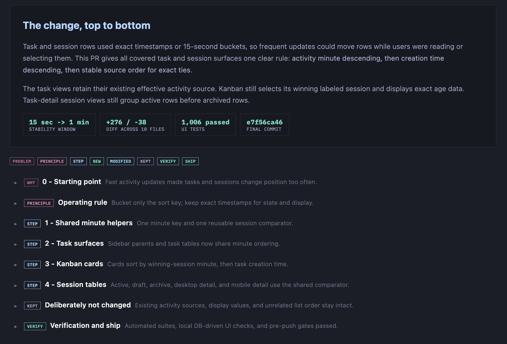
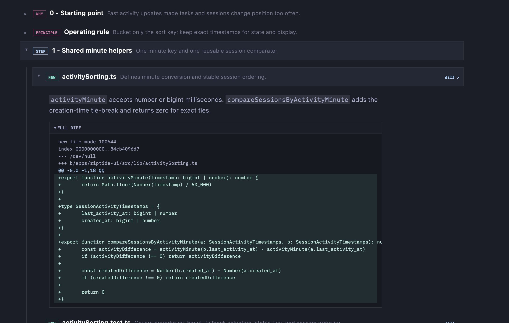
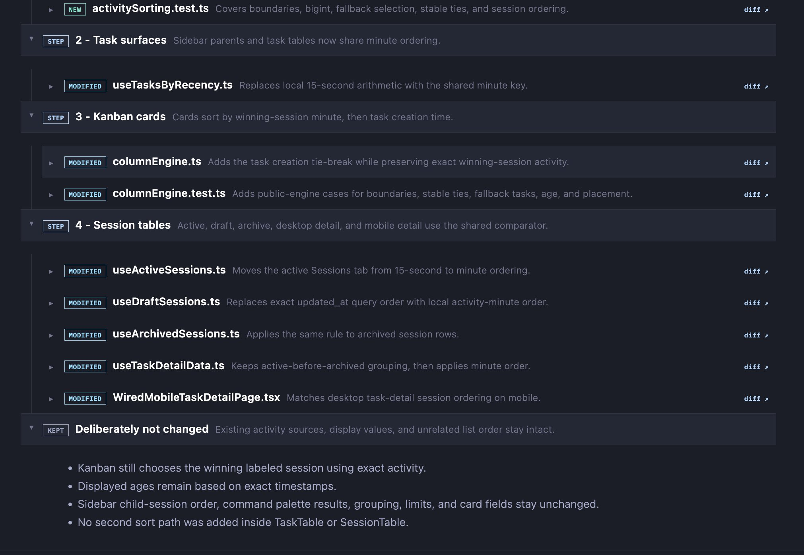

# Structured review-artifact schema in receipts

## Goal & Context
<!-- scope: business -->

Review receipts today carry verdicts plus free prose; downstream consumers must regex findings out of markdown. The review skills already mandate structured finding fields in their prompts and convergence-ratchet numbering. This spec preserves that structure at receipt-write time with deterministic parsing, explicit identity/currentness semantics, and portable anchors.

The PR cognitive aid has a related gap. `/flow-next:make-pr` already produces TL;DR, boundaries, R-ID evidence, verification, critical changes, trust calibration, a risk-ranked review plan, generated-noise grouping, and optional HTML. It does not preserve one intent-ordered explanation that GitHub and cockpit-class consumers can render from the same object. This spec adds a versioned `pr_cognitive_aid.changeWalkthrough` composed by the existing host agent, schema-validated and persisted by thin flowctl plumbing, and rendered in GitHub Markdown by `make-pr`.

Hard constraints (MergeFoundry MASTERPLAN decision 5, binding): no extra LLM calls; no prompt re-bloat; no added model/network I/O; flow-next-only UX must improve or stay unchanged; GitHub Markdown remains canonical for hosted review; downstream products consume additive receipt/artifact fields rather than internal APIs.

## Reference design

These images are normative interaction and information-architecture references, not visual-copy requirements. Flow-Next approximates the hierarchy in GitHub Markdown; richer consumers may render the same data interactively.

### Overview, thesis, proof metrics, and logical sequence



### Progressive disclosure from step to file to diff



### Grouped files, deliberate non-changes, and verification



## Scope
<!-- scope: technical -->

### 1. Versioned structured findings

Review-shaped receipts gain one optional additive container:

```text
findings: {
  schemaVersion: 1,
  sourceReceiptId,
  reviewKind: plan | implementation | completion | qa,
  backend,
  round,
  baseSha?, headSha,
  supersedesReceiptId?,
  items: [{
    id, priorFindingId?, ordinal,
    severity: P0 | P1 | P2 | P3,
    confidence: 0 | 25 | 50 | 75 | 100,
    classification: introduced | pre_existing,
    status: open | fixed | not_fixed | withdrawn,
    anchor?: {
      path, originalPath?,
      side: base | head,
      startLine, endLine?,
      baseSha, headSha, blobOid?
    },
    title, body, suggestion?, rIds: [],
    firstSeenReceiptId, lastSeenReceiptId
  }]
}
```

- Canonical severity is P0-P3. Deterministic aliases are `Critical -> P0`, `Major -> P1`, `Minor -> P2`, and `Nitpick -> P3`; QA already emits P0-P2.
- `id` is a durable finding-lineage identity. Round 1 derives it deterministically from `sourceReceiptId + ordinal`; ratchet `Prior finding N` forms carry the prior `id`. New later-round findings receive a new ID and may not reuse an old ordinal identity. `priorFindingId` records an explicit lineage edge when a parser cannot preserve the same ID byte-for-byte.
- `anchor` is optional. A missing file/line produces no anchor, never a guessed one. `side`, SHAs and optional `blobOid` make line ranges meaningful across renames; `originalPath` records the base-side name when relevant.
- The current finding state comes from the newest receipt in the explicit `supersedesReceiptId` chain for the same review kind/backend/run. Its item status wins. A receipt whose `headSha` differs from the current review head is stale and remains evidence, but not current status. Read-only consumers project this chain; they never write resolution state.
- Canonical finding order is severity P0 -> P3, confidence descending, then ordinal. Unknown enum values or unsupported schema versions retain the prose receipt and mark structured findings unsupported; they are never silently coerced.
- The pure-stdlib parser consumes existing reviewer markdown and convergence-ratchet forms. Unparseable output degrades to no structured container plus existing prose, never an error.

### 2. Versioned PR cognitive-aid artifact

`/flow-next:make-pr` gains this portable artifact envelope:

```text
pr_cognitive_aid: {
  schemaVersion: 1,
  artifactId, specId,
  baseSha, headSha, generatedAt,
  supersedesArtifactId?,
  sources: [{id, kind, ref, digest?}],
  changeWalkthrough: {
    thesis,
    proof: [{label, value, sourceRefs: []}],
    groups: [{
      ordinal,
      kind: problem | principle | step | kept | verify,
      title, summary,
      sourceRefs: [], rIds: [], taskIds: [],
      files: [{
        path,
        changeType: added | modified | deleted | renamed | copied,
        attentionClass: canonical | generated | mechanical,
        summary, additions?, deletions?, diffUrl?,
        sourceRefs: [], rIds: [], taskIds: []
      }]
    }]
  }
}
```

- **One source table:** `sourceRefs` resolve only against the envelope's bounded `sources[]`. Allowed kinds are `spec`, `task`, `rid`, `review_receipt`, `qa_receipt`, `diff_metadata`, and `commit`. Group and file summaries require at least one source reference. File-level R-ID/task claims require file-level references; consumers may not infer every group claim onto every file.
- **Judgment owner:** the existing `make-pr` host agent composes thesis, intent grouping, summaries, provenance references and order from the existing cognitive-aid payload. No deterministic intent classifier, no second model, and no commit-message storytelling.
- **Plumbing owner:** flowctl validates and atomically writes the artifact through the existing receipt/artifact storage contract. GitHub Markdown, optional HTML and downstream products consume this exact object.
- **Currentness:** `artifactId` identifies one generation. Repeated runs form an explicit `supersedesArtifactId` chain. The current artifact is the newest chain member whose `headSha` equals the PR head and whose `baseSha` equals the current merge base. Mismatched artifacts are visibly stale and cannot supply current verification, approval or ship claims.
- **No parallel truth:** when a current v1 artifact exists, thesis, proof metrics, R-ID/task links, verification and walkthrough sections render from it. Older cognitive-aid fields are fallback-only when no supported current artifact exists; renderers never merge old and new sources into one apparent current view.
- **Change dimensions stay separate:** `changeType` is Git state; `attentionClass` is review attention. Human-review lines and canonical file count include only `attentionClass=canonical`. A generated modified file remains both `changeType=modified` and `attentionClass=generated`.

### 3. Validation bounds and failure behavior

- UTF-8 encoded artifact maximum: 512 KiB.
- Maximums: 128 sources, 16 proof cells, 12 groups, 200 file rows per group, 500 unique files overall, and 32 entries for each `sourceRefs`, `rIds`, or `taskIds` array.
- String limits: thesis 4,000 characters; group summary 1,000; file summary 500; titles/labels/values/IDs 160; repository path 1,024; URL 2,048.
- URLs are HTTPS or repository-relative only. Paths are normalized repository-relative paths without `..` traversal.
- Validation rejects overflow, invalid references, duplicate ordinals/IDs, conflicting duplicate file membership, unsafe paths/URLs, stale SHAs presented as current, or ungrounded semantic summaries. It does not truncate and pretend the story is complete. Existing prose/compact PR rendering remains available after rejection.
- Raw diff text is not part of this artifact. Optional local HTML fetches bounded diff content separately through existing redaction and size guards.

### 4. Deterministic rendering rules

- Full walkthrough renders when `humanReviewLines >= 200` or `canonicalFileCount >= 6`. `humanReviewLines` is additions + deletions over unique canonical files only. Below threshold, render thesis, proof and one flat canonical-file table; no discretionary second threshold path.
- Logical order is problem and principle when evidenced, then 1-7 implementation steps, then deliberately unchanged behavior, then verification/ship evidence. Missing kinds are omitted rather than invented.
- Generated/mechanical files are aggregated in a separate collapsed group and excluded from threshold metrics.
- Validation plus Markdown rendering of the golden maximum-normal fixture must complete within 50 ms p95 over 30 warm runs in CI, excluding atomic disk write. No network/model I/O is permitted.

### 5. GitHub Markdown approximation

1. `## The change, top to bottom` with the grounded thesis.
2. Compact proof table for human-review lines, canonical/total changed files, verification totals and head commit when available.
3. Complete legend for `WHY`, `PRINCIPLE`, `STEP`, `KEPT`, `VERIFY`, `NEW`, `MODIFIED`, `DELETED`, `RENAMED`, `COPIED`, `GENERATED`, and `MECHANICAL`.
4. One `<details>` block per logical group. Its summary carries kind, ordinal/title and intent. The body contains a file table with change type, attention class, path, purpose, `+/-` stats and diff link.
5. Deliberately not changed and Verification and ship are first-class groups.
6. Generated/mechanical groups start collapsed; only the first canonical implementation step starts open.
7. The existing risk-ranked Review plan remains separate. The walkthrough explains how the change works; the review plan identifies where human judgment is most valuable.
8. Raw diff excerpts remain excluded from GitHub Markdown by default.

### 6. Cross-repo consumer and fixture contract

- Flow-Next owns the canonical schema and fixture at `plugins/flow-next/tests/fixtures/pr-cognitive-aid/v1/golden.json`.
- A fixture metadata file records schema version, source commit, source path and SHA-256. Flow Swarm vendors a byte-identical copy plus that metadata under its test fixtures because private cross-repo network access is not assumed in CI.
- Flow-Next tests structured artifact, Markdown and optional HTML parity against the canonical fixture. Flow Swarm tests its vendored SHA-256 against the pinned upstream digest, then tests semantic rendering/fallback behavior. Updating either schema or fixture requires an explicit version bump or synchronized digest update.
- Downstream renderers preserve order, labels, provenance, file membership, deliberate non-changes and verification. They may enrich interaction, navigation, local collapse state and bounded inline diff display only.
- Absent, stale, unsupported-version or invalid artifacts select deterministic labeled fallback states, never an exception or silent mixed view.

## Boundaries / non-goals

- No new review passes, validator/deep-pass changes, verdict-grammar changes, or extra LLM calls.
- No skill-side JSON request to reviewer models. Findings remain parsed deterministically from reviewer prose.
- No deterministic attempt to infer logical change intent. The existing `make-pr` host owns judgment; flowctl validates and persists.
- No replacement of existing R-ID coverage, verification, critical-changes, trust-calibration, Review plan, Mermaid or optional HTML sections.
- No requirement that GitHub render interactive inline diffs.
- Cockpit styling and interaction remain downstream.
- No historical backfill.

## Acceptance Criteria

- **R1:** All review backends emit optional versioned `findings` containers with canonical enums, durable lineage IDs, explicit round/receipt currentness, portable anchors and deterministic ordering; legacy prose remains valid.
- **R2:** The pure-stdlib parser covers real backend and ratchet fixtures, preserves/carries finding identities, never guesses anchors, and degrades without raising.
- **R3:** Prompt changes remain format-only with measured skill-prose token delta <= 0; sync-codex is idempotent; no new LLM invocation exists.
- **R4:** Finding parsing adds no model/network I/O and meets a pinned fixture benchmark; stale/superseded receipts remain evidence but cannot become current status.
- **R5:** Receipt/memory docs define schema versions, enums, anchors, lineage/currentness, bounds and fallback behavior product-neutrally.
- **R6:** `make-pr` produces a bounded, schema-validated `pr_cognitive_aid.changeWalkthrough` with explicit artifact identity, base/head binding, provenance references and separate change/attention dimensions, with no extra model call.
- **R7:** GitHub Markdown follows the deterministic threshold and complete rendering grammar while preserving the existing Review plan and raw-diff privacy boundary.
- **R8:** Validation rejects unsafe/oversize/ungrounded artifacts without truncation; current selection never mixes stale/legacy fields; validation plus render meets the 50 ms p95 budget.
- **R9:** Canonical v1 fixture and metadata prove structured/Markdown/HTML semantic parity; Flow Swarm's vendored fixture is SHA-pinned to the upstream bytes.
- **R10:** The three reference images resolve repository-relatively and remain explicitly information-architecture references.
