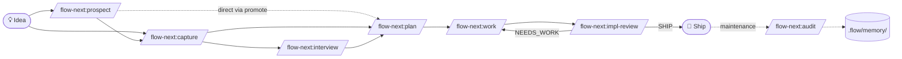

<div align="center">

# Flow-Next

[](LICENSE)
[](plugins/flow-next/)
[](plugins/flow-next/README.md)

[](https://mickel.tech)
[](https://twitter.com/gmickel)
[](https://github.com/sponsors/gmickel)
[](https://discord.gg/f3DYq8AAm5)

**Plan-first AI workflow. Zero external dependencies.**

</div>

> 📖 **[Read the full docs →](plugins/flow-next/README.md)** — the main documentation. All 19 commands with reference, lifecycle workflow with mermaid diagrams, install + setup on every platform, Ralph autonomous mode, Codex / Droid / OpenCode notes, complete `flowctl` CLI reference, project glossary + strategy + decision records, memory system. **Start there if you want depth — this root page is the marketing TL;DR.**

> 👥 **[Adopting in a team? Read the teams + spec-driven-development guide →](plugins/flow-next/docs/teams.md)** — maps each SDLC stage to a Flow-Next command, names the six handover objects in the agentic lifecycle, and walks through Spec-as-PR, parallel work from one spec, R-ID frozen-at-handover, the symmetric interview pattern, and the Week 1 / Month 1 / Quarter 1 adoption ladder. Cross-links to the [AI-x-SDLC-Starter-Kit methodology guide](https://github.com/gmickel/AI-x-SDLC-Starter-Kit/blob/main/guides/methodology.md) for the underlying theory.

> 💬 **[Join the Discord](https://discord.gg/f3DYq8AAm5)** — discussions, updates, feature requests, bug reports

---

## What Is This?

Flow-Next is an AI agent orchestration plugin. **Twenty-three agent-native skills** for the full lifecycle: idea → spec → tasks → review → ship → maintain. Bundled task tracking, dependency graphs, re-anchoring, multi-model reviews, decay-aware project memory, GitHub PR creation + resolution, agent-readiness audits. Everything lives in your repo — no external services, no global config. Uninstall: delete `.flow/`.

First-class on **Claude Code**, **OpenAI Codex** (CLI + Desktop), and **Factory Droid**. Also runs on **OpenCode** via the [community port](https://github.com/gmickel/flow-next-opencode).

> 🆕 **v1.0.0 — `flowctl epic` → `flowctl spec`.** The 1.0 release renames the canonical primitive: `flowctl epic` becomes `flowctl spec`, `.flow/epics/` becomes `.flow/specs/`, `epic-scout` becomes `spec-scout`, `/flow-next:epic-review` becomes `/flow-next:spec-completion-review`. **All 0.x scripts and CLAUDE.md examples keep working** — the legacy CLI is preserved as a deprecation alias layer through all of 1.x; JSON read responses dual-emit `spec_id` *and* `epic_id`; on read, `.flow/epics/` is auto-fallback when `.flow/specs/` is absent. Two migration paths: interactive via `/flow-next:setup` (recommended) or deterministic via `flowctl migrate-rename --yes` (transactional backup at `.flow/.backup-pre-1.0/`, lockfile-guarded, sentinel-anchored). Rollback supported via `flowctl migrate-rollback --yes`. Suppress the auto-detect banner with `FLOW_NO_AUTO_MIGRATE=1`. Soft alias-removal target is 2.0.0 (telemetry-driven, not calendar-driven). [Full changelog](CHANGELOG.md).

> 🌐 **[Visual overview at mickel.tech/apps/flow-next](https://mickel.tech/apps/flow-next)** — diagrams, examples, the full feature tour.

---

## Install

<table>
<tr>
<td><strong>Claude Code</strong></td>
<td><strong>OpenAI Codex</strong></td>
<td><strong>Factory Droid</strong></td>
</tr>
<tr>
<td>

```bash
/plugin marketplace add \
  https://github.com/gmickel/flow-next
/plugin install flow-next
/flow-next:setup
```

</td>
<td>

```bash
git clone https://github.com/gmickel/flow-next.git
cd flow-next
./scripts/install-codex.sh flow-next
# then: /flow-next:setup
```

</td>
<td>

```bash
droid plugin marketplace add \
  https://github.com/gmickel/flow-next
# /plugins → install flow-next
```

</td>
</tr>
</table>

**Why a script for Codex?** Codex's plugin protocol currently only registers `skills` from `plugin.json` — not custom `.toml` agents or hooks. The `/plugins` install gives you slash commands, but no subagent isolation (worker model tier, `disallowed_tools`) and no Ralph hooks. `install-codex.sh` merges all 21 agents + hooks directly into `~/.codex/config.toml` so you get the full multi-agent + Ralph experience. We'll switch to `/plugins` once Codex's manifest supports `agents` and `hooks` fields.

**Update Codex:** `cd flow-next && git pull && ./scripts/install-codex.sh flow-next`. The script is idempotent — safe to re-run on every update.

📖 **[Full docs](plugins/flow-next/README.md)** · **[Codex install guide](plugins/flow-next/README.md#openai-codex)** · **[OpenCode port](https://github.com/gmickel/flow-next-opencode)**

---

## The Workflow



Idea → spec → tasks → ship. Branch in, branch out — pick the entry point that matches your context.

---

## Why It Works

| Problem | Solution |
|---------|----------|
| Context drift | **Re-anchoring** before every task — re-reads specs + git state |
| Context window limits | **Fresh context per task** — worker subagent starts clean |
| Single-model blind spots | **Cross-model reviews** — RepoPrompt, Codex, or Copilot as second opinion |
| Forgotten requirements | **Dependency graphs** — tasks declare blockers, run in order |
| "It worked on my machine" | **Evidence recording** — commits, tests, PRs tracked per task |
| Infinite retry loops | **Auto-block stuck tasks** — fails after N attempts, moves on |
| Duplicate implementations | **Pre-implementation search** — worker checks for similar code before writing new |
| Hallucinated specs from "I think we discussed…" | **Source-tagged capture** — every acceptance criterion marked `[user]` / `[paraphrase]` / `[inferred]`, mandatory read-back loop |
| Stale project memory polluting future work | **`/flow-next:audit` + categorized memory schema** — agent reviews each entry, flags stale (never deletes) |
| GitHub PR review threads piling up | **`/flow-next:resolve-pr`** — fetch → triage → dispatch resolver agents → reply → resolve via GraphQL |

---

## Commands

| Command | What It Does |
|---------|--------------|
| `/flow-next:prospect` | Generate ranked candidate ideas grounded in the repo, upstream of `capture`/`interview`/`plan` |
| `/flow-next:capture` | Synthesize conversation context into a spec (source-tagged, mandatory read-back) |
| `/flow-next:interview` | Deep spec refinement with lead-with-recommendation + confidence tiers + codebase-first investigation |
| `/flow-next:plan` | Research codebase, create spec + dependency-ordered tasks |
| `/flow-next:work` | Execute tasks with re-anchoring + worker subagents + review gates |
| `/flow-next:impl-review` | Cross-model implementation review (RepoPrompt, Codex, or Copilot) |
| `/flow-next:plan-review` | Cross-model plan review |
| `/flow-next:spec-completion-review` | Spec-completion review gate — verify combined implementation matches the spec (renamed from `/flow-next:epic-review` in 1.0.0; soft-removal target 2.0.0, telemetry-driven) |
| `/flow-next:resolve-pr` | Resolve GitHub PR review threads (fetch → triage → fix → reply → resolve via GraphQL) |
| `/flow-next:audit` | Agent-native review of `.flow/memory/` entries against current code (Keep / Update / Consolidate / Replace / Delete) |
| `/flow-next:memory-migrate` | Lift legacy flat memory files into the categorized schema; agent classifies each entry |
| `/flow-next:prime` | 8-pillar agent-readiness assessment with parallel scouts; remediation via consent prompts |
| `/flow-next:ralph-init` | Scaffold autonomous loop (`scripts/ralph/`) |

---

## Ralph (Autonomous Mode)

Run overnight. Fresh context per iteration + multi-model review gates + auto-block stuck tasks.

```bash
/flow-next:ralph-init           # One-time setup
scripts/ralph/ralph.sh          # Run from terminal
```

📖 **[Ralph deep dive](plugins/flow-next/docs/ralph.md)** · **[Ralph TUI](flow-next-tui/)** (`bun add -g @gmickel/flow-next-tui`)

---

## Ecosystem

| Project | Platform |
|---------|----------|
| [flow-next-opencode](https://github.com/gmickel/flow-next-opencode) | OpenCode |
| [FlowFactory](https://github.com/Gitmaxd/flowfactory) | Factory.ai Droid |

---

## Also Check Out

> **[GNO](https://gno.sh)** — Local hybrid search for your notes, docs, and code. Give Claude Code long-term memory over your files via MCP.
>
> ```bash
> bun install -g @gmickel/gno && gno mcp install --target claude-code
> ```

---

<div align="center">

Made by [Gordon Mickel](https://mickel.tech) · [@gmickel](https://twitter.com/gmickel) · [gordon@mickel.tech](mailto:gordon@mickel.tech)

[](https://github.com/sponsors/gmickel)

</div>
