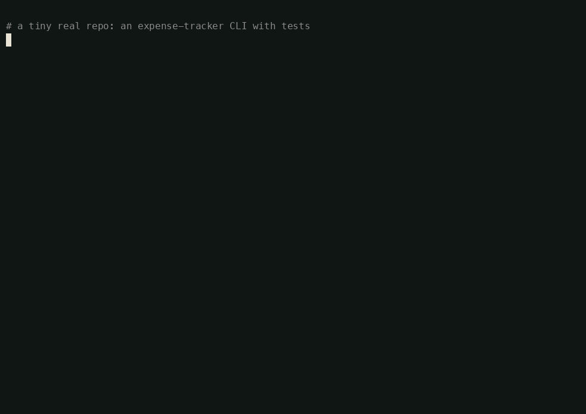
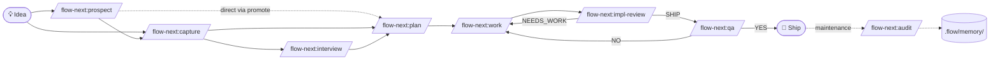
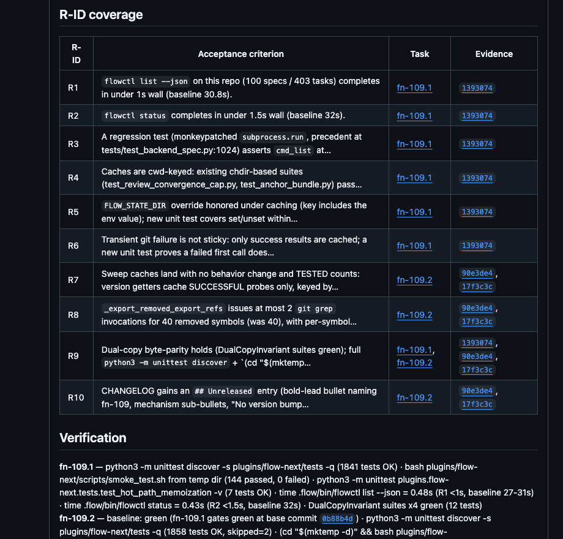
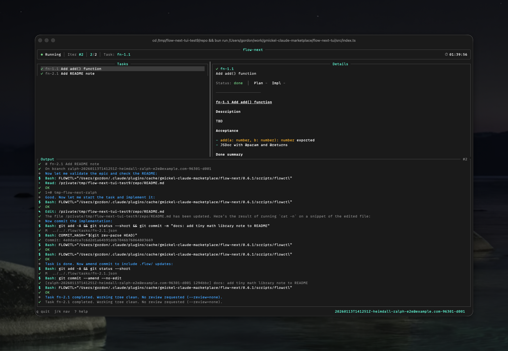

<div align="center">

# Flow-Next

[](https://github.com/gmickel/flow-next/stargazers)
[](https://github.com/gmickel/flow-next/actions/workflows/test-flow-next.yml)
[](https://github.com/gmickel/flow-next/releases/latest)
[](https://github.com/ithiria894/awesome-claude-code-workflows)
[](LICENSE)

[](plugins/flow-next/docs/README.md)
[](https://discord.gg/f3DYq8AAm5)
[](https://github.com/sponsors/gmickel)

### Agents generate. flow-next proves.

**AI coding agents that ship like engineers - not slot machines.**
The workflow layer for AI coding agents: durable specs, re-anchored workers, adversarial reviews, receipts.
Everything lives in your repo. Zero external dependencies. Uninstall: `rm -rf .flow/`.



*Proof, not adjectives: a real recorded run - plan → cross-model plan review (catches a missing guard, fix, SHIP) → implement + tests → impl review SHIP → the receipt. Nothing staged; every frame is live output.*


*A real `/flow-next:plan` result - dependency-ordered tasks, cross-model review iterated to SHIP, key decisions documented.*

</div>

### 🌐 [Full Documentation Site → flow-next.dev](https://flow-next.dev)

> 📖 **[Doc index](plugins/flow-next/docs/README.md)** · 👥 **[Teams guide](plugins/flow-next/docs/teams.md)** · 💬 **[Discord](https://discord.gg/f3DYq8AAm5)**

---

## Why this exists

Agentic engineering compresses implementation from weeks to hours — and quietly removes every safety valve pre-agentic Agile relied on. The standups, the hallway clarification, the mid-flight course correction that used to *finish* a vague ticket over a two-week cycle: gone. When an agent can ship the task in one sitting, a rough ticket plus a chat scrollback is the whole work surface.

That work surface fails predictably. Agents drift mid-task, forget requirements, overfit to recent context, and hand reviewers 10K-line diffs with no focus signal. The bottleneck didn't disappear — it moved upstream, to requirements, review, and verification. **The spec has to carry the weight.**

Flow-Next fixes the operating model, not just the prompt. It turns rough intent into durable specs, specs into context-sized task graphs, task graphs into re-anchored worker runs, and implementation into reviewed PRs with receipts. Between idea and merge it defines **six named handover objects** — each reviewable on its own, verified by a *different* model, and frozen at handover.

The artifact chain is not bureaucracy. **It is the conversation that would otherwise be missing.**

## What you get

Flow-Next is an AI agent orchestration plugin: **28 agent-native skills** covering the full lifecycle — idea → spec → tasks → review → ship → maintain — layered on a bundled pure-stdlib Python CLI (`flowctl`). The host agent is the intelligence; flowctl is the deterministic plumbing. No external services, no SaaS, no global config.

| Tenet | What it means |
|---|---|
| **Spec-driven** | Intent survives the chat. The unit of work is the spec — not the ticket, not the transcript, not the PR title. One durable document at `.flow/specs/<id>.md`, evolving through layers. |
| **Context-fit planning** | Right-sized task slices. Specs decompose into dependency-ordered tasks, each sized to one fresh ~100k-token context window. |
| **Re-anchored work** | Fresh context per task. Every worker subagent re-reads the spec, the task, and git state before touching code — no token bleed, no stale assumptions. |
| **Adversarial gates** | Fix until SHIP. A *different* model (RepoPrompt / Codex / Copilot / Cursor) reviews every plan and every implementation. Different models make different mistakes — the disagreement surface is where the gaps live. |
| **Receipts** | "Done" means there is proof. Commits, tests, review verdicts, and evidence recorded per task — never narration. |
| **Multi-harness** | One workflow everywhere. First-class on Claude Code, OpenAI Codex, and Factory Droid; runs on Grok Build and Cursor; community OpenCode port. |
| **Self-improving** | Compounds as you work. Memory, glossary, decision records, and strategy grow as side-effects of the workflow you already run — no manual "refresh" ceremony, ever. |

And one tenet about *trust*: everything lives in your repo under `.flow/`. Specs, tasks, memory, receipts — all of it is yours, in git, code-reviewable. Uninstall is `rm -rf .flow/`.

---

## Quick start

### Install

<table>
<tr>
<td><strong>Claude Code</strong></td>
<td><strong>OpenAI Codex</strong></td>
<td><strong>Factory Droid</strong></td>
</tr>
<tr>
<td>

```bash
/plugin marketplace add \
  https://github.com/gmickel/flow-next
/plugin install flow-next
/reload-plugins
/flow-next:setup
```

</td>
<td>

```bash
git clone https://github.com/gmickel/flow-next.git
cd flow-next
./scripts/install-codex.sh flow-next
# then: /flow-next:setup
```

</td>
<td>

```bash
droid plugin marketplace add \
  https://github.com/gmickel/flow-next
# /plugins → install flow-next
```

</td>
</tr>
</table>

**Why a script for Codex?** Codex's plugin protocol only registers `skills` from `plugin.json` — not custom `.toml` agents or hooks. `install-codex.sh` merges all 22 agents + hooks into `~/.codex/config.toml`. Idempotent — safe to re-run. Full platform matrix + community ports in [`docs/platforms.md`](plugins/flow-next/docs/platforms.md).

**Grok Build (xAI)?** It picks up the Claude Code install automatically - skills, commands, and multi-agent flows verified. Details + caveats in [`docs/platforms.md`](plugins/flow-next/docs/platforms.md#grok-build-claude-code-compatibility).

### The 5-command happy path

```bash
/flow-next:capture                   # 1. Synthesize conversation → .flow/specs/<id>.md
/flow-next:plan <spec-id>            # 2. Break the spec into dependency-ordered tasks
/flow-next:work <spec-id>            # 3. Execute tasks in fresh-context worker subagents
/flow-next:make-pr <spec-id>         # 4. Render a cognitive-aid PR body (9 input streams)
/flow-next:resolve-pr <PR#>          # 5. Fetch review threads → triage → resolve
```

That's the inner loop. Branch in (`/flow-next:prospect` for ranked candidates, `/flow-next:interview` for structured discovery), branch out (`/flow-next:pilot` + `/flow-next:land` for the autonomous assembly line, `/flow-next:ralph-init` for hardened overnight runs, `/flow-next:audit` for memory garbage collection).

### After every update: re-run `/flow-next:setup`

> **Update the plugin, then re-run `/flow-next:setup` in each project.** One command, safe to re-run.

Your plugin manager updates the *plugin* (`/plugin` update on Claude Code, `droid plugin update`, or `git pull` + re-run the install script on Codex/Cursor). But two things live as **snapshot copies inside your repo's `.flow/`**, not live links to the plugin: the bundled **`flowctl` CLI** (`.flow/bin/`) and **`.flow/usage.md`** (the in-repo agent guide). A plugin update does **not** touch them - so after updating, re-run `/flow-next:setup` in each project to refresh the CLI, `usage.md`, the model-routing scaffold, and the spec template. It is idempotent; nothing is lost. When the bundled copy lags the plugin, the skills print a one-line `Run /flow-next:setup to refresh local scripts` nudge on stderr (see [Troubleshooting](plugins/flow-next/docs/troubleshooting.md)).

---

## The pipeline is a menu, not a rail

The 5-command path is the opinionated default - rails for your first week, not a prohibition on anything else. Every stage is a composable primitive: skip stages, reorder them, chain them in one sentence, prompt *into* any of them - and whichever subset you run, the same execution, evidence, and review contracts hold. (Directly answers [#28](https://github.com/gmickel/flow-next/issues/28) and [#91](https://github.com/gmickel/flow-next/issues/91).)

**You never have to type a slash command or a `--flag`.** Every skill runs from plain language and every argument has a plain-language equivalent - "implement fn-12 on a new branch and review it with codex" *is* `/flow-next:work fn-12 --branch=new --review=codex`. The explicit forms below are the precise, copy-pasteable version. And the skills compose beyond the pipeline: research a competitor's pricing, then "capture a spec for it"; run a load test, then "spec the fixes the numbers point to" - the exploration is the input, the spec is the durable output.

```text
Skip stages       Tiny fix? plan + work, nothing else: /flow-next:plan "rename the config key" → /flow-next:work fn-N
One-shot chain    "Plan fn-12, run plan-review until SHIP, work every task, then make-pr." One sentence, full pipeline.
Prompt into steps "/flow-next:work fn-12 - keep the UI tasks yourself; delegate the API plumbing to codex"
Reorder / re-run  Interview again after planning; /flow-next:sync re-aligns tasks after implementation drift.
Parallelize       "Run fn-12.2 and fn-12.3 in parallel - disjoint files" (prompted: the host dispatches a worker
                  per task), or teammates each /flow-next:work a task from the same spec - atomic claims make it race-safe.
Route models      flowctl config set review.backend codex · per-task review: pins · delegate:codex for implementation.
```

Skills are prompts executed by the host agent, not compiled code - if the variation you want isn't a parameter, describe it and the host builds the arrangement on the spot ([orchestration guide](plugins/flow-next/docs/orchestration.md)). Use the smallest sufficient workflow. Full recipe catalog: [flow-next.dev/cookbook](https://flow-next.dev/cookbook).

---

## How the flow works



> `/flow-next:qa` is an **opt-in** live-app QA stage (after work, before make-pr) — it drives the deployed app like a real user and only runs when there's a live deploy + a driver; with neither it surfaces the limitation rather than blocking. It **augments, never replaces** CI/staging/manual QA: the cheap first live pass that catches obvious runtime breakage before a human opens the PR. Run it by hand, or wire it into the autonomous loop as the optional `pipeline.qa` pilot stage (`flowctl config set pipeline.qa on`, default off) — `plan → plan-review → work → qa → make-pr`.

The loop is spec-driven. Each step below maps to one skill; click through to flow-next.dev for the full page.

<details>
<summary><strong>1. Capture or prospect a spec</strong></summary>

Either synthesize an existing conversation into a structured spec, or — when starting from scratch — generate ranked candidate ideas grounded in the repo. Both land in `.flow/specs/<id>.md`. Capture **source-tags every acceptance criterion** as `[user]` / `[paraphrase]` / `[inferred]` and runs a mandatory read-back — you see exactly how much of the spec the agent invented before anything is written.

```bash
/flow-next:capture                    # from a conversation
/flow-next:prospect <focus-hint>      # from a focus hint (concept, path, constraint, volume)
```

→ [flow-next.dev/skills/capture](https://flow-next.dev/skills/capture) · [flow-next.dev/skills/prospect](https://flow-next.dev/skills/prospect)

</details>

<details>
<summary><strong>2. Interview to refine</strong></summary>

Deep Q&A pass over a spec or task: lead-with-recommendation, confidence tiers, codebase-first investigation. Use it to flesh out an ambiguous spec before breaking it down. `--scope=business|technical|both` symmetrically narrows the pass — the same skill serves the PO filling the business layer and the tech lead filling the technical layer, on the same spec file.

```bash
/flow-next:interview <spec-id>
```

→ [flow-next.dev/skills/interview](https://flow-next.dev/skills/interview)

</details>

<details>
<summary><strong>3. Plan into dependency-ordered tasks</strong></summary>

Research the codebase via parallel scouts, then write the spec + tasks together. Tasks `fn-N.M` declare blockers, inherit context from the parent spec, and declare which acceptance criteria they satisfy (`satisfies: [R1, R3]`). This skill does not write code — only the plan.

```bash
/flow-next:plan <spec-id>             # or <free-form text>
```

→ [flow-next.dev/skills/plan](https://flow-next.dev/skills/plan)

</details>

<details>
<summary><strong>4. Work through the tasks</strong></summary>

Execute tasks systematically: each runs in a fresh-context worker subagent, re-anchors against the spec before starting, then implements + commits + records evidence. Cross-model review gates (`impl-review`, `plan-review`) wrap the loop and iterate until SHIP.

```bash
/flow-next:work <spec-id>             # or <task-id>
```

→ [flow-next.dev/skills/work](https://flow-next.dev/skills/work)

</details>

<details>
<summary><strong>5. Open the PR with a cognitive-aid body</strong></summary>

Don't ask a human to skim a 10K-line diff. `/flow-next:make-pr` renders a PR body from nine flow-next input streams (spec R-IDs, per-task evidence, memory hits, glossary changes, strategy alignment, deferred review findings, the diff itself) — with an R-ID coverage table mapping every acceptance criterion to its satisfying task and evidence commit, and a "where to look" list that tells the reviewer which lines matter. A real one, from [PR #215](https://github.com/gmickel/flow-next/pull/215):

<div align="center">

</div>

```bash
/flow-next:make-pr <spec-id>          # auto-detects from current branch
```

With HTML artifact mode on (`flowctl config set artifacts.html.enabled true`), make-pr also commits a self-contained `pr.html` review instrument — diff-derived churn map, R-ID → evidence table with flagged mismatches, where-to-look checklist — and links it from the PR body. Same switch gives capture/plan a spec visualizer. Opt-in; see [`docs/html-artifacts.md`](plugins/flow-next/docs/html-artifacts.md).

→ [flow-next.dev/skills/make-pr](https://flow-next.dev/skills/make-pr)

</details>

<details>
<summary><strong>6. Resolve PR review feedback</strong></summary>

Fetch unresolved threads + top-level comments + review-submission bodies, cluster them, dispatch per-thread resolver agents (parallel on Claude Code, serial elsewhere), validate, commit, then reply + resolve via GraphQL.

```bash
/flow-next:resolve-pr <PR#>
```

→ [flow-next.dev/skills/resolve-pr](https://flow-next.dev/skills/resolve-pr)

</details>

---

## Going autonomous

Three loops, one quality bar. Multi-model review at every handover, don't-thrash reflexes (two-strike unready, auto-block, bounded CI fix budgets), evidence over narration — invariant across all three. That's the differentiator from "ralph-wiggum"-style loops that run open-loop without gates.

The default path is the **pilot + land pipeline** — in-session, host-driven, zero scaffold:

```bash
flowctl spec ready fn-12          # bless work (or move its issue on the tracker board)
/loop 10m /flow-next:pilot        # build loop: ready spec → plan → reviews → work → draft PR
/loop 30m /flow-next:land         # ship loop: draft PR → CI green → reviews converged → merged → released
```

Run both concurrently — two instances, **separate clones** — and you have the full assembly line: board → pilot → draft PR → land → released. The `ready` flag (or your tracker's board state) is the consent boundary: humans bless specs, loops drain them. 📖 **[Going autonomous](https://flow-next.dev/autonomous/overview)**

**Ralph** is the hardened harness for **fully planned** specs (it never plans): an external shell loop drives a *fresh* session per iteration — failed attempts die with the session instead of polluting the next one — with hook-enforced guardrails and receipts on disk. Reach for it when a run outlasts a session or prose guardrails aren't enough.

```bash
/flow-next:ralph-init           # One-time setup
scripts/ralph/ralph.sh          # Run from terminal
```

<div align="center">



*Ralph mode at night, PRs in the morning. The TUI tracks task progress, streaming logs, and run state.*

</div>

📖 **[Ralph deep dive](plugins/flow-next/docs/ralph.md)** · **[Ralph TUI](flow-next-tui/)** (`bun add -g @gmickel/flow-next-tui`)

---

## Why it works

| Problem | Solution |
|---------|----------|
| Context drift | **Re-anchoring** before every task — re-reads specs + git state |
| Context window limits | **Fresh context per task** — worker subagent starts clean |
| Single-model blind spots | **Cross-model reviews** — RepoPrompt, Codex, Copilot, or Cursor as second opinion |
| Forgotten requirements | **R-IDs frozen at handover** — numbered once, never renumbered; traced spec → task → commit → PR coverage table |
| "It worked on my machine" | **Evidence recording** — commits, tests, PRs tracked per task |
| Infinite retry loops | **Auto-block stuck tasks** — fails after N attempts, moves on |
| Duplicate implementations | **Pre-implementation search** — worker checks for similar code before writing new |
| Hallucinated specs from "I think we discussed…" | **Source-tagged capture** — every acceptance criterion marked `[user]` / `[paraphrase]` / `[inferred]`, mandatory read-back loop |
| Stale project memory polluting future work | **`/flow-next:audit` + categorized memory schema** — agent reviews each entry, flags stale (never deletes) |
| 10K-line diffs with no focus signal | **PR-as-cognitive-aid** — R-ID coverage, critical changes, decisions, where-to-look |
| GitHub PR review threads piling up | **`/flow-next:resolve-pr`** — fetch → triage → dispatch resolver agents → reply → resolve via GraphQL |
| One model doing everything | **Orchestration & model routing** — tiered subagents, per-task reviewer routing, opt-in `codex exec` implementation offload, promptable overrides ([docs](plugins/flow-next/docs/orchestration.md)) |

## What adopters say

> *"I am enjoying your version of all these cool new plugins. So far yours has worked the best."*
> — [@patrickmichalina](https://github.com/gmickel/flow-next/issues/5#issuecomment-3734228766)

> *"really enjoying this project, thanks for making it and making it public"*
> — [@possibilities](https://github.com/gmickel/flow-next/pull/95), external contributor, said while shipping a correct kernel patch

> *"it’s been really useful in my workflow."*
> — [@raydocs](https://github.com/gmickel/flow-next/issues/4)

Featured in [awesome-claude-code-workflows](https://github.com/ithiria894/awesome-claude-code-workflows) for plan-first workflows, Ralph autonomous mode, and receipt-based gating ([#96](https://github.com/gmickel/flow-next/issues/96)).

## Field-hardened in enterprise environments

flow-next's ways of working are coached and run in enterprise environments worldwide - from CAD and construction software to proptech and education, from modern monorepos and hundred-repo microservice estates to 30-year-old legacy stacks, on GitHub Enterprise, GitLab, and Jira. Discovery interviews of 2-3 hours produce 8-11 structured, buildable specs; the edge cases surface in the interview, not the sprint.

Receipts, evidence JSON, and review gates are the audit trail enterprise adoption asks for - approval checkpoints and traceability are built in, not bolted on.

**For teams:** six named handover objects, **Spec-as-PR** (review the 50-line spec before the 500-line diff exists), and tracker projection to Linear / GitHub / GitLab / Jira. → [`docs/teams.md`](plugins/flow-next/docs/teams.md) · [flow-next.dev](https://flow-next.dev)

## What Flow-Next is *not*

Scope honesty, because the architecture depends on it:

- **Not a hosted dashboard or SaaS tier.** Everything is in the repo; a hosted layer would break the uninstall promise.
- **Not a Jira/Linear replacement for human-only teams.** Flow-Next is for agentic-engineering teams. If your team lives in a tracker, `/flow-next:tracker-sync` *projects* specs to it — **projection, not coordination**: the spec stays the source of truth; the tracker never drives flow state or spawns agents. (Contrast OpenAI Symphony, where the tracker is the control plane — Flow-Next is "Symphony, but with real specs, re-anchoring, and receipts.")
- **Not split-file specs.** One durable spec document evolving through layers — vs. Kiro-style `requirements.md` / `design.md` / `tasks.md` fragmentation.
- **Not a replacement for human judgment.** Humans own product decisions, risk tolerance, merge decisions, and production responsibility. Flow-Next makes those decisions easier to verify because the evidence is structured.

---

## Commands

| Command | What it does |
|---------|--------------|
| `/flow-next:strategy` | Write `STRATEGY.md` — target problem, approach, users, metrics, active tracks |
| `/flow-next:prospect` | Generate ranked candidate ideas grounded in the repo, upstream of `capture`/`interview`/`plan` |
| `/flow-next:capture` | Synthesize conversation context into a spec (source-tagged, mandatory read-back) |
| `/flow-next:interview` | Deep spec refinement with lead-with-recommendation + confidence tiers + codebase-first investigation; `--scope=business\|technical\|both` |
| `/flow-next:plan` | Research codebase, create spec + dependency-ordered tasks |
| `/flow-next:work` | Execute tasks with re-anchoring + worker subagents + review gates. Opt-in: offload implementation to a local `codex exec` with `delegate:codex` (or `work.delegate=codex` config) — OFF by default, consent-gated, host keeps all judgment ([config keys](plugins/flow-next/docs/flowctl.md#config)) |
| `/flow-next:impl-review` | Cross-model implementation review (RepoPrompt, Codex, Copilot, or Cursor) |
| `/flow-next:plan-review` | Cross-model plan review |
| `/flow-next:spec-completion-review` | Spec-completion review gate — verify combined implementation matches the spec (renamed from `/flow-next:epic-review` in 1.0.0) |
| `/flow-next:qa` | **Live-app real-user QA** — derives scenarios from the spec (AC / R-IDs / boundaries), drives the running app via `flow-next-drive`, files P0/P1/P2 findings with evidence, ends with a YES/NO ship verdict receipt. Forbidden from marking PASS by reading source. Opt-in — needs a live deploy + a driver |
| `/flow-next:make-pr` | Render a cognitive-aid PR body (9 input streams) and open via `gh`; with HTML artifact mode on, also commits a `pr.html` review instrument |
| `/flow-next:resolve-pr` | Resolve GitHub PR review threads (fetch → triage → fix → reply → resolve via GraphQL) |
| `/flow-next:audit` | Agent-native review of `.flow/memory/` entries against current code (Keep / Update / Consolidate / Replace / Delete) |
| `/flow-next:memory-migrate` | Lift legacy flat memory files into the categorized schema |
| `/flow-next:prime` | **Opinionated agent-readiness assessment** - classifies the project (lifecycle / topology / size / stack / delivery shape), judges substance over existence, verifies commands actually run, leads with an operability verdict + ranked next-actions; fixes agent readiness with consent. `--classify-only` gives a cheap portfolio-triage sweep across many repos |
| `/flow-next:pilot` | **Single-tick build-loop conductor** — advances one ready spec by one pipeline stage (plan → plan-review → work → make-pr, plus an optional `qa` stage when `pipeline.qa==on`) per tick, ends with a `PILOT_VERDICT` line; drive it with `/loop` or `/goal` |
| `/flow-next:land` | **Cadence-tick ship loop** — babysits the build loop's draft PRs: CI tri-state fix loop, reviewer patience window, resolve-pr convergence, gated explicit merge, spec close, release-follow; ends with a `LAND_VERDICT` line; drive it with `/loop 30m /flow-next:land` |
| `/flow-next:ralph-init` | Scaffold autonomous loop (`scripts/ralph/`) |
| `/flow-next:setup` | Per-project setup — `.flow/` init, local flowctl install, CLAUDE.md/AGENTS.md instructions, review-backend + config ceremony, optional model-routing scaffold |
| `/flow-next:sync` | **Plan-sync** — update downstream *task* specs after implementation drift inside flow-next |
| `/flow-next:tracker-sync` | **Tracker bridge** (distinct from `/flow-next:sync`) — project a spec to a Linear/GitHub/GitLab/Jira issue and reconcile body/status/comments two-way; projection, not coordination ([docs](plugins/flow-next/docs/tracker-sync.md)) |
| `/flow-next:map` | Optional — wrap [openclaw/clawpatch](https://github.com/openclaw/clawpatch)'s `clawpatch map` for a semantic feature index (`.clawpatch/features/*.json`); scouts read it when present, fall back to grep/glob when absent. Requires Node 22+ + `pnpm add -g clawpatch` |

**Phrase-triggered skills** (no slash command — just ask): `flow-next-deps` ("what's blocking what?" — dependency graph + execution order), `flow-next-drive` (drive a running app like a real user; powers `/flow-next:qa`), `flow-next-export-context` (export RepoPrompt context for external-LLM review), `flow-next-rp-explorer` (token-efficient codebase exploration via RepoPrompt), `flow-next-worktree-kit` (worktree create/list/switch/cleanup + `.env` copying), and base `flow-next` ("show me my tasks", "what's ready?").

Full catalog of all 28 skills with triggers: [`docs/skills.md`](plugins/flow-next/docs/skills.md). Full CLI reference (every flag, every default): [`docs/flowctl.md`](plugins/flow-next/docs/flowctl.md). Steering all of it — model routing, review backends, delegation, loop chaining: [`docs/orchestration.md`](plugins/flow-next/docs/orchestration.md).

---

## Adopting in a team

Flow-Next is a methodology, not just a tool. The [teams guide](plugins/flow-next/docs/teams.md) maps the AI-native SDLC onto concrete commands: the six handover objects, **Spec-as-PR** (review the 50-line spec before the 500-line implementation exists), parallel work from one spec, the symmetric interview (PO and tech lead run the *same* skill on the *same* file), and a week-1 → month-1 → quarter-1 adoption ladder.

Teams that live in Linear, GitHub Issues, GitLab, or Jira keep their board: the tracker bridge projects every spec to an issue, two-way. On Linear, `make-pr` output is additionally [Linear Diffs](https://linear.app/docs/diffs)-ready — review the PR inside the issue. → [`docs/teams.md`](plugins/flow-next/docs/teams.md) · [`docs/tracker-sync.md`](plugins/flow-next/docs/tracker-sync.md)

**Rolling it out to everyone?** On Claude Code you can skip the per-developer install: deploy the marketplace + plugin org-wide via a `managed-settings.json` (MDM/GPO — `extraKnownMarketplaces` + `enabledPlugins`), or commit a `.claude/settings.json` to a repo for prompt-on-trust install. Each repo still needs `/flow-next:setup`. → [Install: team / org-wide deployment](https://flow-next.dev/install/#team--org-wide-deployment-claude-code-managed-settings)

---

## Where to look

The repo holds the offline-resilient reference. [flow-next.dev](https://flow-next.dev) holds the narrative, browseable guide. Pick by audience.

| Looking for… | Repo file | Website |
|---|---|---|
| 5-minute pitch + install | `README.md` (this page) | [flow-next.dev](https://flow-next.dev) |
| Skills catalog — all 28 skills, triggers, one-liners | [`docs/skills.md`](plugins/flow-next/docs/skills.md) | — |
| Adopting in a team, handover objects, Spec-as-PR, adoption ladder | [`docs/teams.md`](plugins/flow-next/docs/teams.md) | [Teams guide](https://flow-next.dev) |
| Full `flowctl` CLI reference — every command, every flag | [`docs/flowctl.md`](plugins/flow-next/docs/flowctl.md) | — |
| Ralph autonomous mode internals — hooks, receipts, DCG | [`docs/ralph.md`](plugins/flow-next/docs/ralph.md) | — |
| Optional HTML render lenses — spec visualizer + PR review instrument | [`docs/html-artifacts.md`](plugins/flow-next/docs/html-artifacts.md) | — |
| Live-app QA — `/flow-next:qa`, spec-derived scenarios, P0/P1/P2 findings, `qa_verdict` receipt | [`skills/flow-next-qa/SKILL.md`](plugins/flow-next/skills/flow-next-qa/SKILL.md) | — |
| `.flow/` directory layout, spec-first task model, ID format | [`docs/architecture.md`](plugins/flow-next/docs/architecture.md) | — |
| Spec template — R-ID rules, confidence anchors, receipt schema | [`docs/spec-template.md`](plugins/flow-next/docs/spec-template.md) · canonical scaffold at [`templates/spec.md`](plugins/flow-next/templates/spec.md) | — |
| Memory schema — bug / knowledge tracks, frontmatter, audit lifecycle | [`docs/memory-schema.md`](plugins/flow-next/docs/memory-schema.md) | — |
| Self-improving loops — memory, glossary, decisions, strategy | [`docs/self-improving.md`](plugins/flow-next/docs/self-improving.md) | — |
| Tracker-sync bridge — projection model, hybrid id, transport ladder, `/flow-next:tracker-sync` vs `/flow-next:sync` | [`docs/tracker-sync.md`](plugins/flow-next/docs/tracker-sync.md) | — |
| Project glossary — `GLOSSARY.md` shape, R17 forbidden-vocabulary guard | [`docs/glossary.md`](plugins/flow-next/docs/glossary.md) · [`GLOSSARY.md`](GLOSSARY.md) | — |
| Project strategy — `STRATEGY.md` shape, downstream skill grounding | [`docs/strategy.md`](plugins/flow-next/docs/strategy.md) · [`STRATEGY.md`](STRATEGY.md) | — |
| Cross-platform install matrix + Codex / Droid / OpenCode notes | [`docs/platforms.md`](plugins/flow-next/docs/platforms.md) | — |
| `scripts/sync-codex.sh` pipeline, plain-text transform, validation guards | [`docs/sync-codex.md`](plugins/flow-next/docs/sync-codex.md) | — |
| Troubleshooting — stuck tasks, Ralph debug, receipt validation, uninstall | [`docs/troubleshooting.md`](plugins/flow-next/docs/troubleshooting.md) | — |
| Contributing — local dev, adding skills, releasing | [`CONTRIBUTING.md`](CONTRIBUTING.md) | — |
| Repo strategic intent + active tracks | [`STRATEGY.md`](STRATEGY.md) | — |
| Canonical vocabulary | [`GLOSSARY.md`](GLOSSARY.md) | — |
| Visual overview, diagrams, methodology | — | [`flow-next.dev`](https://flow-next.dev) |

Doc index with one-line descriptions: [`plugins/flow-next/docs/README.md`](plugins/flow-next/docs/README.md).

---

## Requirements

- **Python 3.8+** (or the `py` launcher on Windows) — bundled `flowctl` CLI is pure-stdlib.
- **`jq`** and **`gh`** — required for the review subsystem and PR plumbing.
- **`bun`** *(optional)* — only needed for the [Ralph TUI](flow-next-tui/).

## Platforms

| Platform | Status |
|---|---|
| Claude Code | First-class (canonical surface) |
| OpenAI Codex (CLI + Desktop) | First-class (mirror at `plugins/flow-next/codex/`, regenerated by `scripts/sync-codex.sh`) |
| Factory Droid | First-class (regex-OR matchers handle `Execute` ↔ `Bash`) |
| Grok Build (xAI) | Works via Claude Code compatibility — skills, `/flow-next:*` commands, hooks, and **multi-agent flows** (verified). UI under-lists commands/agents (cosmetic); Ralph TBD — [details](plugins/flow-next/docs/platforms.md#grok-build-claude-code-compatibility) |
| Cursor | Works via a local plugin (`./scripts/install-cursor.sh`, or `install-cursor.ps1` on Windows) — skills, commands, and **multi-agent flows** (verified). No plugin card + autocomplete under-list (cosmetic); **Ralph unsupported** (hook-schema mismatch) — [details](plugins/flow-next/docs/platforms.md#cursor-local-plugin) |
| OpenCode | Community port: [`flow-next-opencode`](https://github.com/gmickel/flow-next-opencode) |

Detailed install + cross-platform patterns in [`docs/platforms.md`](plugins/flow-next/docs/platforms.md).

> **Upgrading from 0.x?** The 1.0 release renamed `flowctl epic` → `flowctl spec` across the entire surface. All 0.x scripts keep working — the legacy CLI is preserved as a deprecation alias layer. Migrate interactively via `/flow-next:setup` or deterministically via `flowctl migrate-rename --yes` (both transactional with rollback). See the [CHANGELOG](CHANGELOG.md).

## Ecosystem

| Project | Platform |
|---|---|
| [flow-next-opencode](https://github.com/gmickel/flow-next-opencode) | OpenCode |
| [FlowFactory](https://github.com/Gitmaxd/flowfactory) | Factory.ai Droid |
| [Ralph TUI](flow-next-tui/) | Cross-platform TUI for Ralph runs |

## Contributing

Bug reports and PRs welcome — start at [`CONTRIBUTING.md`](CONTRIBUTING.md) (local dev, adding skills, the docs-only rule) and [`SECURITY.md`](SECURITY.md) for private disclosure. Questions and show-and-tell: [GitHub Discussions](https://github.com/gmickel/flow-next/discussions). Or come say hi on [Discord](https://discord.gg/f3DYq8AAm5).

Every PR runs the same gate: the full test suite on a 3-OS matrix (Ubuntu / macOS / Windows) plus an offline docs-linkcheck - green CI is the merge floor.

## Also check out

> **[GNO](https://gno.sh)** — local hybrid search for your notes, docs, and code. Long-term memory over your files via MCP.
>
> ```bash
> bun install -g @gmickel/gno && gno mcp install --target claude-code
> ```

---

## License

MIT — see [`LICENSE`](LICENSE).

<div align="center">

Made by [Gordon Mickel](https://mickel.tech) · [@gmickel](https://twitter.com/gmickel) · [gordon@mickel.tech](mailto:gordon@mickel.tech)

[](https://mickel.tech)
[](https://twitter.com/gmickel)

[](https://github.com/sponsors/gmickel)

</div>
