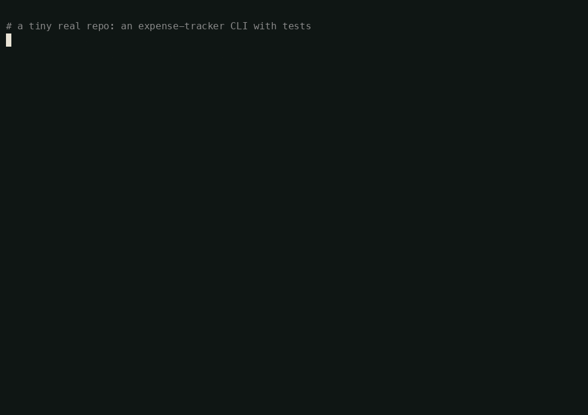
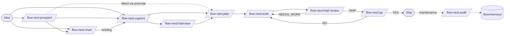
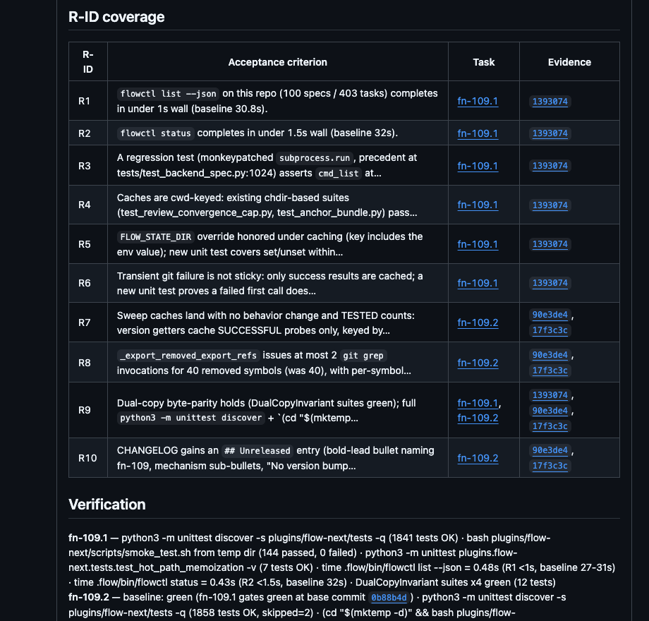
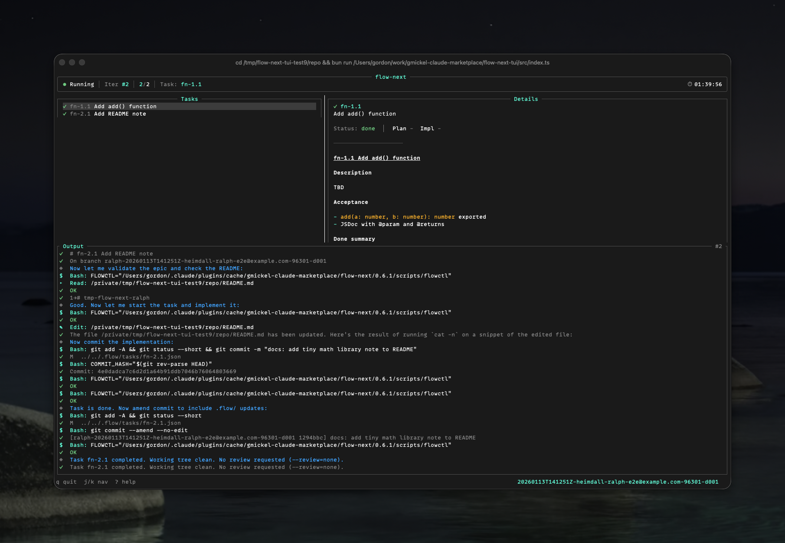

<div align="center">

# Flow-Next

[](https://github.com/gmickel/flow-next/stargazers)
[](https://github.com/gmickel/flow-next/actions/workflows/test-flow-next.yml)
[](https://github.com/gmickel/flow-next/releases/latest)
[](https://github.com/ithiria894/awesome-claude-code-workflows)
[](LICENSE)

### Agents generate. flow-next proves.

**Implementation got cheap. Reviewing it, verifying it, and keeping a codebase coherent did not.**

Flow-Next is the workflow layer that carries the weight: durable specs, re-anchored workers, adversarial cross-model review, and a receipt behind every claim of done. Everything lives in your repo, and uninstall is `rm -rf .flow/`.



*A real recorded run: plan, then cross-model plan review (catches a missing guard, fix, SHIP), then implement plus tests, then impl review SHIP, ending on the receipt. Nothing staged; every frame is live output.*

<sub>The recording drives each tick with `claude -p "..."` (Claude Code's non-interactive / headless mode) so the whole run captures unattended. In normal use you type the prompt or the `/flow-next:...` command in your interactive session: same pipeline, same gates.</sub>

</div>

> 📖 **[Doc index](plugins/flow-next/docs/README.md)** · 👥 **[Teams guide](plugins/flow-next/docs/teams.md)** · 💬 **[Discord](https://discord.gg/f3DYq8AAm5)** · **[Full documentation site: flow-next.dev](https://flow-next.dev)**

---

## Why this exists

Agentic engineering compresses implementation from weeks to hours, and it quietly removes every safety valve pre-agentic Agile relied on. The standups, the hallway clarification, the mid-flight course correction that used to *finish* a vague ticket over a two-week cycle: gone. When an agent can ship the task in one sitting, a rough ticket plus a chat scrollback is the whole work surface.

That work surface fails predictably. Agents drift mid-task, forget requirements, overfit to recent context, and hand reviewers 10K-line diffs with no focus signal. The bottleneck did not disappear; it moved upstream, to requirements, review, and verification. **The spec has to carry the weight.**

That failure surface is measured rather than asserted. [SlopCodeBench](https://arxiv.org/html/2603.24755v1) (Orlanski et al., Mar 2026) chains an agent across 93 checkpoints of extending *its own* prior code, under specs that fix only external behavior:

- **No model finished a problem.** Across 11 models, not one solved a single problem end to end.
- **The pass rate collapses as the work goes on.** The best strict pass rate was 17.2%, down to 0.5% by the final checkpoint.
- **Quality erodes with every iteration.** Code quality degraded in 80-90% of trajectories, diverging further from maintained human repositories at each step.
- **The cheapest fix was tested and ruled out.** Quality-aware prompts lowered *initial* verbosity by about a third, changed the rate of decay not at all, left every pass-rate subtype statistically unchanged, and cost up to 48% more.

Better instructions do not survive iteration. What the paper's authors name as untested is enforcing structural discipline *across* checkpoints through tooling, and that is the bet this repo makes.

Flow-Next puts the discipline in the operating model. It turns rough intent into durable specs, specs into context-sized task graphs, task graphs into re-anchored worker runs, and implementation into reviewed PRs with receipts. From the conversation you already had to a merged pull request, it defines **six named handover objects**, each reviewable on its own, verified by a *different* model, and frozen at handover. **The artifact chain is the conversation that would otherwise be missing.**

## What you get

Flow-Next is an AI agent orchestration plugin: agent-native skills layered on a bundled pure-stdlib Python CLI (`flowctl`). The host agent is the intelligence; flowctl is the deterministic plumbing. One arc, from the conversation you already had to a merged pull request: decide what to build, build it, prove it. Every skill runs from plain language, and the slash commands are the precise form of the same thing. No external services, no SaaS, no global config.

**Ship more without lowering the bar.**
A different model reviews every plan and every implementation, the loop iterates until SHIP, and a task cannot be marked done without evidence JSON.

**Reviews stop being where work waits.**
The pull request arrives explaining itself: which acceptance criterion each change satisfies, which decisions still need a human, what deliberately did not change.

**Your team's context stops living in three people's heads.**
Specs, decisions, glossary, and memory are files in your repository that the next run reads. A teammate joining on Monday reads the same thing the agent does.

**Climb to autonomy without a leap of faith.**
One dial from a supervised pair to a loop draining the backlog overnight. The gates do not change as you climb.

**Spend the expensive model where it earns its keep.**
Route any model to any role, by parameter or by sentence. Cost and quality become steering decisions you make per task.

**Your process outlives your agent.**
The same specs, gates, receipts, and task state across harnesses. Everything sits in your repository under `.flow/`, in git and code-reviewable, and uninstall is `rm -rf .flow/`.

<details>
<summary><strong>The vocabulary underneath: seven tenets</strong></summary>

| Tenet | What it means |
|---|---|
| **Spec-driven** | Intent survives the chat. The unit of work is the spec, never the ticket, the transcript, or the PR title. One durable document at `.flow/specs/<id>.md`, evolving through layers. |
| **Context-fit planning** | Right-sized task slices. Specs decompose into dependency-ordered tasks, each sized to one fresh ~100k-token context window. |
| **Re-anchored work** | Fresh context per task. Every worker subagent re-reads the spec, the task, and git state before touching code: no token bleed, no stale assumptions. |
| **Adversarial gates** | Fix until SHIP. A *different* model (RepoPrompt / Codex / Copilot / Cursor) reviews every plan and every implementation. Different models make different mistakes, and the disagreement surface is where the gaps live. |
| **Receipts** | "Done" means there is proof. Commits, tests, review verdicts, and evidence recorded per task, never narration. |
| **Multi-harness** | One workflow everywhere. First-class on Claude Code, OpenAI Codex, Factory Droid, Cursor, and xAI Grok Build. Community port for OpenCode. |
| **Self-improving** | Compounds as you work. Memory, glossary, decision records, and strategy grow as side-effects of the workflow you already run, with no manual "refresh" ceremony, ever. |

</details>

## Where it already runs

Flow-Next's ways of working are coached and run in enterprise engineering organisations worldwide, from CAD and construction software to proptech and education, across modern monorepos, hundred-repo microservice estates, and 30-year-old legacy stacks, on GitHub Enterprise, GitLab, and Jira. A 2-3 hour structured discovery interview reliably produces 8-11 implementation-ready specs with numbered acceptance criteria, boundaries, and task breakdowns; the edge cases surface in the interview instead of the sprint. Receipts, evidence JSON, and review gates are the audit trail enterprise adoption asks for: approval checkpoints and traceability are built in.

Adoption is not uniformly euphoric, and pretending otherwise would cost this page its credibility. The consistent pattern: **product and delivery roles feel relief early**, with specs they can read, evidence they can audit, and progress they can see. **Senior developers feel friction early**, because the pipeline formalizes judgment they already exercise implicitly, and the ceremony reads as overhead until the first review gate catches something they would have missed. The friction fades with the first caught regression; the relief does not.

The open-source record is linkable, so it speaks in its own words: an outside contributor shipping a correct `flowctl` patch in [PR #95](https://github.com/gmickel/flow-next/pull/95), a feature in [awesome-claude-code-workflows](https://github.com/ithiria894/awesome-claude-code-workflows) for plan-first workflows, Ralph autonomous mode, and receipt-based gating ([#96](https://github.com/gmickel/flow-next/issues/96)), and a [3-OS test matrix](https://github.com/gmickel/flow-next/actions) on every push, because the field runs all three.

> *"I am enjoying your version of all these cool new plugins. So far yours has worked the best."*
> [@patrickmichalina](https://github.com/gmickel/flow-next/issues/5#issuecomment-3734228766)

> *"really enjoying this project, thanks for making it and making it public"*
> [@possibilities](https://github.com/gmickel/flow-next/pull/95), external contributor

> *"it’s been really useful in my workflow."*
> [@raydocs](https://github.com/gmickel/flow-next/issues/4)

---

## Quick start

### Install

<table>
<tr>
<td><strong>Claude Code</strong></td>
<td><strong>OpenAI Codex</strong></td>
<td><strong>Factory Droid</strong></td>
</tr>
<tr>
<td>

```bash
/plugin marketplace add \
  https://github.com/gmickel/flow-next
/plugin install flow-next
/reload-plugins
/flow-next:setup
```

</td>
<td>

```bash
git clone https://github.com/gmickel/flow-next.git
cd flow-next
./scripts/install-codex.sh flow-next
# For another Codex home (any path you like):
# CODEX_HOME="$HOME/.codex-work" ./scripts/install-codex.sh
# Run once per home.
# then: /flow-next:setup
```

</td>
<td>

```bash
droid plugin marketplace add \
  https://github.com/gmickel/flow-next
# /plugins → install flow-next
```

</td>
</tr>
</table>

**Why a script for Codex?** Codex's plugin protocol only registers `skills` from `plugin.json`, not custom `.toml` agents or hooks. `install-codex.sh` merges the bundled agents and hooks into the active Codex home's `config.toml` (`~/.codex` by default). It is idempotent, so re-running it is safe. To install into another Codex home, run `CODEX_HOME="$HOME/.codex-work" ./scripts/install-codex.sh` once for that home (any path works; quote it if it contains spaces). Full platform matrix + community ports in [`docs/platforms.md`](plugins/flow-next/docs/platforms.md).

**Grok Build (xAI)?** It picks up the Claude Code install automatically - skills, commands, and multi-agent flows verified. Details + caveats in [`docs/platforms.md`](plugins/flow-next/docs/platforms.md#grok-build-claude-code-compatibility).

### The 5-command happy path

```bash
/flow-next:capture                   # 1. Synthesize conversation → .flow/specs/<id>.md
/flow-next:plan <spec-id>            # 2. Break the spec into dependency-ordered tasks
/flow-next:work <spec-id>            # 3. Execute tasks in fresh-context worker subagents
/flow-next:make-pr <spec-id>         # 4. Render a cognitive-aid PR body (9 input streams)
/flow-next:resolve-pr <PR#>          # 5. Fetch review threads → triage → resolve
```

That's the inner loop. Branch in (`/flow-next:prospect` for ranked candidates, `/flow-next:chart` when one oversized idea is still unclear - optional pre-capture discovery, never mandatory - `/flow-next:guide` when you're unsure which path is smallest, `/flow-next:interview` for structured discovery on an existing spec), branch out (`/flow-next:pilot` + `/flow-next:land` for the autonomous assembly line, `/flow-next:audit` for memory garbage collection).

**You do not have to run all of it.** The base loop is spec → plan → work; every other subsystem is a layer with a stated cost, a trigger, and a manual invocation. [Running lean](plugins/flow-next/docs/running-lean.md) prices each one and frames the two ways to run: **human-driven** (you are present, so you can be the reviewer, the tracker, the QA — run lean) and **autonomous** (nobody is watching, so those layers are what replace you — run gated). Neither is the real mode.

### After every update

**Plugin mode (Claude Code, the setup default for Claude-Code-only repos): nothing to do.** Nothing is copied into your repo: `flowctl` rides the plugin's `bin/` PATH injection, the agent guide is pulled live via `flowctl usage`, and the spec template resolves from the bundled copy. Plugin updates land silently; you never re-run setup for an update.

**Copy mode (mixed-host repos with Codex/Cursor/Droid teammates, CI, or plain terminals): update the plugin, then re-run `/flow-next:setup` in each project.** In copy mode two things live as **snapshot copies inside your repo's `.flow/`**, not live links to the plugin: the bundled **`flowctl` CLI** (`.flow/bin/`) and **`.flow/usage.md`** (the in-repo agent guide). A plugin update does **not** touch them - re-running setup refreshes the CLI, `usage.md`, the model-routing scaffold, and the spec template. It is idempotent; nothing is lost. Plan detects a known copy/plugin version mismatch before planning; direct invocation of other skills does not run a version preflight. See [Troubleshooting](plugins/flow-next/docs/troubleshooting.md).

Setup asks the mode question once per repo (Claude Code only; other hosts are always copy mode) and stamps the choice; switching later is a consented setup re-run. Details: [platforms.md](plugins/flow-next/docs/platforms.md).

---

## The pipeline is a menu, not a rail

The 5-command path is the opinionated default: rails for your first week, with everything else still available. Every stage is a composable primitive. Skip stages, reorder them, chain them in one sentence, prompt *into* any of them, and whichever subset you run, the same execution, evidence, and review contracts hold. (Directly answers [#28](https://github.com/gmickel/flow-next/issues/28) and [#91](https://github.com/gmickel/flow-next/issues/91).)

**You never have to type a slash command or a `--flag`.** Plain language is a first-class entry point: every skill runs from it, and every argument has a plain-language equivalent, so "implement fn-12 on a new branch and review it with codex" *is* `/flow-next:work fn-12 --branch=new --review=codex`. The explicit forms below are the precise, copy-pasteable version. The skills also compose past the pipeline: research a competitor's pricing, then "capture a spec for it"; run a load test, then "spec the fixes the numbers point to". The exploration is the input, the spec is the durable output.

**Prototype first when the question needs it.** Capture's input can be a conversation, a half-formed briefing package, a business-language BRD, an eval result, or a working prototype. Some questions ("how should this look?", "does this state model survive the awkward cases?") cannot be settled in prose, so build the thing badly on purpose and then *"capture a spec from this prototype, ignore the code quality, I want the intent and the requirements it demonstrates."* What happens to that code is a separate call made at **plan** time against your architecture and standards. The general move is to let something real answer the question and then capture the answer: probe a performance complaint, reproduce a bug report as the failing test that becomes R1, run an eval for a model choice, bake off candidate approaches as one task each. See [Prototype-Driven Specs](https://flow-next.dev/strategy/prototype-driven-specs/) and the [cookbook](https://flow-next.dev/cookbook/#compose-beyond-the-pipeline).

**Capture is the intake valve; interview is the sharpening tool.** Don't "interview me on this ticket" - capture the ticket first (capture also proposes whether it's one spec or several, and tags every line `[user]`, `[paraphrase]`, or `[inferred]`), then point the interview at what's actually soft. This also dissolves the "how big should a spec be?" debate: capture the **entire epic** and let the proposal scope it into dependency-sorted specs, then sharpen each one. The tags make it targetable: *"do a business interview on this spec covering everything that was inferred"* burns down exactly the lines the agent guessed, and *"in-depth technical interview on R9"* pressure-tests one requirement instead of re-litigating the whole spec. Capture marks the guesses; interview burns them down.

```text
Skip stages       Tiny fix? plan + work, nothing else: /flow-next:plan "rename the config key" → /flow-next:work fn-N
One-shot chain    "Plan fn-12, run plan-review until SHIP, work every task, then make-pr." One sentence, full pipeline.
Prompt into steps "/flow-next:work fn-12 - keep the UI tasks yourself; delegate the API plumbing to codex"
Reorder / re-run  Interview again after planning; /flow-next:sync re-aligns tasks after implementation drift.
Parallelize       /flow-next:plan reports execution waves. /flow-next:work inspects the ready frontier, dispatches
                  a safe subset in isolated workspaces when useful, joins it, then continues; otherwise it serializes.
Route models      flowctl config set review.backend codex · per-task review: pins · delegate:codex for implementation.
```

Skills are prompts executed by the host agent. If the variation you want is not already a parameter, describe it and the host builds the arrangement on the spot ([orchestration guide](plugins/flow-next/docs/orchestration.md)). Use the smallest sufficient workflow. Full recipe catalog: [flow-next.dev/cookbook](https://flow-next.dev/cookbook).

---

## How the flow works


```mermaid
flowchart LR
    Idea([Idea]) --> P[/flow-next:prospect/]
    Idea --> Ch[/flow-next:chart/]
    Idea --> C[/flow-next:capture/]
    P --> Ch
    P --> C
    Ch -->|briefing| C
    P -.->|direct via promote| L[/flow-next:plan/]
    C --> L
    C --> I[/flow-next:interview/]
    I --> L
    L --> W[/flow-next:work/]
    W --> R[/flow-next:impl-review/]
    R -->|SHIP| Q[/flow-next:qa/]
    R -->|NEEDS_WORK| W
    Q -->|YES| Done([Ship])
    Q -->|NO| W

    Done -.maintenance.-> A[/flow-next:audit/]
    A -.-> M[(.flow/memory/)]
```

> `/flow-next:chart` is an **optional** pre-capture discovery route for one oversized or unclear idea - not a mandatory stage and never a pilot stage. Skip it when intent and boundaries are already stateable (`signal absent`); if you skip despite residual risk, the evidence/consent/review contracts still apply later. Unsure which path fits? `/flow-next:guide` recommends the smallest sufficient route.
>
> `/flow-next:qa` is an **opt-in** live-app QA stage (after work, before make-pr): it drives the deployed app like a real user and only runs when there's a live deploy + a driver; with neither it surfaces the limitation rather than blocking. It **augments, never replaces** CI/staging/manual QA: the cheap first live pass that catches obvious runtime breakage before a human opens the PR. Run it by hand, or wire it into the autonomous loop as the optional `pipeline.qa` pilot stage (`flowctl config set pipeline.qa on`, default off): `plan → plan-review → work → qa → make-pr`.

The loop is spec-driven. Each step below maps to one skill; click through to flow-next.dev for the full page.

<details>
<summary><strong>1. Capture, prospect, or chart (optional discovery)</strong></summary>

Either synthesize an existing conversation into a structured spec, generate ranked candidate ideas grounded in the repo, or - when **one** idea is too big and still unclear - run optional `/flow-next:chart` decision-map discovery and hand the briefing to capture. Specs land in `.flow/specs/<id>.md`. Capture **source-tags every acceptance criterion** as `[user]` / `[paraphrase]` / `[inferred]` and runs a mandatory read-back, so you see exactly how much of the spec the agent invented before anything is written. Chart D-ID/evidence provenance is structural and distinct from those criterion author tags.

```bash
/flow-next:capture                    # from a conversation or chart briefing
/flow-next:prospect <focus-hint>      # ranked candidates (concept, path, constraint, volume)
/flow-next:chart "multi-tenant migration"  # optional: one oversized idea, one decision at a time
/flow-next:guide "we have a half-formed platform idea"  # smallest-sufficient router
```

→ [flow-next.dev/skills/capture](https://flow-next.dev/skills/capture) · [flow-next.dev/skills/prospect](https://flow-next.dev/skills/prospect)

</details>

<details>
<summary><strong>2. Interview to refine</strong></summary>

Deep Q&A pass over a spec or task: lead-with-recommendation, confidence tiers, codebase-first investigation. Use it to flesh out an ambiguous spec before breaking it down. `--scope=business|technical|both` symmetrically narrows the pass, so the same skill serves the PO filling the business layer and the tech lead filling the technical layer, on the same spec file.

```bash
/flow-next:interview <spec-id>
```

→ [flow-next.dev/skills/interview](https://flow-next.dev/skills/interview)

</details>

<details>
<summary><strong>3. Plan into dependency-ordered tasks</strong></summary>

Research the codebase via parallel scouts, then write the spec + tasks together. Tasks `fn-N.M` declare blockers, inherit context from the parent spec, and declare which acceptance criteria they satisfy (`satisfies: [R1, R3]`). This skill does not write code, only the plan.

<div align="center">

</div>

*A real `/flow-next:plan` result: dependency-ordered tasks, cross-model review iterated to SHIP, key decisions documented.*

```bash
/flow-next:plan <spec-id>             # or <free-form text>
```

→ [flow-next.dev/skills/plan](https://flow-next.dev/skills/plan)

</details>

<details>
<summary><strong>4. Work through the tasks</strong></summary>

Execute tasks systematically: each runs in a fresh-context worker subagent, re-anchors against the spec before starting, then implements + commits + records evidence. Cross-model review gates (`impl-review`, `plan-review`) wrap the loop and iterate until SHIP.

```bash
/flow-next:work <spec-id>             # or <task-id>
```

→ [flow-next.dev/skills/work](https://flow-next.dev/skills/work)

</details>

<details>
<summary><strong>5. Open the PR with a cognitive-aid body</strong></summary>

Don't ask a human to skim a 10K-line diff. `/flow-next:make-pr` renders a PR body from nine flow-next input streams (spec R-IDs, per-task evidence, memory hits, glossary changes, strategy alignment, deferred review findings, the diff itself), with an R-ID coverage table mapping every acceptance criterion to its satisfying task and evidence commit, and a "where to look" list that tells the reviewer which lines matter. A real one, from [PR #215](https://github.com/gmickel/flow-next/pull/215):

<div align="center">

</div>

```bash
/flow-next:make-pr <spec-id>          # auto-detects from current branch
```

Make PR also preserves one versioned, intent-ordered change walkthrough whose
identity, provenance, logical groups, file membership, deliberate non-changes,
and verification render from the same object. See the
[`pr-cognitive-aid` consumer contract](plugins/flow-next/docs/pr-cognitive-aid.md).
With HTML artifact mode on (`flowctl config set artifacts.html.enabled true`),
make-pr also commits a self-contained `pr.html` review instrument and links it
from the PR body. Same switch gives capture/plan a spec visualizer. Opt-in; see
[`docs/html-artifacts.md`](plugins/flow-next/docs/html-artifacts.md).

→ [flow-next.dev/skills/make-pr](https://flow-next.dev/skills/make-pr)

</details>

<details>
<summary><strong>6. Resolve PR review feedback</strong></summary>

Fetch unresolved threads + top-level comments + review-submission bodies, cluster them, dispatch per-thread resolver agents (parallel on Claude Code, serial elsewhere), validate, commit, then reply + resolve via GraphQL.

```bash
/flow-next:resolve-pr <PR#>
```

→ [flow-next.dev/skills/resolve-pr](https://flow-next.dev/skills/resolve-pr)

</details>

---

## Going autonomous

Three loops, one quality bar. Multi-model review at every handover, don't-thrash reflexes (two-strike unready, auto-block, bounded CI fix budgets), and evidence over narration hold across all three. That's the differentiator from "ralph-wiggum"-style loops that run open-loop without gates.

The default path is the **pilot + land pipeline**, in-session, host-driven, zero scaffold:

```bash
flowctl spec ready fn-12          # bless work (or move its issue on the tracker board)
/loop 10m /flow-next:pilot        # build loop: ready spec → plan → reviews → work → draft PR
/loop 30m /flow-next:land         # ship loop: draft PR → CI green → reviews converged → merged → released
```

Run both concurrently (two instances, **separate clones**) and you have the full assembly line: board → pilot → draft PR → land → released. The `ready` flag (or your tracker's board state) is the consent boundary: humans bless specs, loops drain them. 📖 **[Going autonomous](https://flow-next.dev/autonomous/overview)**

**Ralph** is the hardened harness for **fully planned** specs (it never plans): an external shell loop drives a *fresh* session per iteration, so failed attempts die with the session instead of polluting the next one, under hook-enforced guardrails with receipts on disk. **Ralph is deprecated** — a script calling `/flow-next:pilot` and `/flow-next:land` on a loop or a `cron` does the same job without the scaffold and the guard hooks. Nothing is removed and existing installs keep working; new setups should use pilot + land. ([Why](plugins/flow-next/docs/running-lean.md#ralph-deprecated).)

```bash
/flow-next:ralph-init           # One-time setup
scripts/ralph/ralph.sh          # Run from terminal
```

<div align="center">



*Ralph mode at night, PRs in the morning. The TUI tracks task progress, streaming logs, and run state.*

</div>

**[Ralph deep dive](plugins/flow-next/docs/ralph.md)** · **[Ralph TUI](flow-next-tui/)** (`bun add -g @gmickel/flow-next-tui`)

---

## Why it works

| Problem | Solution |
|---------|----------|
| Context drift | **Re-anchoring** before every task: re-reads specs + git state |
| Context window limits | **Fresh context per task**: worker subagent starts clean |
| Single-model blind spots | **Cross-model reviews**: RepoPrompt, Codex, Copilot, or Cursor as second opinion |
| Forgotten requirements | **R-IDs frozen at handover**: numbered once, never renumbered; traced spec → task → commit → PR coverage table |
| "It worked on my machine" | **Evidence recording**: commits, tests, PRs tracked per task |
| Infinite retry loops | **Auto-block stuck tasks**: fails after N attempts, moves on |
| Duplicate implementations | **Pre-implementation search**: worker checks for similar code before writing new |
| Hallucinated specs from "I think we discussed…" | **Source-tagged capture**: every acceptance criterion marked `[user]` / `[paraphrase]` / `[inferred]`, mandatory read-back loop |
| Stale project memory polluting future work | **`/flow-next:audit` + categorized memory schema**: agent reviews each entry, flags stale (never deletes) |
| 10K-line diffs with no focus signal | **PR-as-cognitive-aid**: R-ID coverage, critical changes, decisions, where-to-look |
| GitHub PR review threads piling up | **`/flow-next:resolve-pr`**: fetch → triage → dispatch resolver agents → reply → resolve via GraphQL |
| One model doing everything | **Orchestration & model routing**: tiered subagents, per-task reviewer routing, opt-in `codex exec` implementation offload, promptable overrides ([docs](plugins/flow-next/docs/orchestration.md)) |

## What Flow-Next is *not*

Scope honesty, because the architecture depends on it:

- **Not a hosted dashboard or SaaS tier.** Everything is in the repo; a hosted layer would break the uninstall promise.
- **Not a Jira/Linear replacement for human-only teams.** Flow-Next is for agentic-engineering teams. If your team lives in a tracker, `/flow-next:tracker-sync` *projects* specs to it: **projection, not coordination**. The spec stays the source of truth; the tracker never drives flow state or spawns agents. (Contrast OpenAI Symphony, where the tracker is the control plane. Flow-Next is "Symphony, but with real specs, re-anchoring, and receipts.")
- **Not split-file specs.** One durable spec document evolving through layers, versus Kiro-style `requirements.md` / `design.md` / `tasks.md` fragmentation.
- **Not a replacement for human judgment.** Humans own product decisions, risk tolerance, merge decisions, and production responsibility. Flow-Next makes those decisions easier to verify because the evidence is structured.
- **Not waterfall.** Waterfall means irreversible phases, a plan frozen at minimum knowledge, and handovers that discard what the next phase learns. Flow-Next has none of them: stages are re-enterable (re-interview after planning exposes a hole, re-plan after a task proves the approach wrong), the spec is captured at the moment of *most* knowledge because exploration comes first, and evidence is written *back* into the spec as work proceeds. It does ask for more **thought** earlier than a loose ticket does; it does not ask for more **commitment** earlier. The spec is a ratchet, not a gate. Full argument: [Prototype-Driven Specs](https://flow-next.dev/strategy/prototype-driven-specs/).

---

## Commands

Every skill is invocable as `/flow-next:<name>` or in plain language. The inner loop is `capture` → `plan` → `work` → `make-pr` → `resolve-pr`. Upstream of it sit `strategy`, `prospect`, optional `chart` (pre-capture decision map for oversized unclear ideas), `guide` (smallest-sufficient router), and `interview`; around it, the review gates (`plan-review`, `impl-review`, `spec-completion-review`, `qa`); after it, the loops (`pilot`, `land`, `ralph-init`) and the maintenance skills (`audit`, `sync`, `memory-migrate`). `setup`, `prime`, `tracker-sync`, and `map` handle the project itself.

**Phrase-triggered skills** (no slash command, just ask): `flow-next-deps` ("what's blocking what?", dependency graph + execution order), `flow-next-drive` (drive a running app like a real user; powers `/flow-next:qa`), `flow-next-export-context` (export RepoPrompt context for external-LLM review), `flow-next-rp-explorer` (token-efficient codebase exploration via RepoPrompt), `flow-next-worktree-kit` (worktree create/list/switch/cleanup + `.env` copying), and base `flow-next` ("show me my tasks", "what's ready?").

Full catalog of all 30 skills (24 slash-command, 6 phrase-triggered), with triggers, one-liners, and every flag: [`docs/skills.md`](plugins/flow-next/docs/skills.md). Full CLI reference (every command, every default): [`docs/flowctl.md`](plugins/flow-next/docs/flowctl.md). Steering all of it, from model routing to review backends, delegation, and loop chaining: [`docs/orchestration.md`](plugins/flow-next/docs/orchestration.md).

---

## Adopting in a team

Flow-Next is a methodology with a tool attached. The [teams guide](plugins/flow-next/docs/teams.md) maps the AI-native SDLC onto concrete commands: the six handover objects, **Spec-as-PR** (review the 50-line spec before the 500-line implementation exists), parallel work from one spec, the symmetric interview (PO and tech lead run the *same* skill on the *same* file), and a week-1 → month-1 → quarter-1 adoption ladder.

Teams that live in Linear, GitHub Issues, GitLab, or Jira keep their board: the tracker bridge projects every spec to an issue, two-way. On Linear, `make-pr` output is also [Linear Diffs](https://linear.app/docs/diffs)-ready, so you review the PR inside the issue. → [`docs/teams.md`](plugins/flow-next/docs/teams.md) · [`docs/tracker-sync.md`](plugins/flow-next/docs/tracker-sync.md)

**Rolling it out to everyone?** On Claude Code you can skip the per-developer install: deploy the marketplace + plugin org-wide via a `managed-settings.json` (MDM/GPO, using `extraKnownMarketplaces` + `enabledPlugins`), or commit a `.claude/settings.json` to a repo for prompt-on-trust install. Each repo still needs `/flow-next:setup`. → [Install: team / org-wide deployment](https://flow-next.dev/install/#team--org-wide-deployment-claude-code-managed-settings)

---

## Where to look

The repo holds the offline-resilient reference. [flow-next.dev](https://flow-next.dev) holds the narrative, browseable guide. Pick by audience.

| Looking for… | Repo file | Website |
|---|---|---|
| 5-minute pitch + install | `README.md` (this page) | [flow-next.dev](https://flow-next.dev) |
| Skills catalog: all 30 skills, triggers, one-liners | [`docs/skills.md`](plugins/flow-next/docs/skills.md) | n/a |
| Adopting in a team, handover objects, Spec-as-PR, adoption ladder | [`docs/teams.md`](plugins/flow-next/docs/teams.md) | [Teams guide](https://flow-next.dev) |
| Full `flowctl` CLI reference: every command, every flag | [`docs/flowctl.md`](plugins/flow-next/docs/flowctl.md) | n/a |
| Which layers to run at all: human-driven vs autonomous profiles, every optional layer priced | [`docs/running-lean.md`](plugins/flow-next/docs/running-lean.md) | n/a |
| Ralph autonomous mode internals (**deprecated**): hooks, receipts, DCG | [`docs/ralph.md`](plugins/flow-next/docs/ralph.md) | n/a |
| Optional HTML render lenses: spec visualizer + PR review instrument | [`docs/html-artifacts.md`](plugins/flow-next/docs/html-artifacts.md) | n/a |
| Live-app QA: `/flow-next:qa`, spec-derived scenarios, P0/P1/P2 findings, `qa_verdict` receipt | [`skills/flow-next-qa/SKILL.md`](plugins/flow-next/skills/flow-next-qa/SKILL.md) | n/a |
| `.flow/` directory layout, spec-first task model, ID format | [`docs/architecture.md`](plugins/flow-next/docs/architecture.md) | n/a |
| Spec template: R-ID rules, confidence anchors, receipt schema | [`docs/spec-template.md`](plugins/flow-next/docs/spec-template.md) · canonical scaffold at [`templates/spec.md`](plugins/flow-next/templates/spec.md) | n/a |
| Structured review findings: versioned receipt schema, lineage/currentness, anchors, bounds, consumer fallback | [`docs/review-findings.md`](plugins/flow-next/docs/review-findings.md) | [Receipts](https://flow-next.dev/review/receipts/) |
| Memory schema: bug / knowledge tracks, frontmatter, audit lifecycle | [`docs/memory-schema.md`](plugins/flow-next/docs/memory-schema.md) | n/a |
| Self-improving loops: memory, glossary, decisions, strategy | [`docs/self-improving.md`](plugins/flow-next/docs/self-improving.md) | n/a |
| Tracker-sync bridge: projection model, hybrid ids, deterministic `flowctl tracker` transport, `/flow-next:tracker-sync` vs `/flow-next:sync` | [`docs/tracker-sync.md`](plugins/flow-next/docs/tracker-sync.md) | n/a |
| Project glossary: `GLOSSARY.md` shape, R17 forbidden-vocabulary guard | [`docs/glossary.md`](plugins/flow-next/docs/glossary.md) · [`GLOSSARY.md`](GLOSSARY.md) | n/a |
| Project strategy: `STRATEGY.md` shape, downstream skill grounding | [`docs/strategy.md`](plugins/flow-next/docs/strategy.md) · [`STRATEGY.md`](STRATEGY.md) | n/a |
| Cross-platform install matrix + Codex / Droid / OpenCode notes | [`docs/platforms.md`](plugins/flow-next/docs/platforms.md) | n/a |
| `scripts/sync-codex.sh` pipeline, plain-text transform, validation guards | [`docs/sync-codex.md`](plugins/flow-next/docs/sync-codex.md) | n/a |
| Troubleshooting: stuck tasks, Ralph debug, receipt validation, uninstall | [`docs/troubleshooting.md`](plugins/flow-next/docs/troubleshooting.md) | n/a |
| Contributing: local dev, adding skills, releasing | [`CONTRIBUTING.md`](CONTRIBUTING.md) | n/a |
| Repo strategic intent + active tracks | [`STRATEGY.md`](STRATEGY.md) | n/a |
| Canonical vocabulary | [`GLOSSARY.md`](GLOSSARY.md) | n/a |
| Visual overview, diagrams, methodology | n/a | [`flow-next.dev`](https://flow-next.dev) |

Doc index with one-line descriptions: [`plugins/flow-next/docs/README.md`](plugins/flow-next/docs/README.md).

---

## Requirements

- **Python 3.11+** (or the `py` launcher on Windows): the bundled `flowctl` CLI is pure-stdlib. Launchers skip broken aliases and working interpreters below the supported floor before loading flowctl.
- **`jq`** and **`gh`**: required for the review subsystem and PR plumbing.
- **`bun`** *(optional)*: only needed for the [Ralph TUI](flow-next-tui/).

## Platforms

First-class on Claude Code, OpenAI Codex, Factory Droid, Cursor, and xAI Grok Build. Community port for OpenCode.

| Platform | Status |
|---|---|
| Claude Code | First-class (canonical surface) |
| OpenAI Codex (CLI + Desktop) | First-class (mirror at `plugins/flow-next/codex/`, regenerated by `scripts/sync-codex.sh`) |
| Factory Droid | First-class (regex-OR matchers handle `Execute` ↔ `Bash`) |
| Cursor | First-class. **Recommended:** team-marketplace repo import (admin imports this GitHub repo via the Cursor GitHub App; Default Off/On/Required; auto-refresh on push). **Fallback:** local plugin (`./scripts/install-cursor.sh` / `install-cursor.ps1`). Skills, commands, multi-agent, native asks, slash autocomplete verified; Ralph intentionally not built for Cursor ([details](plugins/flow-next/docs/platforms.md#cursor)) |
| Grok Build (xAI) | First-class via Claude Code compatibility: skills, `/flow-next:*` commands, hooks, and **multi-agent flows** (verified). Type **`/flow-next:`** to open the command autocomplete; `/flow-next-` filters the separate hyphen-named skill surface. Ralph intentionally not built ([details](plugins/flow-next/docs/platforms.md#grok-build-claude-code-compatibility)) |
| OpenCode | Community port: [`flow-next-opencode`](https://github.com/gmickel/flow-next-opencode) |

Detailed install + cross-platform patterns in [`docs/platforms.md`](plugins/flow-next/docs/platforms.md), the canonical home for the tiering sentence above.

> **Upgrading from 0.x?** The 1.0 release renamed the `epic` surface to `spec`; the legacy aliases and automated migration commands were removed in 3.0. Re-run `/flow-next:setup` for current scaffolding, then follow the manual three-step pre-1.0 layout port in [troubleshooting](plugins/flow-next/docs/troubleshooting.md#pre-10-layout-porting).

## Ecosystem

| Project | Platform |
|---|---|
| [flow-next-opencode](https://github.com/gmickel/flow-next-opencode) | OpenCode |
| [FlowFactory](https://github.com/Gitmaxd/flowfactory) | Factory.ai Droid |
| [Ralph TUI](flow-next-tui/) | Cross-platform TUI for Ralph runs |

## Contributing

Bug reports and PRs welcome: start at [`CONTRIBUTING.md`](CONTRIBUTING.md) (local dev, adding skills, the docs-only rule) and [`SECURITY.md`](SECURITY.md) for private disclosure. Questions and show-and-tell: [GitHub Discussions](https://github.com/gmickel/flow-next/discussions). Or come say hi on [Discord](https://discord.gg/f3DYq8AAm5).

Every PR runs the same gate: the full test suite on a 3-OS matrix (Ubuntu / macOS / Windows) plus an offline docs-linkcheck - green CI is the merge floor.

## Also check out

> **[GNO](https://gno.sh)**: local hybrid search for your notes, docs, and code. Long-term memory over your files via MCP.
>
> ```bash
> bun install -g @gmickel/gno && gno mcp install --target claude-code
> ```

---

## License

MIT. See [`LICENSE`](LICENSE).

<div align="center">

Made by [Gordon Mickel](https://mickel.tech) · [@gmickel](https://twitter.com/gmickel) · [gordon@mickel.tech](mailto:gordon@mickel.tech)

[](https://mickel.tech)
[](https://twitter.com/gmickel)

[](https://github.com/sponsors/gmickel)

</div>
