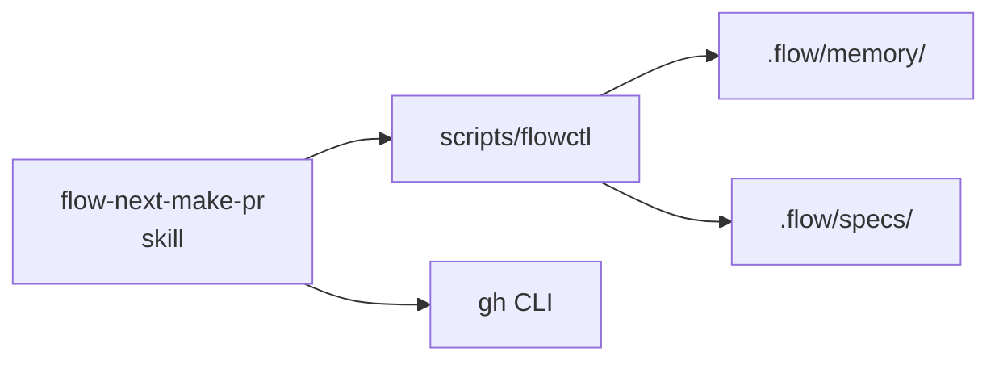
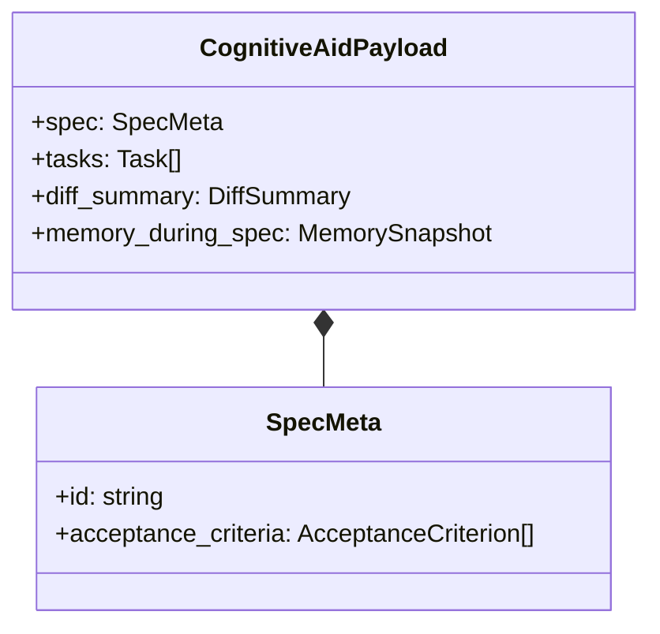
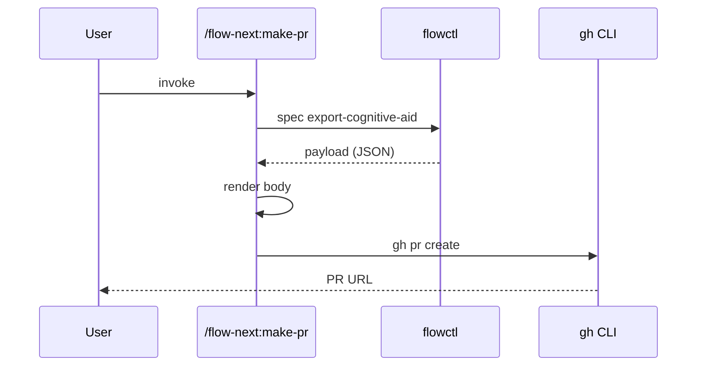
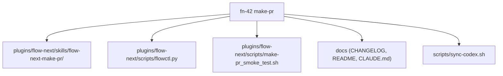

# Mermaid rendering rules — `## Structural changes` codefences

Reference for Phase 3 of `/flow-next:make-pr`. The host agent reads this file once before emitting any mermaid codefence, then validates each rendered diagram against the §6 checklist. Rules here exist because mermaid silently breaks rendering on a small set of recurring inputs — quoting / reserved words / emoji / cycle — and the host agent does not get a parser error from the forge; the diagram simply renders as a code block of mermaid source instead of as a diagram. **Quiet degradation, not loud failure.** Defensive escaping up front is cheaper than re-rendering after a reviewer flags "the diagram didn't render."

The ref file is structured for fast lookup during emission, not for narrative reading. Sections are ordered so the agent can skim top-down: reserved words first (most common silent break), then escapes (second most common), then shape selection (when in doubt), then the final validation checklist (run before emitting).

---

## 1. Reserved words

Mermaid's parser treats the following identifiers as keywords. Using one as a node id without quoting silently breaks rendering. **Always quote or rename.**

| Reserved word | Why it breaks | Safe alternative |
|---------------|---------------|------------------|
| `end` | Closes a `subgraph` block; bare `end` as a node id is consumed as block terminator | Rename to `endpoint`, `done`, `finish`, or quote: `end["end"]` |
| `default` | Reserved by `classDiagram` for defaults | Rename to `defaultCase`, `fallback` |
| `subgraph` | Starts a subgraph block | Never use as an id; rename |
| `class` | Reserved by `classDiagram` for class declarations | Rename to `kls`, `category` |
| `state` | Reserved by `stateDiagram` | Rename or quote |
| `direction` | Reserved by mermaid for `direction` directives | Rename to `dir`, `orient` |
| `click` | Reserved by mermaid for click handlers | Rename to `clk`, `select` |
| `style` | Reserved for inline styling | Rename to `styl`, quote |
| `o` (single letter) | Special connector glyph in some shapes | Rename to `obj`, `node_o`, quote |
| `x` (single letter) | Special connector glyph (cross) | Rename to `xnode`, `xref`, quote |

**Rule of thumb:** any single-letter id (`a`, `b`, `c`) is fine for examples but a real diagram should use semantic ids — `auth`, `db`, `worker`. The reserved words above are the failure modes; everything else is preference.

---

## 2. Special-character escapes

Labels containing the characters below MUST be quoted. Bare labels with these characters parse incorrectly and either render as truncated text or break the diagram entirely.

| Character | Why it breaks | Quote pattern |
|-----------|---------------|---------------|
| `(` `)` | Mermaid uses parentheses for round-shape syntax: `A(label)` | `A["Label with (parens)"]` |
| `:` | Mermaid uses colon in `classDiagram` member separators and in `sequenceDiagram` lines | `A["Module: section"]` |
| `&` | Reserved for HTML entity prefix in some contexts | `A["Auth & sessions"]` |
| `@` | Used in some link-syntax forms | `A["worker@v2"]` |
| `/` | Path separator confuses some parsers in node ids | `A["src/auth/login.ts"]` |
| `#` | Comment marker in some mermaid contexts | `A["#priority"]` |
| `;` | Statement separator in mermaid | `A["read; write"]` |
| `"` | Closes the quote prematurely | Use HTML entity `#quot;` (decimal) |
| `<` `>` | HTML-injection guard | `A["A &lt; B"]` or escape via `#60;` / `#62;` |

**HTML-entity fallback (decimal codes only — hex codes do NOT render):**

```
"  →  #quot;
#  →  #35;
<  →  #60;
>  →  #62;
&  →  #38;
```

The leading `#` plus decimal digits and trailing `;` is mermaid's documented escape syntax. Hex (`#x22;`) silently fails — always use decimal.

**Quoting always-on rule:** when in doubt, wrap labels in `"..."`. There is no penalty for over-quoting; there is silent rendering failure for under-quoting. The host agent should default to quoted labels for every multi-word node, not just ones containing special characters.

---

## 3. Shape decision matrix

The four shapes the skill emits, with one canonical example per shape so the host agent doesn't have to invent syntax from memory:

### 3a. `flowchart LR` — module-level dependency changes

**When:** trigger 1 fires (`cross_module_changes[]` non-empty). New or removed import edges between modules.

**Example:**

````markdown

````

**Notes:** `LR` (left-to-right) reads naturally for "A depends on B" stories. Use `<br/>` for two-line labels in shape brackets; use `\n` only if the surrounding label is quoted. Edge labels go between the arrow ends: `A -->|"reads"| B`.

### 3b. `classDiagram` — type/class additions or removals

**When:** trigger 2 fires AND `public_exports_changed[]` includes class symbols (function additions usually go in `flowchart` instead — `classDiagram` is heavyweight).

**Example:**

````markdown

````

**Notes:** `*--` is composition; `<|--` is inheritance; `-->` is association. **No inheritance cycles** — mermaid silently breaks rendering when `A <|-- B <|-- A`. The host agent verifies the inheritance graph is a DAG before emitting (rule 6 of §6).

### 3c. `sequenceDiagram` — new API endpoint or protocol flow

**When:** trigger 2 fires AND the new public exports include route handlers / RPC endpoints / protocol surfaces.

**Example:**

````markdown

````

**Notes:** `participant X as "Display name"` aliases for readability. `->>` is solid arrow (request); `-->>` is dashed arrow (response). Self-arrows (`S->>S`) document internal state changes.

### 3d. `graph TB` — high-level "spec touches these N areas" overview

**When:** trigger 5 fires (>15 files in >3 distinct modules). The diagram is structural overview, not dependency map — show *what* changed, not *how* things connect.

**Example:**

````markdown

````

**Notes:** `TB` (top-to-bottom) reads naturally for "spec → areas". Group by module, not by file — a leaf labeled `skill (4 files)` beats five sibling leaves. Group-when-it-helps; don't merge if grouping loses load-bearing detail.

---

## 4. Hard caps (recap from workflow.md §3.2)

| Cap | Value | Why |
|-----|-------|-----|
| Diagrams per PR | 3 | More is clutter; reviewer tunes out |
| Nodes per diagram | 12 | GitHub renderer handles more, but readability collapses past ~12 |
| Edges per diagram | 25 | Same readability cliff |
| Characters per codefence | 12,000 | GitHub truncates above; safe margin (real limit ≈25K but truncation behavior is renderer-dependent) |

When trigger conditions would emit more than 3 diagrams, **collapse to one high-level overview** (`graph TB`). When a single diagram would exceed 12 nodes, **group by module / abstraction** (e.g. "5 scout agents" → one node labeled `scouts (5)`). Do not silently truncate — that loses signal; explicit grouping preserves it.

---

## 5. Prose-summary-precedes-diagram rule (R13)

Every mermaid codefence is preceded by a one-paragraph prose summary in plain language describing the structural change. The diagram is **supplementary**; the prose is **load-bearing**.

This is for two distinct readers:

1. **Forges that don't render mermaid.** Some self-hosted Gitea / Bitbucket installs / older GitHub Enterprise versions don't render mermaid codefences. The prose ensures the structural change still lands.
2. **Reviewers who skim diagrams.** A diagram is a glance, not a read. The prose tells the reviewer what they're looking at and why; the diagram lets them verify it visually. Together, both surfaces serve different cognitive modes.

**Pattern:**

```markdown
[One-paragraph prose summary describing what changed structurally and why it matters.
Three to five sentences. Plain language, no jargon. Anchored to file paths from
`diff_summary.files[]`.]

​```mermaid
[diagram]
​```
```

Prose is not a caption ("Figure 3: Module dependencies"). It is a self-contained explanation. If you removed the diagram, the prose alone should still convey the structural change.

---

## 6. Pre-emission validation checklist

The host agent runs this checklist on every codefence before committing it to the body. If any rule fails, **re-render with the issue corrected** rather than emit a broken diagram.

1. **Quotes balanced.** Every `"` opens and closes; HTML entities (`#quot;`) used inside quoted labels.
2. **No bare `end` (or other reserved word from §1) as a node id.** Reserved words are quoted or renamed.
3. **No emoji in labels.** Mermaid silently breaks rendering on emoji in some renderers (notably older GitHub Enterprise). Use words: "tick" not "✓", "warning" not "⚠️".
4. **No MathJax / LaTeX syntax.** `$x$`, `\frac{a}{b}`, `\(...\)` all silently break. If math is genuinely required, render externally and link.
5. **No relative or internal-anchor links.** Mermaid `click` directives need absolute URLs or omit the link entirely. `click A "../foo.md"` silently fails on most forges; use `click A "https://github.com/owner/repo/blob/main/foo.md"` or omit.
6. **classDiagram: no inheritance cycles.** `A <|-- B <|-- A` and longer cycles silently break rendering. Verify the inheritance graph is a DAG before emitting.
7. **flowchart / graph: subgraph names MUST NOT collide with any node id.** `subgraph "Docs" ... Docs[...]` triggers a "Setting Docs as parent of Docs would create a cycle" error and the diagram fails to render — GitHub shows an "Unable to render rich display" banner instead. **Validated empirically on PR #131 during fn-42 dogfood.** The cycle detector treats the inner node as a child of its same-named parent subgraph. Fix: rename the inner node (`DocSurfaces`, `DocFiles`) OR rename the subgraph (`"Documentation"`, `"Docs and CHANGELOG"`). Quoting the name does NOT help — both `"Docs"` and bare `Docs` collide with the node id `Docs`. Run the check by listing every `subgraph "<name>"` line and every `<id>[...]` / `<id>(...)` node id; the two sets must be disjoint.
8. **flowchart: arrow-character preference.** Use `-->` (solid arrow), `-.->` (dashed arrow), `==>` (thick arrow). Avoid ambiguous shapes like `--o` / `--x` unless the connector glyph is intentional — they look like typos in code review.
9. **Total chars ≤12K per codefence.** Count the characters between the opening `​```mermaid` and closing `​````. If above, collapse / group / split.

The checklist is the agent's last line of defense before silent rendering failure. **Run it on every codefence, every time.** A 30-second checklist run is cheaper than a reviewer comment that says "the diagram didn't render."
