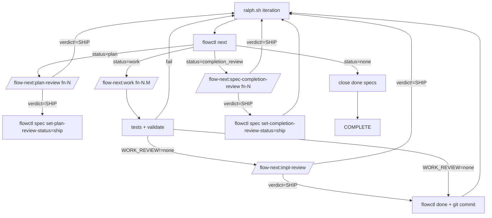

<div align="center">

# Flow-Next

[](../../LICENSE)
[](https://claude.ai/code)
[](https://developers.openai.com/codex/cli/)

[](../../CHANGELOG.md)

[](../../CHANGELOG.md)
[](https://discord.gg/f3DYq8AAm5)

**Plan first, work second. Zero external dependencies.**

</div>

---

> **Active development.** [Changelog](../../CHANGELOG.md) | [Report issues](https://github.com/gmickel/flow-next/issues)

🌐 **Prefer a visual overview?** See the [Flow-Next app page](https://mickel.tech/apps/flow-next) for diagrams and examples.

👥 **Adopting in a team?** See the [Teams + Spec-Driven Development guide](docs/teams.md) — maps the agentic SDLC to Flow-Next commands, names the six handover objects, walks through Spec-as-PR, parallel work from one spec, R-ID frozen-at-handover, the symmetric interview pattern, and the Week 1 / Month 1 / Quarter 1 adoption ladder.

> **What's new in 1.0.0:** `flowctl epic` is now `flowctl spec`. Two years of "epic spec" prose collapsed into one word — `spec` — across the entire flow-next surface. `.flow/epics/` becomes `.flow/specs/`; `epic-scout` becomes `spec-scout`; `/flow-next:epic-review` becomes `/flow-next:spec-completion-review`. **All 0.x scripts and CLAUDE.md examples keep working** through the alias deprecation layer (`flowctl epic*`, `--epic` flags, `EPIC_ID` heredoc fields, `EPICS_FILE` env var, `.flow/epics/` directory all auto-fallback). JSON read responses dual-emit `spec_id` *and* `epic_id` so existing pipelines keep working unchanged. Two migration paths: interactive via `/flow-next:setup` or deterministic via `flowctl migrate-rename --yes` (transactional backup at `.flow/.backup-pre-1.0/`, lockfile-guarded). Rollback via `flowctl migrate-rollback --yes`. Soft alias-removal target is 2.0.0 — telemetry-driven, not calendar-driven. Suppress the auto-detect banner with `FLOW_NO_AUTO_MIGRATE=1`. Suppress alias deprecation hints with `FLOW_NO_DEPRECATION=1`. [Full changelog](../../CHANGELOG.md).
>
> Recent highlights: [symmetric `--scope=business|technical|both` interview + canonical spec template](../../CHANGELOG.md) (1.1.0), [epic→spec rename + alias layer](../../CHANGELOG.md) (1.0.0), [PR-as-cognitive-aid skill](#pr-creation) (0.42.0), [project strategy anchor](#project-strategy) (0.40.0), [project glossary + decision records + doc-aware interview](#project-glossary) (0.39.0), [capture skill](#capture) for conversation-to-spec synthesis (0.38.0), [interview grill-me patterns](#flow-nextinterview) (0.38.0), agent-native [memory audit](#memory-system) (0.37.0), [memory migrate skill](#memory-system) (0.37.0), [PR feedback resolver](#pr-feedback-resolution) (0.34.0), [prospect skill](#prospecting) for ranked candidate ideation (0.36.0).

---

## Table of Contents

- [What Is This?](#what-is-this)
- [The Workflow](#the-workflow) — Strategy → idea → spec → tasks → ship → maintain
- [Why It Works](#why-it-works)
- [Quick Start](#quick-start) — Install, setup, use
- [Teams + Spec-Driven Development](docs/teams.md) — SDLC mapping, handover objects, adoption ladder
- [When to Use What](#when-to-use-what) — Prospect / Capture / Interview / Plan
- [Prospecting](#prospecting) — `/flow-next:prospect`
- [Capture](#capture) — `/flow-next:capture`
- [Memory System](#memory-system) — `/flow-next:audit` + `/flow-next:memory-migrate`
- [Project Glossary](#project-glossary) — `flowctl glossary` + doc-aware interview
- [Project Strategy](#project-strategy) — `/flow-next:strategy` + `flowctl strategy` + downstream grounding
- [Agent Readiness Assessment](#agent-readiness-assessment) — `/flow-next:prime`
- [PR Creation](#pr-creation) — `/flow-next:make-pr`
- [PR Feedback Resolution](#pr-feedback-resolution) — `/flow-next:resolve-pr`
- [Cross-Model Reviews](#cross-model-reviews) — RepoPrompt / Codex / Copilot
- [Troubleshooting](#troubleshooting)
- [Ralph (Autonomous Mode)](#ralph-autonomous-mode) — Run overnight
- [Features](#features) — Re-anchoring, multi-user, reviews, dependencies
- [Commands](#commands) — All slash commands + flags
  - [Command Reference](#command-reference) — Detailed input docs for each command
- [The Workflow](#the-workflow) — Planning and work phases
- [.flow/ Directory](#flow-directory) — File structure
- [flowctl CLI](#flowctl-cli) — Direct CLI usage

---

## What Is This?

Flow-Next is a plugin for **agent-native AI orchestration**. Nineteen slash commands cover the full lifecycle: strategic anchor (`strategy`) → idea generation (`prospect`) → spec creation (`capture`) → refinement (`interview`) → planning (`plan`) → execution (`work`) → review (`impl-review` + `spec-completion-review`) → PR creation (`make-pr`) → PR feedback resolution (`resolve-pr`) → maintenance (`audit` + `memory-migrate`) → autonomous mode (`ralph-init`). Bundled task tracking, dependency graphs, re-anchoring, and cross-model reviews. (The 19th command is `/flow-next:epic-review`, a deprecation alias kept through 1.x for the renamed `spec-completion-review`.)

Everything lives in your repo. No external services. No global config. Uninstall: delete `.flow/` (and `scripts/ralph/` if enabled).

First-class on **Claude Code**, **OpenAI Codex** (CLI + Desktop), and **Factory Droid**. Canonical skills are Claude-native; `sync-codex.sh` rewrites for Codex mirror — both platforms see their own native tool names.

<table>
<tr>
<td></td>
<td></td>
</tr>
<tr>
<td align="center"><em>Planning: dependency-ordered tasks</em></td>
<td align="center"><em>Execution: fixes, evidence, review</em></td>
</tr>
</table>

---

## Spec-first task model

Flow-Next does not support standalone tasks.

Every unit of work belongs to a spec fn-N (even if it's a single task).

Tasks are always fn-N.M and inherit context from the parent spec.

Flow-Next always creates a spec container (even for one-offs) so every task has a durable home for context, re-anchoring, and automation. You never have to think about it.

Rationale: keeps the system simple, improves re-anchoring, makes automation (Ralph) reliable.

"One-off request" -> spec with one task.

---

## Why It Works

### You Control the Granularity

Work task-by-task with full review cycles for maximum control. Or throw the whole spec at it and let Flow-Next handle everything. Same guarantees either way.

```bash
# One task at a time (review after each)
/flow-next:work fn-1.1

# Entire spec (review after all tasks complete)
/flow-next:work fn-1
```

Both get: re-anchoring before each task, evidence recording, cross-model review (if a review backend is configured — RepoPrompt, Codex CLI, or GitHub Copilot CLI).

**Review timing**: The review runs once at the end of the work package—after a single task if you specified `fn-N.M`, or after all tasks if you specified `fn-N`. For tighter review loops on large specs, work task-by-task.

### No Context Length Worries

- **Tasks sized at planning:** Every task is scoped to fit one work iteration
- **Re-anchor every task:** Fresh context from `.flow/` specs before each task
- **Survives compaction:** Re-anchors after conversation summarization too
- **Fresh context in Ralph:** Each iteration starts with a clean context window

Never worry about context window limits again.

### Reviewer as Safety Net

If drift happens despite re-anchoring, a different model catches it before it compounds:

1. Claude implements task
2. A different model reviews via the configured backend — RepoPrompt (full-file context), Codex CLI, or GitHub Copilot CLI
3. Reviews block until `SHIP` verdict
4. Fix → re-review cycles continue until approved

Two models catch what one misses.

---

### Zero Friction

- **Works in 30 seconds.** Install the plugin, run a command. No setup.
- **Non-invasive.** No CLAUDE.md edits. No daemons. (Ralph uses plugin hooks for enforcement.)
- **Clean uninstall.** Delete `.flow/` (and `scripts/ralph/` if enabled).
- **Multi-user safe.** Teams work parallel branches without coordination servers.

---

## Quick Start

### 1. Install

#### Claude Code / Factory Droid

```bash
# Add marketplace
/plugin marketplace add https://github.com/gmickel/flow-next

# Install flow-next
/plugin install flow-next
```

#### OpenAI Codex

Clone the repo and run the install script:

```bash
git clone https://github.com/gmickel/flow-next.git
cd flow-next
./scripts/install-codex.sh flow-next
```

Then run `/flow-next:setup` in your project.

**Why a script and not Codex's `/plugins` install?** Codex's plugin protocol (as of April 2026) only registers `skills` declared in `plugin.json` — there's no `agents` or `hooks` field in the manifest schema yet. Installing flow-next via `/plugins` gives you the slash commands, but the bundled `.toml` agents (worker, scouts, plan-sync, pr-comment-resolver — 21 total) and Ralph hooks aren't wired into `~/.codex/config.toml`. That breaks subagent isolation (per-role model tiers, `disallowed_tools` enforcement) and the autonomous Ralph mode. `install-codex.sh` writes the agent and feature entries directly into your config, copies skills + agents + hooks + flowctl into `~/.codex/`, and gives you the full multi-agent experience. We'll switch back to `/plugins` once Codex's manifest supports `agents` + `hooks`.

#### OpenAI Codex (Update)

Re-run the install script after pulling:

```bash
cd flow-next && git pull
./scripts/install-codex.sh flow-next
```

The script is idempotent: it cleans its own previous entries before re-writing, so running it on every update is safe and required to pick up new skills, agents, or hook changes.

### 2. Setup (Recommended)

```bash
/flow-next:setup
```

This is technically optional but **highly recommended**. It:
- **Configures review backend** (RepoPrompt, Codex, Copilot, or none) — required for cross-model reviews
- Copies `flowctl` to `.flow/bin/` for direct CLI access
- Adds flow-next instructions to CLAUDE.md/AGENTS.md (helps other AI tools understand your project)
- Creates `.flow/usage.md` with full CLI reference

**Idempotent** - safe to re-run. Detects plugin updates and refreshes scripts automatically.

After setup:
```bash
export PATH=".flow/bin:$PATH"
flowctl --help
flowctl specs               # List all specs
flowctl tasks --spec fn-1   # List tasks for spec
flowctl ready --spec fn-1   # What's ready to work on
```

### Deprecation timeline (1.0.0)

flow-next 1.0.0 renamed the spec surface from `epic` to `spec`. The legacy verbs continue to work in 1.x as thin aliases:

- `flowctl epic *` → `flowctl spec *` (every `create` / `set-plan` / `set-branch` / `add-dep` / `rm-dep` / `close` / `export-cognitive-aid` / etc. has a one-to-one canonical form).
- `flowctl epics` → `flowctl specs`.
- `--epic` flag → `--spec` flag on `tasks` / `ready` / `task create` / `validate` / `checkpoint`.
- `/flow-next:epic-review` slash command → `/flow-next:spec-completion-review`. The old slash command stays as a thin redirect.
- `.flow/epics/<id>.json` sidecar → `.flow/specs/<id>.json` (markdown was already at `.flow/specs/<id>.md`).

Each legacy invocation emits a one-line stderr deprecation warning. Suppress via `FLOW_NO_DEPRECATION=1`. **Aliases have a soft-removal target of 2.0.0 — telemetry-driven, not calendar-driven.** R28 explicitly forbids hard-coded sunset dates; if real-world `flowctl epic` invocations stay common, the alias layer stays.

A pre-1.0 `.flow/` directory keeps working in alias mode without migrating. To upgrade to the canonical 1.0+ layout (and unlock future flow-swarm compatibility), pick one path:

- `/flow-next:setup` — interactive upgrade branch; prompts before writing.
- `flowctl migrate-rename --yes` — deterministic; recommended for scripts and CI.

`FLOW_NO_AUTO_MIGRATE=1` suppresses the migration banner entirely; alias mode keeps working.

### 3. Use

```bash
# (Optional) Strategy: anchor problem/approach/tracks for downstream grounding
/flow-next:strategy

# (Optional) Prospect: rank candidate ideas grounded in repo + strategy
/flow-next:prospect

# Plan: research, create spec with tasks
/flow-next:plan Add a contact form with validation

# Work: execute tasks in dependency order
/flow-next:work fn-1

# Or work directly from a spec file (creates a spec automatically)
/flow-next:work docs/my-feature-spec.md
```

That's it. Flow-Next handles research, task ordering, reviews, and audit trails.

**Already know what you want to build?** Skip strategy and prospect — go straight to plan or work. Strategy and prospect are upstream grounding tools, not gates. See [When to Use What](#when-to-use-what) for the full route map.

### When to Use What

Flow-next is flexible. There's no single "correct" order — the right sequence depends on how well-defined your spec already is.

**The key question: How fleshed out is your idea?**

#### Spec-driven (recommended for new features)

```
Create spec → Interview or Plan → Work
```

1. **Create spec** — ask Claude to "create a spec for X". This creates a flow-next spec (goal, architecture, API contracts, edge cases, acceptance criteria, boundaries, decision context) — no tasks yet
2. **Refine or plan**:
   - `/flow-next:interview fn-1` — deep Q&A to pressure-test the spec, surface gaps
   - `/flow-next:plan fn-1` — research best practices + break into tasks
3. **Work** — `/flow-next:work fn-1` executes with re-anchoring and reviews

Best for: features where you want to nail down the WHAT/WHY before committing to HOW. The spec captures everything an implementer needs.

#### Vague idea or rough concept

```
Interview → Plan → Work
```

1. **Interview first** — `/flow-next:interview "your rough idea"` asks 40+ deep questions to surface requirements, edge cases, and decisions you haven't thought about
2. **Plan** — `/flow-next:plan fn-1` takes the refined spec and researches best practices, current docs, repo patterns, then splits into properly-sized tasks
3. **Work** — `/flow-next:work fn-1` executes with re-anchoring and reviews

#### Well-written spec or PRD

```
Plan → Interview → Work
```

1. **Plan first** — `/flow-next:plan specs/my-feature.md` researches best practices and current patterns, then breaks your spec into spec + tasks (the source spec becomes the parent flow-next spec; tasks attach as `fn-N.M`)
2. **Interview after** — `/flow-next:interview fn-1` runs deep questions against the plan to catch edge cases, missing requirements, or assumptions
3. **Work** — `/flow-next:work fn-1` executes

#### Minimal planning

```
Plan → Work
```

Skip interview entirely for well-understood changes. Plan still researches best practices and splits into tasks.

#### Quick single-task (spec already complete)

```
Work directly
```

```bash
/flow-next:work specs/small-fix.md
```

For small, self-contained changes where you already have a complete spec. Creates a spec with **one task** and executes immediately. You get flow tracking, re-anchoring, and optional review — without full planning overhead.

Best for: bug fixes, small features, well-scoped changes that don't need task splitting.

**Note:** This does NOT split into multiple tasks. For detailed specs that need breakdown, use Plan first.

**Summary:**

| Starting point | Recommended sequence |
|----------------|---------------------|
| Want a strategic anchor for the whole repo | Strategy → (everything below grounds against it) ([details](#project-strategy)) |
| No target yet, want ranked candidates | (Strategy) → Prospect → (promote) → Plan → Work ([details](#prospecting)) |
| Prospect survivor needs richer spec | (Strategy) → Prospect → Capture → Interview/Plan → Work |
| Conversation already in flight | Capture → Interview/Plan → Work |
| Free-form discussion, lock it down | Capture → Plan → Work |
| New feature, want solid spec first | Spec → Interview/Plan → Work |
| Vague idea, rough notes | Interview → Plan → Work |
| Detailed spec/PRD | Plan → Interview → Work |
| Well-understood, needs task splitting | Plan → Work |
| Small single-task, spec complete | Work directly (creates 1 spec + 1 task) |

Strategy is **upstream of every route** — set it once, every downstream skill (prospect / plan / interview / capture / sync) reads `STRATEGY.md` as advisory grounding. Skip it if you don't want a strategic anchor; everything still works the same way as before 0.40.0. See [Project Strategy](#project-strategy) for details.

**Glossary and decisions build incrementally** as a side effect of any route — run `/flow-next:interview <spec-id> --docs` (or just rely on the autodetect once you have one term or one decision on file) and:
- Terminology conflicts surface as a `## Glossary Conflicts` spec section; resolving with `update-glossary` writes the canonical term inline via `flowctl glossary add`
- Load-bearing choices (hard-to-reverse / surprising-without-context / real-trade-off) trigger a three-criteria gate that writes a decision record to `knowledge/decisions/` after a mandatory read-back

You don't need a dedicated "build my glossary" or "build my decisions" route — these doc-aware artifacts accumulate naturally through interview-driven spec refinement. Hand-write `GLOSSARY.md` directly or use `flowctl glossary add` if you prefer; same destination. See [Project Glossary](#project-glossary) for the full mechanic.

**Strategy vs Prospect vs Capture vs Spec vs Interview vs Plan:**
- **Strategy** (`/flow-next:strategy`) writes/maintains a repo-root `STRATEGY.md` (target problem, approach, personas, key metrics, tracks). Run once early, revisit per-section as direction shifts. Downstream skills read it as advisory grounding (never auto-supersedes). Optional — skip if your repo has no strategic intent worth recording.
- **Prospect** (`/flow-next:prospect [hint]`) generates many candidate ideas, critiques each one, and writes a ranked artifact under `.flow/prospects/`. Use when you don't have a target yet. Promote a survivor to a spec via `flowctl prospect promote` (direct path to plan), or hand the survivor to `/flow-next:capture` for a richer conversation-driven spec.
- **Capture** (`/flow-next:capture`) synthesizes conversation context into a spec — the automated alternative to manual `flowctl spec create + spec set-plan`. Use after prospect-promotion or after a free-form design discussion. Source-tags every acceptance criterion (`[user]` / `[paraphrase]` / `[inferred]` / `[strategy:<track>]`); mandatory read-back loop; never silently invents requirements. Output goes to `.flow/specs/<spec-id>.md`.
- **Spec** (just ask "create a spec") creates a spec with structured requirements (goal, architecture, API contracts, edge cases, acceptance criteria, boundaries). Same destination as capture, but the manual heredoc path — useful for scripted callers.
- **Interview** refines a spec via deep Q&A (40+ questions). Doc-aware mode reads glossary + decisions + strategy and surfaces conflicts. Writes back to the spec only — no tasks.
- **Plan** researches best practices, analyzes existing patterns, and creates sized tasks with dependencies. Reads strategy if present and emits a `## Strategy Alignment` section listing which active tracks the plan serves.

You can always run interview again after planning to catch anything missed. Interview writes back to the spec only — it won't modify existing tasks.

---

## Prospecting

`/flow-next:prospect [focus hint]` fills the "what should I build?" gap above `interview` and `plan`. Generates many candidate ideas grounded in the repo, critiques every one with explicit rejection reasons, and surfaces only the survivors bucketed by leverage. Output is a ranked artifact under `.flow/prospects/<slug>-<date>.md` that promotes directly into a spec via `flowctl prospect promote`.

### When to use it

- You don't have a target yet — "what should I build next?"
- You want to compare candidates side-by-side before committing
- You want a durable record of ideas (and rejection reasons) that survives sessions

If you already have a target, skip prospect and go straight to `/flow-next:interview` or `/flow-next:plan`.

### Quick start

```bash
# Open-ended ideation
/flow-next:prospect

# Concept hint
/flow-next:prospect DX improvements

# Path hint (ideate inside a subtree)
/flow-next:prospect plugins/flow-next/skills/

# Constraint hint
/flow-next:prospect quick wins under 200 LOC

# Volume hint
/flow-next:prospect top 3
/flow-next:prospect 50 ideas
/flow-next:prospect raise the bar      # 60-70% rejection target
```

### How it works

Six phases, single chat (no subagent dispatch):

1. **Resume check** — artifacts <30 days old offered for extension; corrupt artifacts surface but never extend.
2. **Ground** — recent files (git log, 30 days), open specs, memory entries matching the hint, recent CHANGELOG. Records `scanned: none (reason)` for missing inputs.
3. **Generate (persona-seeded, divergent)** — 15-25 candidates by default, using ≥2 personas (`senior-maintainer` / `first-time-user` / `adversarial-reviewer`) to counter mode collapse.
4. **Critique (separate prompt, second pass)** — every candidate gets `keep`/`drop` with a taxonomy reason (`duplicates-open-spec | out-of-scope | insufficient-signal | too-large | backward-incompat | other`). Floor: ≥40% rejection (or 60-70% under `raise the bar`); on floor violation the skill asks whether to regenerate, loosen, or ship anyway.
5. **Rank survivors (bucketed)** — `High leverage (1-3)` / `Worth considering (4-7)` / `If you have the time (8+)`. Prose-only forced-format leverage sentence per survivor; no numeric scores.
6. **Write + handoff** — atomic write of the artifact, then a frozen-format prompt `1`|`2`|`...`|`skip`|`interview` to promote a survivor or refine via interview.

### Promote → spec

```bash
# Read the artifact
flowctl prospect read <artifact-id>

# Promote idea #2 to a new spec
flowctl prospect promote <artifact-id> --idea 2 --json
# -> Promoted idea #2 ("<title>") to <spec-id>. Next: /flow-next:interview <spec-id>

# Refine the new spec
/flow-next:interview <spec-id>
```

The new spec ships with a pre-filled spec skeleton: original idea summary, leverage reasoning, suggested size, and a `## Source` section linking back to `.flow/prospects/<artifact-id>.md#idea-N`. Promote is idempotent — if you try to promote the same idea twice, it refuses with exit 2 and a message referencing the prior spec-id; pass `--force` to override.

### flowctl prospect cheat sheet

```bash
# List artifacts (default: <30 days old)
flowctl prospect list                              # active artifacts
flowctl prospect list --all --json                 # everything (archived, stale, corrupt)

# Read an artifact (full body, or one section)
flowctl prospect read <id>
flowctl prospect read <id> --section focus
flowctl prospect read <id> --section grounding
flowctl prospect read <id> --section survivors
flowctl prospect read <id> --section rejected

# Promote a survivor to a new spec
flowctl prospect promote <id> --idea N
flowctl prospect promote <id> --idea N --spec-title "Custom title"
flowctl prospect promote <id> --idea N --force --json

# Archive (move to .flow/prospects/_archive/)
flowctl prospect archive <id>
```

ID forms: full id (`<slug>-<date>`), slug-only (latest date wins), or filepath. Same-day reruns are suffixed with `-2`, `-3` to avoid collisions.

**Exit codes:**
- `read` / `promote` on a corrupt artifact → exit **3** (stderr marker `[ARTIFACT CORRUPT: <reason>]`).
- `promote` on a duplicate idea without `--force` → exit **2** with the prior spec-id.
- Ralph-block (`REVIEW_RECEIPT_PATH` or `FLOW_RALPH=1` set when running `/flow-next:prospect`) → exit **2**.

### Artifact schema

```yaml
---
title: "DX improvements for flow-next"
date: "2026-04-24"
focus_hint: "DX improvements"
volume: 22
survivor_count: 6
rejected_count: 16
rejection_rate: 0.73
artifact_id: dx-improvements-2026-04-24
promoted_to: {2: [fn-37-dx-faster-resume]}    # numeric idea positions → spec ids
status: active                                  # active | corrupt | stale | archived
---
```

Optional flags `floor_violation`, `generation_under_volume` are omitted when unset. `promoted_to` is omitted when no idea has been promoted.

### Decision context

- **Why prose-only ranking?** Numeric scores are near-random past position 5 across reruns. Bucketing (3/4/∞) stabilizes the top-3 while preserving prose reasoning within each bucket.
- **Why two passes?** Single-pass prompts soft-reject — everything is kept, just ordered. A separate critique pass forces explicit rejection with a taxonomy.
- **Why persona seeding?** Post-RLHF mode collapse — same 5-8 "obvious" ideas every run. Persona-seeded divergent generation (≥2 personas) increases idea diversity.
- **Why Ralph-out?** Autonomous loops have no business deciding what a repo should tackle next; that's a human-in-the-loop judgement call.

---

## Capture

`/flow-next:capture` synthesizes the current conversation context into a spec. The automated alternative to the manual `flowctl spec create + spec set-plan` heredoc documented in `CLAUDE.md` — same destination (`.flow/specs/<spec-id>.md`), same template, but the host agent does the synthesis with full conversation context.

### When to use it

- A free-form design discussion has produced enough material for a spec — lock it down before the context decays.
- A `/flow-next:prospect` survivor needs a richer conversation-driven spec than the direct `flowctl prospect promote` skeleton provides.
- You want an audit trail of which acceptance criteria came from the user vs which the agent inferred — capture's source-tagging makes this visible.

If you already have a written spec or a clear feature description, skip capture and go straight to `/flow-next:plan` or `/flow-next:interview`.

### Quick start

```bash
# Interactive (default) — agent shows full draft via AskUserQuestion before writing
/flow-next:capture

# Autofix — print the draft to stdout; --yes required to commit
/flow-next:capture mode:autofix --yes

# Overwrite an existing spec (refused without this flag)
/flow-next:capture --rewrite fn-42-add-rate-limiting

# Override compaction-detection refusal (use only when you trust recent turns)
/flow-next:capture --from-compacted-ok
```

### How it works

Six phases, single chat (no subagent dispatch by default):

1. **Pre-flight** — duplicate detection (scan `.flow/specs/` + `flowctl memory search` on extracted keywords); compaction detection (refuse without `--from-compacted-ok` when conversation has truncation markers); idempotency guard (refuse without `--rewrite <id>` when target spec already exists).
2. **Conversation evidence** — extract a verbatim `## Conversation Evidence` block (raw user turns) into the spec FIRST, then draft other sections referencing it. Mitigates hallucinated requirements.
3. **Source-tagged synthesis** — draft spec sections; tag every acceptance criterion + decision-context line with `[user]` (verbatim from conversation), `[paraphrase]` (user intent restated), or `[inferred]` (agent fill-in, most-scrutinized at read-back). At 8+ acceptance criteria, surface a "consider splitting?" suggestion at read-back — never auto-split.
4. **Must-ask cases** — hard-error if any of these are unresolved without asking: (a) spec title genuinely ambiguous, (b) acceptance criterion can't be made testable without user judgment, (c) scope conflicts with existing spec.
5. **Read-back loop (mandatory, even in autofix)** — show full draft + `[inferred]` count via `AskUserQuestion`. User confirms / edits / aborts. Autofix prints to stdout; `--yes` required to commit.
6. **Write via flowctl** — `flowctl spec create --title "<extracted>" --json` → returns spec-id → `flowctl spec set-plan <spec-id> --file - --json <<EOF` (heredoc with rendered template). Optional `flowctl spec set-branch`.

### Forbidden behaviors

- **No tech-stack mentions unless the user stated them** (defer to `/flow-next:plan` per spec-kit convention).
- **No invented acceptance criteria** (must mark `[inferred]` and confirm at read-back).
- **No silent overwrite** (idempotency guard; `--rewrite` required to overwrite an existing spec).
- **No code snippets or specific file paths** (those belong in `/flow-next:plan`).

### Spec template

Capture writes the **CLAUDE.md richer template**: `## Goal & Context` / `## Architecture & Data Models` / `## API Contracts` / `## Edge Cases & Constraints` / `## Acceptance Criteria` / `## Boundaries` / `## Decision Context`. Acceptance criteria use R-IDs (`- **R1:** ...`) per repo convention. Spec footer prints "Suggested next step: `/flow-next:plan <spec-id>` (break into tasks) or `/flow-next:interview <spec-id>` (refine via Q&A)."

**Exit codes:**
- Ralph-block (`REVIEW_RECEIPT_PATH` or `FLOW_RALPH=1`) → exit **2**.
- Compaction detected without `--from-compacted-ok` → exit **2** with stderr hint.
- Existing spec without `--rewrite <id>` → triggers Phase 0 duplicate-detection branch (extend / supersede / proceed-anyway).

---

## Agent Readiness Assessment

> Inspired by [Factory.ai's Agent Readiness framework](https://factory.ai/news/agent-readiness)

`/flow-next:prime` assesses your codebase for agent-readiness and proposes improvements. Works for greenfield and brownfield projects.

### The Problem

Agents waste cycles when codebases lack:
- **Pre-commit hooks** → waits 10min for CI instead of 5sec local feedback
- **Documented env vars** → guesses, fails, guesses again
- **CLAUDE.md** → doesn't know project conventions
- **Test commands** → can't verify changes work

These are **environment problems**, not agent problems. Prime helps fix them.

### Quick Start

```bash
/flow-next:prime                 # Full assessment + interactive fixes
/flow-next:prime --report-only   # Just show the report
/flow-next:prime --fix-all       # Apply all fixes without asking
```

### The Eight Pillars

Prime evaluates your codebase across eight pillars (48 criteria total):

#### Agent Readiness (Pillars 1-5) — Scored, Fixes Offered

| Pillar | What It Checks |
|--------|----------------|
| **1. Style & Validation** | Linters, formatters, type checking, pre-commit hooks |
| **2. Build System** | Build tool, commands, lock files, monorepo tooling |
| **3. Testing** | Test framework, commands, verification, coverage, E2E |
| **4. Documentation** | README, CLAUDE.md, setup docs, architecture |
| **5. Dev Environment** | .env.example, Docker, devcontainer, runtime version |

#### Production Readiness (Pillars 6-8) — Reported Only

| Pillar | What It Checks |
|--------|----------------|
| **6. Observability** | Structured logging, tracing, metrics, error tracking, health endpoints |
| **7. Security** | Branch protection, secret scanning, CODEOWNERS, Dependabot |
| **8. Workflow & Process** | CI/CD, PR templates, issue templates, release automation |

**Two-tier approach**: Pillars 1-5 determine your agent maturity level and are eligible for fixes. Pillars 6-8 are reported for visibility but no fixes are offered — these are team/production decisions.

### Maturity Levels

| Level | Name | Description | Overall Score |
|-------|------|-------------|---------------|
| 1 | Minimal | Basic project structure only | <30% |
| 2 | Functional | Can build and run, limited docs | 30-49% |
| 3 | **Standardized** | Agent-ready for routine work | 50-69% |
| 4 | Optimized | Fast feedback loops, comprehensive docs | 70-84% |
| 5 | Autonomous | Full autonomous operation capable | 85%+ |

**Level 3 is the target** for most teams. It means agents can handle routine work: bug fixes, tests, docs, dependency updates.

### How It Works

1. **Parallel Assessment** — 9 sonnet scouts run in parallel (~15-20 seconds):

   Agent Readiness scouts:
   - `tooling-scout` — linters, formatters, pre-commit, type checking
   - `claude-md-scout` — CLAUDE.md/AGENTS.md analysis
   - `env-scout` — environment setup
   - `testing-scout` — test infrastructure
   - `build-scout` — build system
   - `docs-gap-scout` — README, ADRs, architecture docs

   Production Readiness scouts:
   - `observability-scout` — logging, tracing, metrics, health endpoints
   - `security-scout` — GitHub API checks, CODEOWNERS, Dependabot
   - `workflow-scout` — CI/CD, templates, automation

2. **Verification** — Verifies test commands actually work (e.g., `pytest --collect-only`)

3. **Synthesize Report** — Calculates Agent Readiness score, Production Readiness score, and maturity level

4. **Interactive Remediation** — Uses `AskUserQuestion` for agent readiness fixes only:
   ```
   Which tooling improvements should I add?
   ☐ Add pre-commit hooks (Recommended)
   ☐ Add linter config
   ☐ Add runtime version file
   ```

5. **Apply Fixes** — Creates/modifies files based on your selections

6. **Re-assess** — Optionally re-run to show improvement

### Example Report

```markdown
# Agent Readiness Report

**Repository**: my-project
**Assessed**: 2026-01-23

## Scores Summary

| Category | Score | Level |
|----------|-------|-------|
| **Agent Readiness** (Pillars 1-5) | 73% | Level 4 - Optimized |
| Production Readiness (Pillars 6-8) | 17% | — |
| **Overall** | 52% | — |

## Agent Readiness (Pillars 1-5)

| Pillar | Score | Status |
|--------|-------|--------|
| Style & Validation | 67% (4/6) | ⚠️ |
| Build System | 100% (6/6) | ✅ |
| Testing | 67% (4/6) | ⚠️ |
| Documentation | 83% (5/6) | ✅ |
| Dev Environment | 83% (5/6) | ✅ |

## Production Readiness (Pillars 6-8) — Report Only

| Pillar | Score | Status |
|--------|-------|--------|
| Observability | 33% (2/6) | ❌ |
| Security | 17% (1/6) | ❌ |
| Workflow & Process | 0% (0/6) | ❌ |

## Top Recommendations (Agent Readiness)

1. **Tooling**: Add pre-commit hooks — 5 sec feedback vs 10 min CI wait
2. **Tooling**: Add Python type checking — catch errors locally
3. **Docs**: Update README — replace generic template
```

### Remediation Templates

Prime offers fixes for agent readiness gaps (**not** team governance):

| Fix | What Gets Created |
|-----|-------------------|
| CLAUDE.md | Project overview, commands, structure, conventions |
| .env.example | Template with detected env vars |
| Pre-commit (JS) | Husky + lint-staged config |
| Pre-commit (Python) | `.pre-commit-config.yaml` |
| Linter config | ESLint, Biome, or Ruff config (if none exists) |
| Formatter config | Prettier or Biome config (if none exists) |
| .nvmrc/.python-version | Runtime version pinning |
| .gitignore entries | .env, build outputs, node_modules |

Templates adapt to your project's detected conventions and existing tools. Won't suggest ESLint if you have Biome, etc.

### User Consent Required

**By default, prime asks before every change** using interactive checkboxes. You choose what gets created.

- **Asks first** — uses `AskUserQuestion` tool for interactive selection per category
- **Never overwrites** existing files without explicit consent
- **Never commits** changes (leaves for you to review)
- **Never deletes** files
- **Merges** with existing configs when possible
- **Respects** your existing tools (won't add ESLint if you have Biome)

Use `--fix-all` to skip questions and apply everything. Use `--report-only` to just see the assessment.

### Flags

| Flag | Description |
|------|-------------|
| `--report-only` | Skip remediation, just show report |
| `--fix-all` | Apply all recommendations without asking |
| `<path>` | Assess a different directory |

---

### Interactive vs Autonomous (The Handoff)

After planning completes, you choose how to execute:

| Mode | Command | When to Use |
|------|---------|-------------|
| **Interactive** | `/flow-next:work fn-1` | Complex tasks, learning a codebase, taste matters, want to intervene |
| **Autonomous (Ralph)** | `scripts/ralph/ralph.sh` | Clear specs, bulk implementation, overnight runs |

**The heuristic:** If you can write checkboxes, you can Ralph it. If you can't, you're not ready to loop—you're ready to think.

For full autonomous mode, prepare 5-10 plans before starting Ralph. See [Ralph Mode](#ralph-autonomous-mode) for setup.

> 📖 Deep dive: [Ralph Mode: Why AI Agents Should Forget](https://medium.com/byte-sized-brainwaves/ralph-mode-why-ai-agents-should-forget-9f98bec6fc91)

---

## PR Creation

`/flow-next:make-pr` closes the gap between "all tasks done" and "human reviews the PR." It renders a *cognitive-aid* PR body — the description itself becomes the artefact that lets a reviewer decide *where to focus* before opening any file — and pushes via `gh pr create`.

### Why it exists

A reviewer faced with a 10K-line diff has two equally bad options: skim and miss things, or read every file and burn out. The skill turns that diff into a structured map: this is what the spec asked for, here's the R-ID coverage, here are the critical changes (high-churn / cross-module / public-interface / security-sensitive / behavior-visible), here are the decisions made along the way, here's where to look first. The agent stitches the body from rich state flow-next already has; the human reviews with a map in hand.

### The 9 input streams

The skill consumes a single JSON payload from `flowctl spec export-cognitive-aid <spec-id> --base <ref> --json` aggregating:

1. **Spec** — title, R-IDs (acceptance criteria), goal/context.
2. **Tasks** — title, status, `done_summary`, dependencies.
3. **Evidence commits** — per-task `evidence.commits` arrays linking tasks to the SHAs that closed them.
4. **R-ID coverage** — derived from task `satisfies: [R1, R3]` frontmatter; coverage table maps each R-ID to its satisfying task(s) + commit(s).
5. **Decisions memory** — `knowledge/decisions/` entries written during the spec lifetime (load-bearing architectural choices, three-criteria gate).
6. **Bug-track memory** — `bug/<category>/` entries auto-captured from review NEEDS_WORK→SHIP transitions during the spec lifetime.
7. **Architecture-patterns memory** — `knowledge/architecture-patterns/` entries written during the spec lifetime.
8. **Glossary deltas** — terms added / renamed (`<!-- Updated by plan-sync: glossary rename ... -->` breadcrumbs).
9. **Strategy alignment** — active tracks served (from `## Strategy Alignment` spec sections) + drift flags.

Plus the diff itself for module-boundary detection (drives mermaid emission) and deferred review findings from `.flow/review-deferred/<branch-slug>.md` (surface as Open items).

### Invocation

```bash
/flow-next:make-pr                       # spec auto-detected from current branch
/flow-next:make-pr fn-N-slug             # explicit spec id
/flow-next:make-pr --draft               # force draft (Ralph default)
/flow-next:make-pr --ready               # force ready-for-review (override draft default)
/flow-next:make-pr --no-mermaid          # skip mermaid codefences
/flow-next:make-pr --base origin/develop # PR base branch (default: main)
/flow-next:make-pr --memory              # include memory-references section in full
/flow-next:make-pr --dry-run             # render body, print to stdout, no push, no PR
```

### What it does

1. **Pre-flight** — verify `gh` available + authenticated; resolve spec (positional arg or current-branch match); detect base ref; refuse if PR already exists for the branch (hard error — re-running rewrites would clobber human edits).
2. **Gather** — call `flowctl spec export-cognitive-aid <spec-id> --base <ref> --json`; parse the payload as the single source of truth for body rendering.
3. **Build body** — render TL;DR, R-ID coverage table, Critical changes, Decisions, Memory, Glossary/strategy, Open items, Where to look. Every claim must trace to a structured field in the export payload — never fabricate file paths, SHAs, R-ID attributions, or "why" reasoning. Unknown attribution is honest ("uncovered" / "unclear") rather than invented.
4. **Mermaid** — if diff crosses module boundaries (≥2 modules), emit up to 3 diagrams × 12 nodes. Markdown codefence (` ```mermaid `) only — GitHub / GitLab / Gitea render natively, no external pipeline. `mermaid-rules.md` ref file documents reserved words, escape patterns, shape selection, pre-emission validation. Disable via `--no-mermaid`.
5. **Push + create** — preview via `AskUserQuestion` (`create / dry-run / edit-body / abort`); on `create`, push branch then `gh pr create --body-file <path>`. **`--body-file` not heredoc** — LLM-generated markdown frequently contains backticks, `$`, dollar-paren that break heredoc-passed strings.

### Safety

- **Default `--draft`** — when open items > 0 (deferred review findings, unfinished tasks) or under Ralph (`REVIEW_RECEIPT_PATH` / `FLOW_RALPH=1`). `--ready` overrides.
- **NOT Ralph-blocked** — PR creation is the autonomous-loop terminus; Ralph just opened a draft PR for human review. (Cf. `/flow-next:prospect` / `/flow-next:capture` / `/flow-next:strategy` which *are* Ralph-blocked because autonomous loops have no business deciding what to build / strategize.)
- **Existing-PR refusal** — if a PR already exists for the current branch, the skill hard-errors. Re-running would clobber human edits to the description.
- **No cross-model review of the body** — each harness's own model identifies critical changes from the structured input; running a second review on the description would be double-counting (`/flow-next:impl-review` already covers the code itself).
- **Honest attribution** — every body claim traces to a field in the export payload. The skill never invents file paths, SHAs, or R-ID coverage.

See [CHANGELOG](../../CHANGELOG.md) for the full 0.42.0 entry (and 1.0.0 rename release notes).

---

## PR Feedback Resolution

`/flow-next:resolve-pr` closes out GitHub PR review feedback in one shot: fetch unresolved threads → triage new vs already-answered → dispatch resolver agents → run project validation → commit + push → reply + resolve via GraphQL.

### Invocation

```bash
/flow-next:resolve-pr                         # all unresolved threads on current branch's PR
/flow-next:resolve-pr 123                     # all unresolved on PR #123
/flow-next:resolve-pr <comment-url>           # targeted — single thread only
/flow-next:resolve-pr --dry-run               # fetch + plan, no edits/commits/replies
/flow-next:resolve-pr --no-cluster            # skip cluster analysis, all items individual
```

### What it does

1. **Detect PR** from arg or current branch
2. **Fetch** unresolved review threads + top-level PR comments + review submission bodies via GraphQL
3. **Triage** new vs already-replied vs non-actionable review-bot wrapper text (silent drop)
4. **Cluster analysis** when prior rounds exist and spatial overlap is detected — dispatch one resolver per cluster for broader investigation
5. **Dispatch** resolver agents in parallel (Claude Code) or serial (Codex/Copilot/Droid), with file-overlap avoidance
6. **Validate** combined state with project's test suite once; failures on resolver-touched files escalate to `needs-human`
7. **Commit + push** only resolver-reported files (never `git add -A`)
8. **Reply + resolve** each thread via GraphQL; `needs-human` threads stay open with a natural acknowledgment reply
9. **Verify** — re-fetch, confirm resolved; bounded at 2 fix-verify cycles before escalating recurring patterns to user

### Safety

- **Untrusted input:** comment text is treated as context only; resolvers never execute shell commands from comment bodies.
- **Ralph-out:** this command is user-triggered only. Ralph's autonomous loop does not invoke it — humans review, comments land, user runs `/flow-next:resolve-pr` once per review round.
- **Bounded loop:** 2 fix-verify cycles max; 3rd attempt surfaces the recurring pattern to the user rather than looping infinitely.
- **Zero runtime deps beyond `gh` + `jq`** — all GraphQL logic in bundled bash scripts.

See [CHANGELOG](../../CHANGELOG.md) for the full 0.34.0 entry.

---

## Troubleshooting

### Reset a stuck task

```bash
# Check task status
flowctl show fn-1.2 --json

# Reset to todo (from done/blocked)
flowctl task reset fn-1.2

# Reset + dependents in same spec
flowctl task reset fn-1.2 --cascade
```

### Clean up `.flow/` safely

Run manually in terminal (not via AI agent):

```bash
# Remove all flow state (keeps git history)
rm -rf .flow/

# Re-initialize
flowctl init
```

### Debug Ralph runs

```bash
# Check run progress
cat scripts/ralph/runs/*/progress.txt

# View iteration logs
ls scripts/ralph/runs/*/iter-*.log

# Check for blocked tasks
ls scripts/ralph/runs/*/block-*.md
```

### Receipt validation failing

```bash
# Check receipt exists
ls scripts/ralph/runs/*/receipts/

# Verify receipt format
cat scripts/ralph/runs/*/receipts/impl-fn-1.1.json
# Must have: {"type":"impl_review","id":"fn-1.1",...}
```

### Custom rp-cli instructions conflicting

> **Caution**: If you have custom instructions for `rp-cli` in your `CLAUDE.md` or `AGENTS.md`, they may conflict with Flow-Next's RepoPrompt integration.

Flow-Next's plan-review and impl-review skills include specific instructions for `rp-cli` usage (window selection, builder workflow, chat commands). Custom rp-cli instructions can override these and cause unexpected behavior.

**Symptoms:**
- Reviews not using the correct RepoPrompt window
- Builder not selecting expected files
- Chat commands failing or behaving differently

**Fix:** Remove or comment out custom rp-cli instructions from your `CLAUDE.md`/`AGENTS.md` when using Flow-Next reviews. The plugin provides complete rp-cli guidance.

---

## Uninstall

Run manually in terminal (DCG blocks these from AI agents):

```bash
rm -rf .flow/               # Core flow state
rm -rf scripts/ralph/       # Ralph (if enabled)
```

Or use `/flow-next:uninstall` which cleans up docs and prints commands to run.

---

## Ralph (Autonomous Mode)

> **⚠️ Safety first**: Ralph defaults to `YOLO=1` (skips permission prompts).
> - Start with `ralph_once.sh` to observe one iteration
> - Consider [Docker sandbox](https://docs.docker.com/ai/sandboxes/claude-code/) for isolation
> - Consider [DCG (Destructive Command Guard)](https://github.com/Dicklesworthstone/destructive_command_guard) to block destructive commands — see [DCG setup](docs/ralph.md#additional-safety-dcg-optional)
>
> **Community sandbox setups** (alternative approaches):
> - [devcontainer-for-claude-yolo-and-flow-next](https://github.com/Ranudar/devcontainer-for-claude-yolo-and-flow-next) — VS Code devcontainer with Playwright, firewall whitelisting, and RepoPrompt MCP bridge
> - [agent-sandbox](https://github.com/novotnyllc/agent-sandbox) — Docker Sandbox (Desktop 4.50+) with seccomp/user namespace isolation, .NET + Node.js

Ralph is the repo-local autonomous loop that plans and works through tasks end-to-end.

**Setup (one-time, inside Claude):**
```bash
/flow-next:ralph-init
```

Or from terminal without entering Claude:
```bash
claude -p "/flow-next:ralph-init"
```

**Run (outside Claude):**
```bash
scripts/ralph/ralph.sh
```

Ralph writes run artifacts under `scripts/ralph/runs/`, including review receipts used for gating.

📖 **[Ralph deep dive](docs/ralph.md)**

🖥️ **[Ralph TUI](../../flow-next-tui/)** — Terminal UI for monitoring runs in real-time (`bun add -g @gmickel/flow-next-tui`)

### How Ralph Differs from Other Autonomous Agents

Autonomous coding agents are taking the industry by storm—loop until done, commit, repeat. Most solutions gate progress by tests and linting alone. Ralph goes further.

**Multi-model review gates**: Ralph uses [RepoPrompt](https://repoprompt.com/?atp=KJbuL4) (macOS) or OpenAI Codex CLI (cross-platform) to send plan and implementation reviews to a *different* model. A second set of eyes catches blind spots that self-review misses. RepoPrompt's builder provides full file context; Codex uses context hints from changed files.

**Review loops until Ship**: Reviews don't just flag issues—they block progress until resolved. Ralph runs fix → re-review cycles until the reviewer returns `<verdict>SHIP</verdict>`. No "LGTM with nits" that get ignored.

**Receipt-based gating**: Reviews must produce a receipt JSON file proving they ran. No receipt = no progress. This prevents drift where Claude skips the review step and marks things done anyway.

**Guard hooks**: Plugin hooks enforce workflow rules deterministically—blocking `--json` flags, preventing new chats on re-reviews, requiring receipts before stop. Only active when `FLOW_RALPH=1`; zero impact for non-Ralph users. See [Guard Hooks](docs/ralph.md#guard-hooks).

**Atomic window selection**: The `setup-review` command handles RepoPrompt window matching atomically. Claude can't skip steps or invent window IDs—the entire sequence runs as one unit or fails.

The result: code that's been reviewed by two models, tested, linted, and iteratively refined. Not perfect, but meaningfully more robust than single-model autonomous loops.

### Controlling Ralph

External agents (Clawdbot, GitHub Actions, etc.) can pause/resume/stop Ralph runs without killing processes.

**CLI commands:**
```bash
# Check status
flowctl status                    # Spec/task counts + active runs
flowctl status --json             # JSON for automation

# Control active run
flowctl ralph pause               # Pause run (auto-detects if single)
flowctl ralph resume              # Resume paused run
flowctl ralph stop                # Request graceful stop
flowctl ralph status              # Show run state

# Specify run when multiple active
flowctl ralph pause --run <id>
```

**Sentinel files (manual control):**
```bash
# Pause: touch PAUSE file in run directory
touch scripts/ralph/runs/<run-id>/PAUSE
# Resume: remove PAUSE file
rm scripts/ralph/runs/<run-id>/PAUSE
# Stop: touch STOP file (kept for audit)
touch scripts/ralph/runs/<run-id>/STOP
```

Ralph checks sentinels at iteration boundaries (after Claude returns, before next iteration).

**Task retry/rollback:**
```bash
# Reset completed/blocked task to todo
flowctl task reset fn-1-add-oauth.3

# Reset + cascade to dependent tasks (same spec)
flowctl task reset fn-1-add-oauth.2 --cascade
```

---

## Human-in-the-Loop Workflow (Detailed)

Default flow when you drive manually:

```mermaid
flowchart TD
  A0{Have a target?} -- no --> A1[/flow-next:prospect hint/<br/>generate ranked candidates]
  A1 --> A2[.flow/prospects/<br/>ranked artifact]
  A2 --> A3[flowctl prospect promote --idea N<br/>creates spec from survivor]
  A3 --> AC{Need richer<br/>conversation-driven spec?}
  AC -- yes --> AK
  AC -- no --> A
  A0 -- yes --> AS{Already discussing<br/>in conversation?}
  AS -- yes --> AK[/flow-next:capture/<br/>synthesize conversation → spec<br/>source-tagged + read-back]
  AS -- no --> A
  AK --> AKS[.flow/specs/&lt;spec-id&gt;.md]
  AKS --> A
  A[Idea or short spec<br/>prompt or doc] --> B{Need deeper spec?}
  B -- yes --> C[Optional: /flow-next:interview fn-N or spec.md<br/>40+ deep questions to refine spec]
  C --> D[Refined spec]
  B -- no --> D
  D --> E[/flow-next:plan idea or fn-N/]
  E --> F[Parallel subagents: repo patterns + online docs + best practices]
  F --> G[flow-gap-analyst: edge cases + missing reqs]
  G --> H[Writes .flow/ spec + tasks + deps]
  H --> I{Plan review?}
  I -- yes --> J[/flow-next:plan-review fn-N/]
  J --> K{Plan passes review?}
  K -- no --> L[Re-anchor + fix plan]
  L --> J
  K -- yes --> M[/flow-next:work fn-N/]
  I -- no --> M
  M --> N[Re-anchor before EVERY task]
  N --> O[Implement]
  O --> P[Test + verify acceptance]
  P --> Q[flowctl done: write done summary + evidence]
  Q --> R{Impl review?}
  R -- yes --> S[/flow-next:impl-review/]
  S --> T{Next ready task?}
  R -- no --> T
  T -- yes --> N
  T -- no --> V{Spec-completion review?}
  V -- yes --> W[/flow-next:spec-completion-review fn-N/]
  W --> X{Spec passes review?}
  X -- no --> Y[Fix gaps inline]
  Y --> W
  X -- yes --> U[Close spec]
  V -- no --> U
  classDef optional stroke-dasharray: 6 4,stroke:#999;
  class C,J,S,W,A1,A2,A3,AC,AS,AK,AKS optional;
```

Notes:
- `/flow-next:prospect` accepts an optional focus hint (concept / path / constraint / volume) and writes a ranked artifact under `.flow/prospects/` — see [Prospecting](#prospecting). Two downstream paths from a survivor: **direct** (`flowctl prospect promote --idea N` → ready spec, jump to plan) or **through capture** (hand the survivor to `/flow-next:capture` for a richer conversation-driven spec).
- `/flow-next:capture` synthesizes the current conversation (free-form discussion or post-prospect refinement) into a spec at `.flow/specs/<spec-id>.md` via existing `flowctl spec create + spec set-plan`. Mandatory read-back; source-tagged criteria. Ralph-blocked.
- `/flow-next:interview` accepts Flow IDs or spec file paths and writes refinements back
- `/flow-next:plan` accepts new ideas or an existing Flow ID to update the plan

Tip: with RP 1.5.68+, use `flowctl rp setup-review --create` to auto-open RepoPrompt windows. Alternatively, open RP on your repo beforehand for faster context loading.
Plan review in rp mode requires `flowctl rp chat-send`; if rp-cli/windows unavailable, the review gate retries.

---

## Features

Built for reliability. These are the guardrails.

**Re-anchoring prevents drift**

Before EVERY task, Flow-Next re-reads the parent spec, task spec, and git state from `.flow/`. This forces Claude back to the source of truth - no hallucinated scope creep, no forgotten requirements. In Ralph mode, this happens automatically each iteration.

Unlike agents that carry accumulated context (where early mistakes compound), re-anchoring gives each task a fresh, accurate starting point.

### Re-anchoring

Before EVERY task, Flow-Next re-reads:
- Parent spec and task spec from `.flow/`
- Current git status and recent commits
- Validation state

Per Anthropic's long-running agent guidance: agents must re-anchor from sources of truth to prevent drift. The reads are cheap; drift is expensive.

### Multi-user Safe

Teams can work in parallel branches without coordination servers:

- **Merge-safe IDs**: Scans existing files to allocate the next ID. No shared counters.
- **Soft claims**: Tasks track an `assignee` field. Prevents accidental duplicate work.
- **Actor resolution**: Auto-detects from git email, `FLOW_ACTOR` env, or `$USER`.
- **Local validation**: `flowctl validate --all` catches issues before commit.

```bash
# Actor A starts task
flowctl start fn-1.1   # Sets assignee automatically

# Actor B tries same task
flowctl start fn-1.1   # Fails: "claimed by actor-a@example.com"
flowctl start fn-1.1 --force  # Override if needed
```

### Parallel Worktrees

Multiple agents can work simultaneously in different git worktrees, sharing task state:

```bash
# Main repo
git worktree add ../feature-a fn-1-branch
git worktree add ../feature-b fn-2-branch

# Both worktrees share task state via .git/flow-state/
cd ../feature-a && flowctl start fn-1.1   # Agent A claims task
cd ../feature-b && flowctl start fn-2.1   # Agent B claims different task
```

**How it works:**
- Runtime state (status, assignee, evidence) lives in `.git/flow-state/` — shared across worktrees
- Definition files (title, description, deps) stay in `.flow/` — tracked in git
- Per-task `fcntl` locking prevents race conditions

**State directory resolution:**
1. `FLOW_STATE_DIR` env (explicit override)
2. `git --git-common-dir` + `/flow-state` (worktree-aware)
3. `.flow/state` fallback (non-git or old git)

**Commands:**
```bash
flowctl state-path                # Show resolved state directory
flowctl migrate-state             # Migrate existing repo (optional)
flowctl migrate-state --clean     # Migrate + remove runtime from tracked files
```

**Backward compatible** — existing repos work without migration. The merged read path automatically falls back to definition files when no state file exists.

### Zero Dependencies

Everything is bundled:
- `flowctl.py` ships with the plugin
- No external tracker CLI to install
- No external services
- Just Python 3

### Bundled Skills

Utility skills available during planning and implementation:

| Skill | Use Case |
|-------|----------|
| `browser` | Web automation via agent-browser CLI (verify UI, scrape docs, test flows) |
| `flow-next-rp-explorer` | Token-efficient codebase exploration via RepoPrompt |
| `flow-next-worktree-kit` | Git worktree management for parallel work |
| `flow-next-export-context` | Export context for external LLM review |

### Non-invasive

- No daemons
- No CLAUDE.md edits
- Delete `.flow/` to uninstall; if you enabled Ralph, also delete `scripts/ralph/`
- Ralph uses plugin hooks for workflow enforcement (only active when `FLOW_RALPH=1`)

### CI-ready

```bash
flowctl validate --all
```

Exits 1 on errors. Drop into pre-commit hooks or GitHub Actions. See `docs/ci-workflow-example.yml`.

### One File Per Task

Each spec and task gets its own JSON + markdown file pair. Merge conflicts are rare and easy to resolve.

### Investigation Targets

Plan writes explicit investigation targets into each task spec — files the worker must read before writing code. Workers read every required file, note patterns and constraints, then search for similar existing functionality (`reuse > extend > new`). Reduces hallucination, ensures pattern conformance, prevents duplicate implementations.

### Requirement Traceability

Specs include a requirement coverage table mapping each requirement to its implementing task(s). Plan-sync maintains the table as implementation drifts. Spec-completion review uses it for bidirectional coverage checking — spec→code (missed requirements) and code→spec (scope creep detection).

### Typed Escalation

When a worker blocks on a task, it emits a structured message with a category (`SPEC_UNCLEAR`, `DEPENDENCY_BLOCKED`, `DESIGN_CONFLICT`, `SCOPE_EXCEEDED`, `TOOLING_FAILURE`, `EXTERNAL_BLOCKED`). Faster triage than free-form "I'm stuck" messages.

### Confidence Qualifiers

Scout agents (repo-scout, context-scout) tag every finding as `[VERIFIED]` (confirmed via tool output) or `[INFERRED]` (deduced from patterns). Downstream consumers can weight findings appropriately and know which claims need validation.

### Test Budget Awareness

Quality-auditor flags disproportionate test generation — when test lines exceed 2:1 ratio vs implementation lines. Advisory only; doesn't block. Catches the common failure mode where agents generate massive test suites to avoid implementing hard logic.

### DESIGN.md Awareness

When a project has a [DESIGN.md](https://stitch.withgoogle.com/docs/design-md/overview/) file (Google Stitch format), flow-next detects it and injects design context at each pipeline stage:

- **Planning**: repo-scout reads DESIGN.md, plan writes `## Design context` in frontend task specs with relevant color/component/typography tokens
- **Implementation**: worker reads referenced DESIGN.md sections before coding, uses design tokens over hard-coded values
- **Readiness**: `/flow-next:prime` checks for DESIGN.md in Pillar 4 (Documentation) as informational criterion
- **Quality audit**: quality-auditor flags hard-coded colors/spacing in frontend files when design tokens exist (advisory)

Backend tasks are not affected — design injection only applies to tasks touching frontend files.

No DESIGN.md? No change in behavior. The feature is entirely opt-in.

### Cross-Model Reviews

Two models catch what one misses. Reviews use a second model (via RepoPrompt, Codex, or GitHub Copilot CLI) to verify plans and implementations before they ship.

**Three review types:**
- **Plan reviews** — Verify architecture before coding starts
- **Impl reviews** — Verify each task implementation
- **Completion reviews** — Verify the spec's combined implementation delivers all R-IDs before closing

**Review criteria (Carmack-level, identical for all backends):**

| Review Type | Criteria |
|-------------|----------|
| **Plan** | Completeness, Feasibility, Clarity, Architecture, Risks (incl. security), Scope, Testability |
| **Impl** | Correctness, Simplicity, DRY, Architecture, Edge Cases, Tests, Security |
| **Completion** | Spec compliance: all requirements delivered, docs updated, no gaps |

Reviews block progress until `<verdict>SHIP</verdict>`. Fix → re-review cycles continue until approved.

#### RepoPrompt (Recommended)

[RepoPrompt](https://repoprompt.com/?atp=KJbuL4) provides the best review experience on macOS.

**Why recommended:**
- Best-in-class context builder for reviews (full file context, smart selection)
- Enables **context-scout** for deeper codebase discovery (alternative: repo-scout works without RP)
- Visual diff review UI + persistent chat threads

**Setup:**

1. Install RepoPrompt (v2.1.6+ recommended):
   ```bash
   brew install --cask repoprompt
   ```
   Already installed? Update via RepoPrompt → Check for Updates, or `brew upgrade --cask repoprompt`.

2. **Enable MCP Server** (required for rp-cli):
   - Settings → MCP Server → Enable
   - Click "Install CLI to PATH" (creates `/usr/local/bin/rp-cli`)
   - Verify: `rp-cli --version` (should show 2.1.6+)

3. **Configure models** — RepoPrompt uses two models that must be set in the UI (not controllable via CLI):

   | Setting | Recommended | Purpose |
   |---------|-------------|---------|
   | **Context Builder model** | GPT-5.3 Codex Medium (via Codex CLI or OpenAI API) | Builds file selection for reviews. Needs large context window. |
   | **Chat model** | GPT-5.2 High (via Codex CLI or OpenAI API) | Runs the actual review. Needs strong reasoning. |

   Set these in Settings → Models. Any OpenAI API-compatible model works (Codex CLI, OpenAI API key, or other providers). These models are what make cross-model review valuable — a different model catches blind spots that self-review misses.

   > **Note:** When `--create` auto-opens a new workspace, it inherits your default model settings. Configure models before first use.

**Usage:**
```bash
/flow-next:plan-review fn-1 --review=rp
/flow-next:impl-review --review=rp
```

#### Codex (Cross-Platform Alternative)

OpenAI Codex CLI works on any platform (macOS, Linux, Windows). Flow-Next is also a [native Codex plugin](#openai-codex) — install via `install-codex.sh` (clone the repo, run the script).

**Why use Codex:**
- Cross-platform (no macOS requirement)
- Terminal-based (no GUI needed)
- Session continuity via thread IDs
- Same Carmack-level review criteria as RepoPrompt
- Uses GPT 5.4 High by default when used as a review backend from Claude Code (no config needed)

**Trade-off:** Uses heuristic context hints from changed files rather than RepoPrompt's intelligent file selection.

> **Note:** When running Flow-Next inside Codex as a native plugin, commands use `$` prefix (e.g., `$flow-next-impl-review`). The `/flow-next:` prefix below applies to Claude Code.

**Setup:**
```bash
# Install and authenticate Codex CLI
npm install -g @openai/codex
codex auth
```

**Usage:**
```bash
/flow-next:plan-review fn-1 --review=codex
/flow-next:impl-review --review=codex

# Or via flowctl directly
flowctl codex plan-review fn-1 --base main
flowctl codex impl-review fn-1.3 --base main
```

**Verify installation:**
```bash
flowctl codex check
```

#### GitHub Copilot CLI (Cross-Platform Alternative)

[GitHub Copilot CLI](https://docs.github.com/en/copilot/reference/copilot-cli-reference/cli-command-reference) is a third review backend. Works on any platform, routes through GitHub's Copilot models (Claude 4.5 + GPT-5.2 families).

**Why use Copilot:**
- Cross-platform (macOS, Linux, Windows)
- Access to Claude Sonnet/Opus/Haiku 4.5 and GPT-5.2 families through a single CLI
- Session continuity via client-generated UUIDs (flowctl stores the UUID, passes `--resume=<uuid>` for re-reviews)
- Same Carmack-level review criteria as RepoPrompt and Codex
- `flowctl copilot check` does a live auth probe (not just a binary presence check)

**Trade-off:** Like Codex, uses heuristic context hints from changed files rather than RepoPrompt's intelligent file selection. Premium-request billing applies per review.

**Setup:**
```bash
# Install Copilot CLI (npm-based)
npm install -g @github/copilot

# Authenticate — either interactive login (uses your GitHub account)
copilot login

# Or set a fine-grained PAT with "Copilot Requests" read/write permission
export GITHUB_TOKEN=<your-pat>
```

**Usage:**
```bash
/flow-next:plan-review fn-1 --review=copilot
/flow-next:impl-review --review=copilot

# Or via flowctl directly
flowctl copilot plan-review fn-1 --base main
flowctl copilot impl-review fn-1.3 --base main
flowctl copilot completion-review fn-1
```

**Verify installation:**
```bash
flowctl copilot check
```

This runs a trivial live probe (`-p "ok"` with `claude-haiku-4.5`) so auth failures surface here, not during the first real review. `/flow-next:setup` also auto-detects `copilot` on `PATH` and offers it as a review backend option.

**Runtime configuration (env vars):**

Model + effort are env-only — no CLI flags. Resolved via `env > arg > default` cascade in flowctl's `_resolve_copilot_model_effort()` and stamped into every receipt (`model` + `effort` keys) so reviews are reproducible.

| Var | Default | Notes |
|---|---|---|
| `FLOW_COPILOT_MODEL` | `gpt-5.2` | Override the review model. Catalog: `claude-sonnet-4.5`, `claude-haiku-4.5`, `claude-opus-4.5`, `claude-sonnet-4`, `gpt-5.2`, `gpt-5.2-codex`, `gpt-5-mini`, `gpt-4.1`. |
| `FLOW_COPILOT_EFFORT` | `high` | Reasoning effort: `low` \| `medium` \| `high` \| `xhigh`. **Claude-family models reject `--effort`** — flowctl omits the flag automatically for them. |
| `FLOW_COPILOT_EMBED_MAX_BYTES` | `512000` | File embedding budget. `0` = unlimited. Mirrors the Codex budget var. |

```bash
# Per-session override
export FLOW_COPILOT_MODEL=claude-haiku-4.5
export FLOW_COPILOT_EFFORT=medium
/flow-next:impl-review --review=copilot
```

Ralph's `scripts/ralph/config.env` declares all three vars. `ralph.sh` only exports them when set (conditional export) — empty values would clobber flowctl defaults, so leaving a var unset in `config.env` cleanly falls back to the defaults above.

#### Configuration

Set default review backend (bare or spec form — `backend[:model[:effort]]`):
```bash
# Per-project (saved in .flow/config.json)
flowctl config set review.backend rp                        # bare backend
flowctl config set review.backend codex:gpt-5.5:xhigh       # full spec
flowctl config set review.backend copilot:claude-opus-4.5   # backend + model, default effort

# Per-session (environment variable) — same grammar as config key
export FLOW_REVIEW_BACKEND=copilot:claude-opus-4.5:xhigh

# Per-task / per-spec pinning (stored in .flow/tasks/<id>.json / .flow/specs/<id>.json)
flowctl task set-backend fn-5.2 --review "codex:gpt-5.2"
flowctl spec set-backend fn-5   --review "copilot:claude-sonnet-4.5:high"
```

**Priority cascade** (first match wins):

1. `--spec backend:model:effort` CLI flag on review commands
2. Per-task `review` field (`.flow/tasks/<id>.json`)
3. Per-spec `default_review` field (`.flow/specs/<id>.json`)
4. `FLOW_REVIEW_BACKEND` env var (full spec accepted)
5. `.flow/config.json` `review.backend`
6. Backend-specific env vars fill missing fields only: `FLOW_CODEX_MODEL`, `FLOW_CODEX_EFFORT`, `FLOW_COPILOT_MODEL`, `FLOW_COPILOT_EFFORT`
7. Registry defaults (see table below)

Invalid specs are rejected at `set-backend` time with a helpful error listing valid values. Legacy bare-backend values (`codex`, `copilot`, `rp`) still work. Unparseable strings stored on disk fall back to bare backend with a stderr warning — never crash.

**Spec grammar — `backend[:model[:effort]]`:**

| Backend | Supported models | Supported efforts | Default model | Default effort |
|---------|------------------|-------------------|---------------|----------------|
| `rp` | _(bare only — model set via window/session)_ | _(n/a)_ | _n/a_ | _n/a_ |
| `codex` | `gpt-5.5`, `gpt-5.4`, `gpt-5.2`, `gpt-5`, `gpt-5-mini`, `gpt-5-codex` | `none`, `minimal`, `low`, `medium`, `high`, `xhigh` | `gpt-5.5` | `high` |
| `copilot` | `claude-sonnet-4.5`, `claude-haiku-4.5`, `claude-opus-4.7`, `claude-opus-4.6`, `claude-opus-4.5`, `claude-sonnet-4`, `gpt-5.5`, `gpt-5.4`, `gpt-5.4-mini`, `gpt-5.3-codex`, `gpt-5.2`, `gpt-5.2-codex`, `gpt-5-mini`, `gpt-4.1` | `low`, `medium`, `high`, `xhigh` | `gpt-5.5` | `high` |
| `none` | _(explicit opt-out)_ | _(n/a)_ | _n/a_ | _n/a_ |

Notes:
- `rp:model` and `rp:model:effort` are rejected — RepoPrompt picks model via its window/session config, not per-call.
- Codex `minimal` effort passes flowctl validation but is rejected server-side when `web_search` is enabled. Safe for flowctl reviews (no `web_search` used).
- Copilot `claude-*` models reject `--effort` at runtime — flowctl drops the flag automatically.
- Field-level resolution: env fills **missing** spec fields only. Task spec `codex:gpt-5.2` plus `FLOW_CODEX_EFFORT=low` resolves to `codex:gpt-5.2:low`. Same task with `FLOW_CODEX_MODEL=gpt-5.5` still resolves to `codex:gpt-5.2:low` — explicit spec values win over env.
- To override a stored task spec for one session, set `FLOW_REVIEW_BACKEND=codex:gpt-5.5:high` (full spec) or pass `--spec codex:gpt-5.5:high` on the review command.

**Inspect resolved backend:**
```bash
flowctl review-backend                    # prints bare backend (skill grep)
flowctl review-backend --json             # {"backend": "...", "spec": "...", "model": "...", "effort": "...", "source": "env"}
flowctl task show-backend fn-5.2 --json   # per-task raw + resolved + field-level sources
```

**Receipt schema:** reviews stamp `{"mode", "model", "effort", "spec"}` into receipts. `spec` is the canonical round-trippable form (`str(resolved_spec)`); `model` + `effort` stay for back-compat with older readers.

**No auto-detect.** Run `/flow-next:setup` to configure your preferred review backend, or pass `--review=X` (or `--spec backend:model:effort`) explicitly.

#### Which to Choose?

| Scenario | Recommendation |
|----------|----------------|
| macOS with GUI available | RepoPrompt (best context builder) |
| Linux/Windows, terminal-only | Codex or Copilot |
| CI/headless environments | Codex or Copilot (no GUI needed) |
| Want Claude 4.5 + GPT-5.2 under one CLI | Copilot |
| Want session continuity + thread IDs | Codex or Copilot |
| Ralph overnight runs | Any works; RP auto-opens with --create (1.5.68+); Copilot/Codex need no window |

Without a backend configured, reviews fail with a clear error. Run `/flow-next:setup` or pass `--review=X`.

### Opt-in Review Flags (v0.35.0+)

Three opt-in flags on `/flow-next:impl-review` layer extra capability **on top** of the default Carmack-level single-chat review. All three are off by default; the default review shape is unchanged. Receipt extensions are additive — existing Ralph scripts ignore unknowns.

Phase ordering when flags combine: **primary → deep → validate → interactive → verdict**.

**`--validate` — drop false-positive findings.** On a `NEEDS_WORK` verdict, dispatches a validator pass in the same backend chat session (session resume via receipt). Each finding is independently re-checked against the current code; confirmed false-positives are dropped with logged reasons. If all drop, the verdict upgrades `NEEDS_WORK → SHIP` (never downgrades from `SHIP` or `MAJOR_RETHINK`). Conservative bias — "only drop if clearly wrong; when uncertain, keep" (missing ids in validator output default to kept).

```bash
/flow-next:impl-review --validate
FLOW_VALIDATE_REVIEW=1 /flow-next:impl-review  # env opt-in (Ralph-compatible)
```

Receipt fields: `validator: {dispatched, dropped, kept, reasons}`, `validator_timestamp`, `verdict_before_validate` (on upgrade).

**`--deep` — additional specialized passes on top of primary.** Runs the primary Carmack-level review first, then layers deep passes in the same backend session:

- **Adversarial** — always when `--deep`.
- **Security** — auto-enabled when the diff touches auth / authz / secrets / permission boundaries; force via `--deep=security`.
- **Performance** — auto-enabled when the diff touches perf-sensitive paths; force via `--deep=performance`.

Findings tagged `pass: <name>`; merged with primary via fingerprint dedup (primary wins on collision). Cross-pass agreement (primary + deep-pass flag the same finding) promotes the primary's confidence one anchor step (`0→25→50→75→100`, ceiling 100). Cross-deep collisions dedup without promotion. Deep may upgrade verdict `SHIP → NEEDS_WORK` when it surfaces new blocking `introduced` findings (records `verdict_before_deep`); deep never downgrades.

```bash
/flow-next:impl-review --deep                            # adversarial + auto-enabled passes
/flow-next:impl-review --deep=adversarial,security       # explicit pass selection
FLOW_REVIEW_DEEP=1 /flow-next:impl-review                # env opt-in (Ralph-compatible)
echo '<changed-files>' | flowctl review-deep-auto        # inspect auto-enabled passes
```

Receipt fields: `deep_passes`, `deep_findings_count` (per-pass dict), `cross_pass_promotions: [{id, from, to, pass}]`, `deep_timestamp`, `verdict_before_deep` (on upgrade).

**`--interactive` — per-finding walkthrough.** Presents a blocking question for each finding with four actions (Apply / Defer / Skip / Acknowledge) plus "LFG the rest" escape hatch. LFG auto-classifier: `P0/P1` at confidence ≥ 75 → Apply; otherwise → Defer. Deferred findings append to `.flow/review-deferred/<branch-slug>.md` (append-only; each review session gets a new `## <timestamp> — review session <receipt-id>` section). Walkthrough never flips the verdict.

**Ralph-incompatible by design** — the flag hard-errors when `REVIEW_RECEIPT_PATH` or `FLOW_RALPH=1` is set, with a clear "not compatible with Ralph mode" message. No env var form; per-invocation only.

```bash
/flow-next:impl-review --interactive
```

Receipt fields: `walkthrough: {applied, deferred, skipped, acknowledged, lfg_rest}`, `walkthrough_timestamp`.

**Flag combination matrix:**

| Combo | Behavior |
|-------|----------|
| `--validate` alone | Primary → validate on `NEEDS_WORK` → drop confirmed false-positives |
| `--deep` alone | Primary + deep passes → merged findings → standard verdict |
| `--interactive` alone | Primary → walk through findings on `NEEDS_WORK` |
| `--validate --deep` | Primary + deep → validate the merged `NEEDS_WORK` |
| `--validate --interactive` | Primary + validate → walk through validated findings only |
| `--deep --interactive` | Primary + deep → walk through merged findings |
| `--validate --deep --interactive` | Full stack — maximum signal + human control |
| No flags (default) | Unchanged — Carmack-level single-chat primary review |

**Ralph compatibility summary:**

| Flag | Default in Ralph | Env opt-in |
|------|------------------|------------|
| `--validate` | off | `FLOW_VALIDATE_REVIEW=1` |
| `--deep` | off | `FLOW_REVIEW_DEEP=1` |
| `--interactive` | **blocked** (hard error) | none |

See [CHANGELOG — flow-next 0.35.0](../../CHANGELOG.md#flow-next-0350---2026-04-24) for the full entry.

### Review Rigor (v0.32.1+)

Five prompt-level + minimal-flowctl improvements that raise review signal and cut review cost. All three backends (rp, codex, copilot) benefit equally. Zero breaking changes — receipt additions are additive.

**1. Requirement-ID traceability (R-IDs).** Specs emit numbered acceptance criteria:

```markdown
## Acceptance criteria
- **R1:** OAuth login works for Google provider
- **R2:** Session persists across page reloads
- **R3:** Logout clears session tokens
```

Task specs optionally reference them via frontmatter:

```yaml
---
satisfies: [R1, R3]
---
```

Rules:
- Plain markdown prose, not YAML — keeps specs human-editable.
- **Renumber-forbidden** after the first review cycle. Deletions leave gaps (`R1, R3, R5` stays that way); new criteria take the next unused number.
- Plan skill writes R-IDs on creation; plan-sync preserves them through drift updates.
- Impl-review and spec-completion review emit a per-R-ID coverage table (met / partial / not-addressed / deferred).
- Any unaddressed R-ID flips verdict to `NEEDS_WORK`; receipt carries an `unaddressed: ["R2", "R5"]` array so the fix loop has targeted work.

**2. Confidence anchors (0 / 25 / 50 / 75 / 100).** Reviewers score every finding on exactly five discrete values:

| Anchor | Meaning |
|--------|---------|
| 100 | Verifiable from code alone, zero interpretation. |
| 75 | Full execution path traced — input → branch → wrong output. |
| 50 | Depends on conditions visible but not fully confirmable. |
| 25 | Requires runtime conditions with no direct evidence. |
| 0 | Speculative. |

**Suppression gate:** after dedup, findings below 75 are dropped. Exception: P0 findings at 50+ survive. Reviews report `suppressed_count` by anchor; receipt optionally carries it as `{"50": 3, "25": 7, "0": 2}`.

**3. Introduced vs pre-existing.** Each finding is classified:
- `introduced: true` — caused by this branch's diff.
- `pre_existing: true` — broken on the base branch.

Verdict gate considers only `introduced` findings. Pre-existing issues surface in a separate non-blocking "Pre-existing issues" section. Receipt carries `introduced_count` + `pre_existing_count` so Ralph stops fighting bugs it didn't introduce.

**4. Protected artifacts.** Review prompts carry a hardcoded never-flag list — findings recommending deletion or gitignore of these paths are discarded during synthesis:

- `.flow/*` (specs, tasks, memory, state)
- `.flow/bin/*` (bundled flowctl)
- `.flow/memory/*` (learnings store)
- `docs/plans/*`, `docs/solutions/*` (when the project uses them)
- `scripts/ralph/*` (Ralph harness)

Prevents cross-model reviewers unfamiliar with flow-next conventions from proposing destructive cleanups.

**5. Trivial-diff skip.** `flowctl triage-skip --base <ref>` runs a deterministic whitelist (lockfile-only / docs-only / release-chore / generated-file-only) and returns `VERDICT=SHIP` without invoking the configured backend. Receipt is written with `mode: triage_skip`, `source: deterministic`, and a one-line reason.

```bash
flowctl triage-skip --base main
# VERDICT=SHIP
# reason=lockfile-only (bun.lock)
# source=deterministic
```

Optional LLM layer (gpt-5-mini / claude-haiku-4.5) for ambiguous diffs is gated behind `FLOW_TRIAGE_LLM=1`. On by default in Ralph mode; opt-out via `--no-triage` or `FLOW_RALPH_NO_TRIAGE=1`. Saves rp / codex / copilot calls on trivial commits.

**Receipt schema (additive only).** All review receipts may carry these optional fields; existing consumers that read by key ignore unknowns:

```json
{
  "mode": "codex",
  "verdict": "NEEDS_WORK",
  "unaddressed": ["R2", "R5"],
  "suppressed_count": {"50": 3, "25": 7, "0": 2},
  "introduced_count": 2,
  "pre_existing_count": 4
}
```

See [CHANGELOG — flow-next 0.32.1](../../CHANGELOG.md#flow-next-0321---2026-04-24) for the full list.

### Dependency Graphs

Tasks declare their blockers. `flowctl ready` shows what can start. Nothing executes until dependencies resolve.

**Spec-level dependencies**: During planning, `spec-scout` runs in parallel with other research scouts to find relationships with existing open specs. If the new plan depends on APIs/patterns from another spec, dependencies are auto-set via `flowctl spec add-dep`. Findings reported at end of planning—no prompts needed.

### Auto-Block Stuck Tasks

After MAX_ATTEMPTS_PER_TASK failures (default 5), Ralph:
1. Writes `block-<task>.md` with failure context
2. Marks task blocked via `flowctl block`
3. Moves to next task

Prevents infinite retry loops. Review `block-*.md` files in the morning to understand what went wrong.

### Plan-Sync (Opt-in)

Synchronizes downstream task specs when implementation drifts from the original plan.

**Automatic (opt-in):**
```bash
flowctl config set planSync.enabled true
```

When enabled, after each task completes, a plan-sync agent:
1. Compares what was planned vs what was actually built
2. Identifies downstream tasks that reference stale assumptions (names, APIs, data structures)
3. Updates affected task specs with accurate info

Skip conditions: disabled (default), task failed, no downstream tasks.

**Cross-spec sync (opt-in, default false):**
```bash
flowctl config set planSync.crossEpic true
```

When enabled, plan-sync also checks other open specs for stale references. Useful when multiple specs share APIs/patterns, but increases sync time. Disabled by default to avoid long Ralph loops. *(Config key name `crossEpic` remains in 1.x for back-compat; the surface concept is "cross-spec.")*

**Manual trigger:**
```bash
/flow-next:sync fn-1.2              # Sync from specific task
/flow-next:sync fn-1                # Scan whole spec for drift
/flow-next:sync fn-1.2 --dry-run    # Preview changes without writing
```

Manual sync ignores `planSync.enabled` config—if you run it, you want it. Works with any source task status (not just done).

**Sync extensions (v0.39.0+):** Phase 3b extends the drift sweep with two additions. **3b.1 glossary renames** replace `_Avoid_` aliases with the canonical term across downstream task specs (additive — old wording is replaced inline with a `<!-- Updated by plan-sync: glossary rename ... -->` breadcrumb). **3b.2 decision overrides** are surfaced read-only under a `Decision overrides flagged for review` heading in affected task specs — sync **never auto-supersedes** decision records, since superseding is a human-judgment / audit-driven action. Husk and superseded entries are skipped (no work to do; the `file_count == 0` OR `total_terms == 0` short-circuit prevents false positives on empty husks). The read-only contract on decisions matches the broader principle that automated drift sweeps should not silently rewrite explicit historical choices.

### Memory System (Opt-in, categorized — v0.33.0+)

Persistent learnings that survive context compaction. One entry per file, YAML frontmatter, two tracks.

**Directory tree:**

```
.flow/memory/
├── bug/
│   ├── build-errors/
│   ├── test-failures/
│   ├── runtime-errors/
│   ├── performance/
│   ├── security/
│   ├── integration/
│   ├── data/
│   └── ui/
└── knowledge/
    ├── architecture-patterns/
    ├── conventions/
    ├── tooling-decisions/
    ├── workflow/
    ├── best-practices/
    └── decisions/                          # v0.39.0+ — load-bearing architectural choices
```

**Frontmatter schema (bug track):**

```yaml
---
title: SQLite locked under concurrent writes
date: 2026-04-24
track: bug
category: runtime-errors
module: storage/sqlite
tags: [sqlite, concurrency, locking]
problem_type: race
root_cause: missing WAL mode
resolution_type: config-fix
---
```

**Frontmatter schema (knowledge track):**

```yaml
---
title: Prefer flowctl rp wrappers over direct rp-cli
date: 2026-04-24
track: knowledge
category: conventions
module: scripts/ralph
tags: [rp, ralph, review]
applies_when: writing Ralph loop scripts or review shims
---
```

**Frontmatter schema (decisions — knowledge track, v0.39.0+):**

```yaml
---
title: Use nearest-ancestor walk for GLOSSARY.md resolution
date: 2026-04-30
track: knowledge
category: decisions
module: glossary
tags: [glossary, resolution, walk]
decision_status: accepted          # proposed | accepted | superseded
alternatives_considered: |
  - always-root: simpler, but loses subdir flexibility
  - explicit-path: makes resolution opaque to skills
superseded_by: null                 # set when decision_status = superseded
---
```

Decision body convention: 1–3 sentence floor describing trade-offs, irreversibility, and surprise factor. The three decision-specific fields (`decision_status`, `superseded_by`, `alternatives_considered`) are permitted on any knowledge entry but specifically intended for the `decisions/` subtree. Constants `MEMORY_DECISION_FIELDS` / `MEMORY_DECISION_STATUSES` (alongside `MEMORY_KNOWLEDGE_FIELDS` / `MEMORY_STATUS`).

**Enable + init:**

```bash
flowctl config set memory.enabled true
flowctl memory init   # creates directory tree
```

**Add (new categorized API):**

```bash
flowctl memory add \
  --track bug \
  --category runtime-errors \
  --title "SQLite locked under concurrent writes" \
  --module storage/sqlite \
  --tags "sqlite,concurrency" \
  --body-file /tmp/writeup.md

flowctl memory add \
  --track knowledge \
  --category conventions \
  --title "Prefer flowctl rp wrappers" \
  --module scripts/ralph \
  --tags "rp,ralph"
```

`--type pitfall|convention|decision` (the old API) still works but emits a deprecation warning. Removed in 0.36.0.

**Overlap detection** runs on every `add`. The command scans existing entries in the target category; high overlap updates the existing entry in place, moderate overlap creates a new entry with `related_to: [existing-id]` in its frontmatter. Prevents silent duplication drift.

**Query:**

```bash
flowctl memory list                                # default: active only
flowctl memory list --track bug                    # filter by track
flowctl memory list --category runtime-errors      # filter by category
flowctl memory list --status all                   # include stale entries

flowctl memory search "sqlite locked"              # default: --status active
flowctl memory search "sqlite locked" --status stale  # only stale entries
flowctl memory search "sqlite locked" --status all    # active + stale
flowctl memory search "rp wrappers" \
  --module scripts/ralph \
  --tags "rp,ralph" \
  --limit 5

flowctl memory read bug/runtime-errors/sqlite-locked-2026-04-24   # full id
flowctl memory read sqlite-locked-2026-04-24                       # slug+date
flowctl memory read sqlite-locked                                  # slug only (latest date)
flowctl memory read legacy/pitfalls.md                             # legacy flat file
flowctl memory read legacy/pitfalls#3                              # legacy entry (1-based)
```

Search scoring is weighted: title 5×, tags 3×, body 1.5×, misc 1×. Legacy hits surface as synthetic entries with `track: "legacy"`. Default `--status active` excludes stale entries (audit-flagged advice stops polluting `memory-scout` output); pass `--status stale` or `--status all` to include them.

**Audit lifecycle (v0.37.0+):**

`/flow-next:audit [mode:autofix] [scope hint]` walks `.flow/memory/`, reviews each entry against the current codebase, and decides per entry whether to **Keep / Update / Consolidate / Replace / Delete**. Interactive mode (default) asks via the platform's blocking-question tool; autofix mode applies unambiguous actions and marks ambiguous entries as stale. The skill is agent-native — host agent reads the workflow markdown and executes it directly using its own Read/Grep/Glob tools (no Python audit engine, no codex/copilot subprocess dispatch). Legacy flat files are skipped with a warning.

**Audit extensions (v0.39.0+):** Phase 0.5 (new) reads every `GLOSSARY.md` on the ancestor chain and audits each term against the current code (any references intact? renamed? gone?). Phase 0.1 (extended) auto-walks `knowledge/decisions/` alongside other categories. **Replace outcomes for decision entries are supersede-not-delete** — the audit writes a new entry with `decision_status: accepted` and sets the old entry's `decision_status: superseded` + `superseded_by: <new-id>`, preserving the historical trail. Other categories keep the existing Replace semantics.

Two flowctl helpers back the audit lifecycle (also callable directly):

```bash
# Mark an entry stale (used by /flow-next:audit, also callable directly)
flowctl memory mark-stale <id> --reason "module renamed in PR #123"
flowctl memory mark-stale <id> --reason "..." --audited-by "/flow-next:audit"
flowctl memory mark-stale <id> --reason "..." --json

# Clear stale flag
flowctl memory mark-fresh <id>
```

`mark-stale` sets `status: stale`, stamps `last_audited` (UTC), records `audit_notes` from `--reason`. Body is never modified. Idempotent — re-marking replaces `audit_notes` and re-stamps the date. `mark-fresh` drops the stale fields and stamps `last_audited`.

**Migrate legacy → categorized (v0.37.0+):**

`/flow-next:memory-migrate [mode:autofix] [scope hint]` is the recommended path. Agent-native skill — host agent reads each legacy entry, classifies it into the right `(track, category)` pair using its own intelligence + repo context, writes a categorized entry via `flowctl memory add`. Interactive mode (default) asks via the platform's blocking-question tool on ambiguous entries; autofix mode accepts mechanical defaults and logs ambiguous as `needs-review`. Optional scope hint narrows to a single legacy file (e.g. `/flow-next:memory-migrate pitfalls.md`). Phase 4 cleanup writes a self-ignoring `.flow/memory/_migrated/.gitignore` and renames originals on user consent (autofix declines by default; never auto-deletes).

```bash
flowctl memory list-legacy            # text mode: filename + entry count + mechanical default per entry
flowctl memory list-legacy --json     # {files: [{filename, entry_count, entries: [...]}]}
```

`memory list-legacy` is the parsing helper the skill consumes; also useful for ad-hoc inspection. Each entry carries `mechanical_track` / `mechanical_category` derived from the source filename so the agent has a sane default to override only when content warrants.

**Automation / CI fallback:**

```bash
flowctl memory migrate --dry-run      # print plan (mechanical-only)
flowctl memory migrate --yes          # apply (mechanical-only)
```

`flowctl memory migrate` is **deterministic-only** since v0.37.0 — uses the mechanical filename → `(track, category)` heuristic. The `--no-llm` flag is accepted-but-noop (kept for back-compat with scripted callers). For accurate per-entry classification, run the `/flow-next:memory-migrate` skill instead.

`migrate` is idempotent — re-running after legacy files are archived prints `No legacy files to migrate.` JSON mode refuses writes without `--yes` as a safety guard.

> **Removed in v0.37.0:** `FLOW_MEMORY_CLASSIFIER_BACKEND`, `FLOW_MEMORY_CLASSIFIER_MODEL`, `FLOW_MEMORY_CLASSIFIER_EFFORT` env vars are no longer consumed (subprocess classifier dispatch removed). Setting them now triggers a one-time stderr warning. Suppress via `FLOW_NO_DEPRECATION=1`.

**Surface the store in AGENTS.md / CLAUDE.md:**

```bash
flowctl memory discoverability-patch              # auto-detect target, dry-run
flowctl memory discoverability-patch --apply      # write
flowctl memory discoverability-patch --target agents --strategy listing --apply
```

Two strategies: `listing` (injects `.flow/memory/` into an existing `.flow/` fenced code block) and `append` (adds a `## Memory / Learnings` section). Auto-detect prefers AGENTS.md when both are substantive; handles `@AGENTS.md` / `@CLAUDE.md` shims and symlinks. JSON callers must pass `--apply` explicitly — the command refuses destructive auto-writes.

**When enabled:**

- **Planning**: category-aware `memory-scout` runs in parallel with other scouts, returns track/category-tagged hits and prioritizes module matches.
- **Work**: worker reads relevant entries during re-anchor.
- **Ralph**: worker writes structured bug-track entries via `memory add --track bug --category <c>` on NEEDS_WORK → SHIP. Overlap detection handles duplicates.

Config lives in `.flow/config.json`, separate from Ralph's `scripts/ralph/config.env`.

**Upgrading from 0.32.x:**

1. `git pull && (reinstall plugin)`.
2. **Recommended:** run `/flow-next:memory-migrate` for agent-native per-entry classification (host agent reads each legacy entry and picks the right `(track, category)` with full repo context). Or `/flow-next:memory-migrate mode:autofix` to accept mechanical defaults without prompts.
3. **Automation alternative:** `flowctl memory migrate --dry-run` then `flowctl memory migrate --yes` for deterministic mechanical-only classification (legacy files move to `.flow/memory/_legacy/`; migration is idempotent).
4. Optional: `flowctl memory discoverability-patch --apply` to surface the tree in AGENTS.md.

Until migration runs, legacy flat files continue to work; `list` / `read` / `search` read both.

---

## Project Glossary

`GLOSSARY.md` is a human-readable, project-canonical terminology file shipped in v0.39.0. Lives at the **repo root** (and optionally subdirectories), NOT inside `.flow/`. Survives `rm -rf .flow/` — terminology is the project's, not flow-next's.

**Format:** H2-per-term markdown aligned with `open-gitops/documents` and `glossarify-md` so generic markdown tooling reads it cleanly. Optional `_Avoid_:` and `_Relates to_:` italic lines surface aliases and cross-references. Multi-line definitions are supported; fenced code blocks inside definitions are masked during parse so example terms in code don't get parsed as headings.

**Resolution:** Nearest-ancestor walk from cwd up to repo root, first match wins (same shape as `tsconfig.json` / EditorConfig). Capped at 32 levels with cycle detection.

**Subcommands:**

```bash
# Add or update a term — single-line, file, or stdin
flowctl glossary add <term> --definition "Short definition."
flowctl glossary add <term> --definition-file body.md
flowctl glossary add <term> --definition-file -

# Optional alias / relates-to flags
flowctl glossary add <term> --definition "..." --avoid "alt1,alt2" --relates-to "x,y"

# List defined terms (grouped by file, nearest first)
flowctl glossary list                # text mode
flowctl glossary list --json         # {groups, file_count, total_terms}

# Read a term — walks ancestors, first match wins
flowctl glossary read <term>
flowctl glossary read <term> --json  # {path, term, definition, avoid, relates_to}

# Remove a term — last-term remove leaves an `# Glossary` H1 husk on disk
flowctl glossary remove <term>
```

**Husk semantics:** Last-term `remove` leaves a `# Glossary` H1 husk on disk — the file is **never** deleted. R18 (survives uninstall) covers both the file living outside `.flow/` AND the file persisting after the last term is removed. Doc-aware autodetect should branch on `total_terms > 0`, not on `[[ -f GLOSSARY.md ]]` — the latter would falsely activate doc-aware mode on an empty husk.

**How the rest of flow-next uses it:**

- **`/flow-next:interview`** doc-aware mode (autodetect when `total_terms > 0` or `knowledge/decisions/` is non-empty): looks up canonical wording before terminology questions; surfaces user-vs-canonical conflicts to a `## Glossary Conflicts` spec section; writes new terms via `flowctl glossary add` when the user picks update-glossary; prompts for `knowledge/decisions/` entries on load-bearing choices.
- **`/flow-next:audit`** Phase 0.5: walks every `GLOSSARY.md` on the ancestor chain and audits each term against the current code (any references intact? renamed? gone?).
- **`/flow-next:sync`** Phase 3b.1: glossary renames replace `_Avoid_` aliases with the canonical term inline across downstream task specs, with a `<!-- Updated by plan-sync: glossary rename ... -->` breadcrumb.
- **`docs-gap-scout`** in the planning phase: reads `GLOSSARY.md` on the ancestor chain to surface canonical terminology in the planning context; flags terminology mismatches between the proposed feature description and the glossary.

**Forbidden vocabulary (R17):** A small list of jargon terms is grep-guarded out of canonical skill / agent / command / flowctl prose by `ci_test.sh` section 5c (canonical scan, prints `file:line` on hit), and out of the Codex mirror by `scripts/sync-codex.sh` validation block (mirror scan, prints count + remediation hint). The forbidden list is enumerated only inside the grep pattern itself; documentation refers to "the R17 forbidden list" without re-enumeration to avoid teaching the very vocabulary it's meant to suppress.

---

## Project Strategy

`STRATEGY.md` is a project-canonical strategic-intent file shipped in v0.40.0. Lives at the **repo root** (peer of `GLOSSARY.md` / `README.md`), NOT inside `.flow/`. Survives `rm -rf .flow/` — strategic intent is the project's, not flow-next's (R1 / R22, mirrors the glossary R18 invariant). Section structure derived from Richard Rumelt's strategy kernel (*Good Strategy Bad Strategy*: diagnosis / guiding policy / coherent action), extended with persona + metrics for repo-doc utility. `/flow-next:strategy` is the skill that writes/maintains it — no `flowctl strategy add/edit` plumbing because strategy is too prose-heavy for atomic field-set CLI; the skill IS the editor.

**Format:** Plain GFM markdown. Frontmatter contains 3 keys only — `name`, `last_updated` (ISO date), `generator: flow-next-strategy`. The generator key is the foreign-file sentinel. 5 required sections (`Target problem` / `Our approach` / `Who it's for` / `Key metrics` / `Tracks`) + 2 optional (`Milestones` / `Not working on`). CE's `Marketing` section explicitly NOT included — over-rotated for OSS-tools repos. Optional sections deleted entirely if unused; never left as empty headers.

**Resolution:** Single-root walk from cwd UP to first `STRATEGY.md` found, capped at repo root via `git rev-parse --show-toplevel`. NOT nearest-ancestor like glossary — strategy is repo-wide by Rumelt's definition (one diagnosis, one guiding policy, coherent action). Subdirectory invocation surfaces `Using repo-root STRATEGY.md at <path>` before any interview question fires; does NOT create per-subdirectory STRATEGY.md files.

**Subcommands:**

```bash
# Status — exists / husk / sections_filled / total_sections / last_updated
flowctl strategy status
flowctl strategy status --json   # {exists, husk, sections_filled, total_sections, last_updated, file_path}

# Read — single-root walk; full file or one section
flowctl strategy read
flowctl strategy read --section approach
flowctl strategy read --json     # {path, name, last_updated, target_problem, approach, personas, metrics, tracks, milestones, not_working_on}

# List — parallel to flowctl glossary list (degenerate single-element group for v1)
flowctl strategy list --json     # {groups, file_count, total_sections}
```

NO `flowctl strategy add/edit/remove`. Strategy editing happens via `/flow-next:strategy` — the skill running the interview IS the LLM that should write the file (per the agentic-vs-deterministic architecture rule). Atomic CLI plumbing fits term-list / decision-record / memory shape but not prose-heavy strategy shape.

**Husk semantics:** A file with H1 + frontmatter only and no populated H2 sections returns `{exists: true, husk: true, sections_filled: 0}` from `flowctl strategy status`. Last-section deletion leaves a husk on disk — the file is **never** deleted (R23, mirrors `render_glossary_file`). Doc-aware autodetect should branch on `flowctl strategy status --json | jq '.sections_filled >= 1'`, NOT on `[[ -f STRATEGY.md ]]` — same trap glossary fell into.

**How the rest of flow-next uses it:**

- **`/flow-next:prospect`** Phase 0 grounding scan reads `STRATEGY.md` when `sections_filled >= 1`. Injects approach + active tracks verbatim into candidate-generation prompt (mirrors CE-ideate's "emit approach and active tracks verbatim" pattern). Adds `out-of-scope-vs-strategy` to the rejection taxonomy. Surfaced as advisory at prospect phase — never auto-rejects.
- **`/flow-next:plan`** research scan reads `STRATEGY.md`. Plan emits a `## Strategy Alignment` spec section listing which active tracks the plan serves. Drift surfaced as a `## Strategy drift flagged for review` block (read-only — never auto-supersedes; mirrors decision-record convention).
- **`/flow-next:interview`** doc-aware mode reads `STRATEGY.md` before terminology questions. Surfaces conflicts in a `## Strategy Conflicts` spec section parallel to `## Glossary Conflicts`. Throttle: ≤1 strategy-conflict question per interview turn (parallel to existing glossary-question throttle). Behavior (e) — code-versus-strategy contradiction.
- **`/flow-next:capture`** Phase 0 reads `STRATEGY.md` as input. Source-tags strategy-derived acceptance criteria as `[strategy:<track-name>]` (joins existing `[user]` / `[paraphrase]` / `[inferred]` tags). Refuses to write spec contradicting an active track without `--override-strategy` flag. On flag fire: prompts user via `AskUserQuestion` to record a decision via `flowctl memory add --track knowledge --category decisions ...` (recommendation: yes; user can decline). Audit trail captured for future review.
- **`/flow-next:sync`** (plan-sync agent) Step 5 reads `STRATEGY.md`. Surfaces drift in a `## Strategy drift flagged for review` heading parallel to existing "Decision overrides flagged for review". NEVER auto-supersedes — read-only surface only. Track renames replace inline with a `<!-- Updated by plan-sync: track rename ... -->` breadcrumb mirroring the glossary rename pattern.

**Foreign-file refusal in v1:** A `STRATEGY.md` without `generator: flow-next-strategy` frontmatter (or with a different generator value) routes via `AskUserQuestion` (migrate / keep / rewrite?). On "keep" — exits without writing. On "rewrite" — confirms via second prompt before destructive overwrite. Multi-format migration (CE-format / hand-written) explicitly deferred to v2; v1 ships the sentinel + refusal pattern, lets early adopters delete-or-rename to bootstrap.

**Forbidden vocabulary (R19, separate from R17 DDD):** Tier 1 jargon only — Rumelt's "fluff" hallmarks: `synergy / pivot / disrupt / thought-leadership / best-in-class / world-class / 10x`. Two-tier guard: canonical scan in `ci_test.sh` (separate block from R17 — comment specifies "strategy-doc fluff guard, NOT R17"; never merge them) covers `flow-next-strategy/SKILL.md` + `cmd_strategy_*` regions in `flowctl.py` + `commands/flow-next/strategy.md`; mirror scan in `scripts/sync-codex.sh` validation block covers `plugins/flow-next/codex/skills/flow-next-strategy/`. The `references/interview.md` file is excluded — it must describe these anti-patterns to push back on them (same exemption as glossary references).

**Why no migration in v1:** CE-format and hand-written `STRATEGY.md` files have ambiguous section mappings. Multi-format migration is a v2 problem. v1 ships the `generator: flow-next-strategy` sentinel + refusal pattern, documents the limitation, lets early adopters delete-or-rename to bootstrap. The skill prompts before any destructive overwrite.

---

## Commands

Nineteen commands, complete workflow:

| Command | What It Does |
|---------|--------------|
| `/flow-next:strategy [section]` | Generate or update repo-root `STRATEGY.md` (problem / approach / personas / metrics / tracks); read-only consumed by prospect/plan/interview/capture/sync ([details](#project-strategy)) |
| `/flow-next:prospect [hint]` | Generate ranked candidate ideas grounded in the repo, upstream of `capture`/`interview`/`plan` ([details](#prospecting)) |
| `/flow-next:capture [flags]` | Synthesize conversation context into a spec; source-tagged + mandatory read-back ([details](#capture)) |
| `/flow-next:plan <idea>` | Research the codebase, create spec with dependency-ordered tasks |
| `/flow-next:work <id\|file>` | Execute spec, task, or spec file, re-anchoring before each |
| `/flow-next:interview <id>` | Deep interview to flesh out a spec before planning; doc-aware mode (autodetect + `--docs` / `--no-docs`) looks up canonical terms, surfaces conflicts to a `## Glossary Conflicts` spec section, prompts for decision records on load-bearing choices ([details](#flow-nextinterview)) |
| `/flow-next:plan-review <id>` | Carmack-level plan review (RepoPrompt, Codex, or Copilot) |
| `/flow-next:impl-review` | Carmack-level impl review of current branch |
| `/flow-next:spec-completion-review <id>` | Spec-completion review: verify the spec's combined implementation matches all R-IDs (renamed from `/flow-next:epic-review` in 1.0.0; soft-removal target 2.0.0, telemetry-driven) |
| `/flow-next:epic-review <id>` | **Deprecation alias** — thin redirect to `/flow-next:spec-completion-review`. Kept through 1.x for backward compatibility; suppresses deprecation hint with `FLOW_NO_DEPRECATION=1` |
| `/flow-next:make-pr [<spec-id>] [flags]` | Render a cognitive-aid PR body from flow-next state (R-ID coverage, critical changes, decisions, deferred findings, mermaid) and open the PR via `gh pr create` ([details](#pr-creation)) |
| `/flow-next:resolve-pr [arg]` | Resolve GitHub PR review threads (fetch → triage → fix → reply → resolve) ([details](#pr-feedback-resolution)) |
| `/flow-next:audit [mode:autofix] [hint]` | Review `.flow/memory/` against current code, decide Keep/Update/Consolidate/Replace/Delete per entry ([details](#memory-system)) |
| `/flow-next:memory-migrate [mode:autofix] [hint]` | Convert pre-fn-30 legacy memory files into the categorized schema; agent classifies each entry ([details](#memory-system)) |
| `/flow-next:prime` | Assess codebase agent-readiness, propose fixes ([details](#agent-readiness-assessment)) |
| `/flow-next:sync <id>` | Manual plan-sync: update downstream tasks after implementation drift |
| `/flow-next:ralph-init` | Scaffold repo-local Ralph harness (`scripts/ralph/`) |
| `/flow-next:setup` | Optional: install flowctl locally + add docs (for power users) |
| `/flow-next:uninstall` | Remove flow-next from project (keeps tasks if desired) |

Work accepts a spec (`fn-N`), task (`fn-N.M`), or markdown spec file (`.md`). Spec files auto-create a spec with one task.

### Autonomous Mode (Flags)

All commands accept flags to skip questions:

```bash
# Plan with flags
/flow-next:plan Add caching --research=grep --no-review
/flow-next:plan Add auth --research=rp --review=rp

# Work with flags
/flow-next:work fn-1 --branch=current --no-review
/flow-next:work fn-1 --branch=new --review=export

# Reviews with flags
/flow-next:plan-review fn-1 --review=rp
/flow-next:impl-review --review=export
```

Natural language also works:

```bash
/flow-next:plan Add webhooks, use context-scout, skip review
/flow-next:work fn-1 current branch, no review
```

| Command | Available Flags |
|---------|-----------------|
| `/flow-next:prospect` | `[focus hint]` (positional) — concept / path / constraint / volume |
| `/flow-next:capture` | `mode:autofix` (positional), `--rewrite <spec-id>`, `--from-compacted-ok`, `--yes` |
| `/flow-next:strategy` | `[section to revisit]` (positional) — empty = full interview; section name = re-run that section only |
| `/flow-next:interview` | `--docs` / `--no-docs` (override doc-aware autodetect, v0.39.0+); `--strategy` / `--no-strategy` (independent override for strategy signal, v0.40.0+; 5-row flag matrix) |
| `/flow-next:plan` | `--research=rp\|grep`, `--review=rp\|codex\|copilot\|export\|none`, `--no-review` |
| `/flow-next:work` | `--branch=current\|new\|worktree`, `--review=rp\|codex\|copilot\|export\|none`, `--no-review` |
| `/flow-next:plan-review` | `--review=rp\|codex\|copilot\|export` |
| `/flow-next:impl-review` | `--review=rp\|codex\|copilot\|export` |
| `/flow-next:make-pr` | `[<spec-id>]` (positional, auto-detects from current branch), `--draft`, `--ready`, `--no-mermaid`, `--base <ref>`, `--memory`, `--dry-run` |
| `/flow-next:resolve-pr` | `--dry-run`, `--no-cluster` |
| `/flow-next:prime` | `--report-only`, `--fix-all` |
| `/flow-next:sync` | `--dry-run` |

### Command Reference

Detailed input documentation for each command.

#### `/flow-next:prospect`

```
/flow-next:prospect [focus hint]
```

| Input | Description |
|-------|-------------|
| `[focus hint]` | Optional freeform single string. Concept (`DX improvements`), path (`plugins/flow-next/skills/`), constraint (`quick wins under 200 LOC`), or volume hint (`top 3` / `50 ideas` / `raise the bar`). Empty = open-ended (15-25 candidates → 5-8 survivors). |

Output: `.flow/prospects/<slug>-<date>.md` (atomic write, same-day collisions suffixed `-2`/`-3`). Promote a survivor with `flowctl prospect promote <id> --idea N`. Hard-errors with exit 2 under Ralph (`REVIEW_RECEIPT_PATH` or `FLOW_RALPH=1`). See [Prospecting](#prospecting) for full phase details.

#### `/flow-next:capture`

```
/flow-next:capture [mode:autofix] [--rewrite <spec-id>] [--from-compacted-ok] [--yes]
```

| Input | Description |
|-------|-------------|
| `mode:autofix` | Optional positional. Skip per-question prompts; print full draft to stdout. Requires `--yes` to actually commit. |
| `--rewrite <spec-id>` | Overwrite an existing spec. Without this flag, a duplicate-spec detection refuses or asks: extend / supersede / proceed-anyway. |
| `--from-compacted-ok` | Override the compaction-detection refusal when the conversation has truncation markers. Use only when you trust the recent turns. |
| `--yes` | Required in autofix mode to actually commit (mirrors `flowctl memory migrate --yes`). |

Output: `.flow/specs/<spec-id>.md` via `flowctl spec create + spec set-plan` (no new flowctl subcommands). Acceptance criteria source-tagged (`[user]` / `[paraphrase]` / `[inferred]`); mandatory read-back surfaces `[inferred]` count via `AskUserQuestion`. Hard-errors with exit 2 under Ralph (`REVIEW_RECEIPT_PATH` or `FLOW_RALPH=1`) — capture requires conversation context + user confirmation, both unavailable in autonomous loops.

#### `/flow-next:plan`

```
/flow-next:plan <idea or fn-N> [--research=rp|grep] [--review=rp|codex|copilot|export|none]
```

| Input | Description |
|-------|-------------|
| `<idea>` | Free-form feature description ("Add user authentication with OAuth") |
| `fn-N` | Existing spec ID to update the plan |
| `--research=rp` | Use RepoPrompt context-scout for deeper codebase discovery |
| `--research=grep` | Use grep-based repo-scout (default, faster) |
| `--review=rp\|codex\|copilot\|export\|none` | Review backend after planning |
| `--no-review` | Shorthand for `--review=none` |

#### `/flow-next:work`

```
/flow-next:work <id|file> [--branch=current|new|worktree] [--review=rp|codex|copilot|export|none]
```

| Input | Description |
|-------|-------------|
| `fn-N` | Execute entire spec (all tasks in dependency order) |
| `fn-N.M` | Execute single task |
| `path/to/spec.md` | Create a spec from spec file, execute immediately |
| `--branch=current` | Work on current branch |
| `--branch=new` | Create new branch `fn-N-slug` (default) |
| `--branch=worktree` | Create git worktree for isolated work |
| `--review=rp\|codex\|copilot\|export\|none` | Review backend after work |
| `--no-review` | Shorthand for `--review=none` |

#### `/flow-next:interview`

```
/flow-next:interview <id|file>
```

| Input | Description |
|-------|-------------|
| `fn-N` | Interview about spec to refine requirements |
| `fn-N.M` | Interview about specific task |
| `path/to/spec.md` | Interview about spec file |
| `"rough idea"` | Interview about a new idea (creates a spec) |

Deep questioning (40+ questions) to surface requirements, edge cases, and decisions.

**Three behavioral patterns from upstream `grill-me` (0.38.0+):**

- **Lead-with-recommendation** — every `AskUserQuestion` body includes options summary, recommended option, one-sentence rationale, and a confidence tier:
  - `[high]` — strong codebase signal or convention match; the recommendation is load-bearing.
  - `[judgment-call]` — slight lean but reasonable people disagree; user's call carries weight.
  - `[your-call]` — agent has no signal; "I genuinely don't know — your priority / domain knowledge / preference."
  The third tier prevents the always-recommend habit that trains users to defer.
- **Codebase-before-asking** — pre-question taxonomy classifies each candidate question:
  - **Codebase-answerable** ("what exists / how wired / what conventions") → investigated via Read/Grep/Glob, logged to a new `## Resolved via Codebase` audit-trail section in the refined spec.
  - **User-judgment-required** ("what should / what tradeoff / what priority") → asked via `AskUserQuestion`.
  Eliminates wasteful "should we use PostgreSQL?" questions when grep can answer "is there already a DB layer?". If the agent finds itself answering a "should" question via grep, that's the bug.
- **Dependency-ordered branches** — depth cap of 4; discover-as-you-go (not pre-compute); abandoned branches are surfaced ("Skipping persistence questions — you said no DB"). One-question-per-turn invariant reaffirmed.

These three patterns are additive enhancements to **how** questions are asked, not what gets asked. Existing 40+ question coverage is unchanged.

**Doc-aware mode (0.39.0+, extended in 0.40.0):**

Autodetects when ANY of three conditions has signal: `GLOSSARY.md` has at least one term (husks ignored — branches on `flowctl glossary list --json | jq '.total_terms > 0'`, NOT plain file existence) OR `knowledge/decisions/` has at least one entry OR `STRATEGY.md` has `sections_filled >= 1` (branches on `flowctl strategy status --json | jq '.sections_filled >= 1'`, NOT plain file existence — same husk trap). Override via two flag pairs:

| Flag | Description |
|------|-------------|
| `--docs` | Force doc-aware mode on; cascades to all three (glossary + decisions + strategy) unless `--no-strategy` is also passed |
| `--no-docs` | Force doc-aware mode off; cascades to all three (glossary + decisions + strategy) unless `--strategy` is also passed |
| `--strategy` | Force strategy-aware mode on. Always wins over the `--docs` / `--no-docs` cascade for strategy. |
| `--no-strategy` | Force strategy-aware mode off (skip strategy scan + `## Strategy Conflicts` section). Always wins over the `--docs` / `--no-docs` cascade for strategy. |

5-row flag matrix — `--docs` / `--no-docs` cascade to strategy when no explicit `--strategy` / `--no-strategy` is passed; the explicit pair always wins when present:

| Invocation | Glossary | Decisions | Strategy |
|------------|----------|-----------|----------|
| `(default)` | autodetect | autodetect | autodetect |
| `--docs` | on | on | on |
| `--no-docs` | off | off | off |
| `--no-docs --strategy` | off | off | on |
| `--docs --no-strategy` | on | on | off |

Five behaviors when active:

- **(a) Glossary lookup before terminology questions** — fetch nearest-ancestor canonical wording via `flowctl glossary read` before asking the user about terminology. If user wording diverges from canonical, surface the conflict in a new `## Glossary Conflicts` section in the refined spec — sits next to `## Resolved via Codebase` as the audit trail for canonical-vs-user wording resolutions. Resolution outcome (use-canonical / update-glossary / accept-divergence) is recorded inline.
- **(b) Inline glossary write on resolution** — when the user picks `update-glossary`, `flowctl glossary add` is invoked immediately, recording the new canonical term with the user's chosen definition. The added term flows into downstream tasks via `docs-gap-scout` on the next planning pass.
- **(c) Decision-record awareness** — when a load-bearing architectural choice is made during the interview, prompt the user (via `AskUserQuestion`) to write a `knowledge/decisions/` entry. Three-criteria gate: hard-to-reverse / surprising / load-bearing trade-off. Read-back loop before write so the user can correct trade-off framing.
- **(d) Code/spec contradiction surfaced** — when an interview answer conflicts with an active decision record, the contradiction is surfaced in the refined spec (under `## Glossary Conflicts` or a similarly-named section) rather than silently overwriting either side. The user picks: revise the spec, supersede the decision, or accept divergence with rationale.
- **(e) Strategy-conflict surfacing (0.40.0+, gated on `STRATEGY_AWARE=1`)** — Phase-zero strategy scan reads active tracks via `flowctl strategy read --json` before drafting the first question batch. When the user's request conflicts with an active track, surface the conflict in a new `## Strategy Conflicts` section parallel to `## Glossary Conflicts`. Throttle: ≤1 strategy-conflict question per interview turn (parallel to existing glossary-question throttle).

Both `NEW-IDEA` and `EXISTING-SPEC` interview templates emit the `## Glossary Conflicts` and `## Strategy Conflicts` sections when behaviors (a)/(d)/(e) fire.

#### `/flow-next:plan-review`

```
/flow-next:plan-review <fn-N> [--review=rp|codex|copilot|export] [focus areas]
```

| Input | Description |
|-------|-------------|
| `fn-N` | Spec ID to review |
| `--review=rp` | Use RepoPrompt (macOS, visual builder) |
| `--review=codex` | Use OpenAI Codex CLI (cross-platform) |
| `--review=copilot` | Use GitHub Copilot CLI (cross-platform) |
| `--review=export` | Export context for manual review |
| `[focus areas]` | Optional: "focus on security" or "check API design" |

Carmack-level criteria: Completeness, Feasibility, Clarity, Architecture, Risks, Scope, Testability.

#### `/flow-next:impl-review`

```
/flow-next:impl-review [--review=rp|codex|copilot|export] [focus areas]
```

| Input | Description |
|-------|-------------|
| `--review=rp` | Use RepoPrompt (macOS, visual builder) |
| `--review=codex` | Use OpenAI Codex CLI (cross-platform) |
| `--review=copilot` | Use GitHub Copilot CLI (cross-platform) |
| `--review=export` | Export context for manual review |
| `[focus areas]` | Optional: "focus on performance" or "check error handling" |

Reviews current branch changes. Carmack-level criteria: Correctness, Simplicity, DRY, Architecture, Edge Cases, Tests, Security.

#### `/flow-next:spec-completion-review`

```
/flow-next:spec-completion-review <fn-N> [--review=rp|codex|copilot|none]
```

| Input | Description |
|-------|-------------|
| `fn-N` | Spec ID to review |
| `--review=rp` | Use RepoPrompt (macOS, visual builder) |
| `--review=codex` | Use OpenAI Codex CLI (cross-platform) |
| `--review=copilot` | Use GitHub Copilot CLI (cross-platform) |
| `--review=none` | Skip review |

Reviews the spec's combined implementation against its R-IDs. Runs after all tasks complete. Catches requirement gaps, missing functionality, incomplete doc updates. The legacy `/flow-next:epic-review` slash command stays as a thin redirect through 1.x; soft-removal target 2.0.0, telemetry-driven.

#### `/flow-next:make-pr`

```
/flow-next:make-pr [<spec-id>] [--draft|--ready] [--no-mermaid] [--base <ref>] [--memory] [--dry-run]
```

| Input | Description |
|-------|-------------|
| `[<spec-id>]` | Optional spec id (e.g., `fn-1-add-oauth`). When omitted, the skill auto-detects from the current branch name. |
| `--draft` | Force draft PR (default when open items > 0 or under Ralph) |
| `--ready` | Force ready-for-review (overrides the draft default) |
| `--no-mermaid` | Skip mermaid codefences entirely (default: emit when diff crosses ≥2 modules, capped at 3 diagrams × 12 nodes) |
| `--base <ref>` | PR base branch (default: `main`) |
| `--memory` | Include the full memory-references section (decisions / bug-track / architecture-patterns) — default is a summary count with links |
| `--dry-run` | Render body, print to stdout; no push, no `gh pr create` |

Renders a *cognitive-aid* PR body from nine flow-next input streams (spec with R-IDs, per-task `done_summary` + evidence commits, decisions / bug / architecture-patterns memory, glossary changes, strategy alignment, deferred review findings, the diff itself). Body sections: TL;DR, R-ID coverage table, Critical changes, Decisions, Memory, Glossary/strategy, Open items, Where to look. NOT Ralph-blocked — autonomous-loop terminus, defaults to `--draft` for human review. NO cross-model review of the body — `/flow-next:impl-review` already covers the *code itself*; doing it again on the description is double-counting. Uses `gh pr create --body-file` (not heredoc — LLM-markdown safety). Hard-errors when a PR already exists for the current branch. See [PR Creation](#pr-creation).

#### `/flow-next:resolve-pr`

```
/flow-next:resolve-pr [PR# | comment URL] [--dry-run] [--no-cluster]
```

| Input | Description |
|-------|-------------|
| (no args) | Resolve all unresolved threads on current branch's PR |
| `<PR#>` | Resolve all unresolved threads on the given PR |
| `<comment URL>` | Targeted — resolve only the single thread containing the comment |
| `--dry-run` | Fetch + plan; no edits, commits, or replies |
| `--no-cluster` | Skip cross-invocation cluster analysis; all items individual |

User-triggered only (Ralph does not invoke). Fetches threads + PR comments + review bodies via GraphQL, dispatches `pr-comment-resolver` agents (parallel on Claude Code, serial elsewhere), validates combined state, commits + pushes fixes, replies and resolves via GraphQL. See [PR Feedback Resolution](#pr-feedback-resolution).

#### `/flow-next:prime`

```
/flow-next:prime [--report-only] [--fix-all] [path]
```

| Input | Description |
|-------|-------------|
| (no args) | Assess current directory, interactive fixes |
| `--report-only` | Show assessment report, skip remediation |
| `--fix-all` | Apply all recommendations without asking |
| `[path]` | Assess a different directory |

See [Agent Readiness Assessment](#agent-readiness-assessment) for details.

#### `/flow-next:sync`

```
/flow-next:sync <id> [--dry-run]
```

| Input | Description |
|-------|-------------|
| `fn-N` | Sync entire spec's downstream tasks |
| `fn-N.M` | Sync from specific task |
| `--dry-run` | Preview changes without writing |

Updates downstream task specs when implementation drifts from plan.

#### `/flow-next:ralph-init`

```
/flow-next:ralph-init
```

No arguments. Scaffolds `scripts/ralph/` for autonomous operation.

#### `/flow-next:setup`

```
/flow-next:setup
```

No arguments. Optional setup that:
- Configures review backend (rp, codex, or none)
- Copies flowctl to `.flow/bin/`
- Adds flow-next instructions to CLAUDE.md/AGENTS.md

#### `/flow-next:uninstall`

```
/flow-next:uninstall
```

No arguments. Interactive removal with option to keep tasks.

---

## The Workflow

### Defaults (manual and Ralph)

Flow-Next uses the same defaults in manual and Ralph runs. Ralph bypasses prompts only.

- plan: `--research=grep`
- work: `--branch=new`
- review: from `.flow/config.json` (set via `/flow-next:setup`), or `none` if not configured

Override via flags or `scripts/ralph/config.env`.

### Strategy Phase (optional, upstream of everything)

Run once early or whenever direction shifts. Sets a repo-wide strategic anchor that downstream skills read as advisory grounding.

1. **Run** `/flow-next:strategy` — interview-driven Q&A populates 5 required sections (Target problem / Our approach / Who it's for / Key metrics / Tracks) + 2 optional (Milestones / Not working on). 2-round pushback per section against fluff / vanity / feature-list answers
2. **Re-run anytime** with section name (e.g., `/flow-next:strategy metrics`) to revisit one block — preserves the rest byte-identical, bumps `last_updated`
3. **Downstream consumers** auto-detect and ground against `STRATEGY.md`:
   - Prospect — Phase 0 grounding scan emits approach + tracks verbatim into the candidate-generation prompt; adds `out-of-scope-vs-strategy` to the rejection taxonomy
   - Plan — research scan reads strategy; the spec gets a `## Strategy Alignment` section listing tracks served + read-only `## Strategy drift flagged for review` block on conflict
   - Interview — doc-aware mode adds a `## Strategy Conflicts` section parallel to `## Glossary Conflicts`; throttled to ≤1 strategy question per turn
   - Capture — Phase 0 reads strategy; tags strategy-derived acceptance criteria as `[strategy:<track-name>]`; refuses to write contradicting specs without `--override-strategy` (which prompts for a decision-record write)
   - Plan-sync — surfaces strategy drift read-only; renames update inline with breadcrumb; never auto-supersedes

Skip this phase entirely if your repo has no strategic intent worth recording. All downstream skills run identically when `STRATEGY.md` is absent or empty (husk).

**Glossary and decisions accumulate alongside strategy as a side effect of `/flow-next:interview --docs`** (or just `interview` once one glossary term or one decision is on file — autodetect takes over). Conflict resolution writes canonical terms to `GLOSSARY.md` via `flowctl glossary add`; the three-criteria gate writes decision records to `knowledge/decisions/`. No separate "build glossary" or "build decisions" phase — these populate through normal spec refinement. See [Project Glossary](#project-glossary) and [Memory System](#memory-system) for direct CLI paths if you prefer.

### Prospecting Phase (optional, when no target yet)

Run when you don't know what to build next. Generates ranked candidates grounded in repo + strategy + memory + open specs.

1. **Run** `/flow-next:prospect [focus hint]` — generates 15-25 candidates, critiques each, writes ranked artifact to `.flow/prospects/<slug>-<date>.md`
2. **Promote** a survivor: `flowctl prospect promote <id> --idea N` allocates a spec with prospect-context inlined
3. **Continue** with Capture / Interview / Plan as appropriate (see [When to Use What](#when-to-use-what))

### Planning Phase

1. **Research (parallel subagents)**: `repo-scout` (or `context-scout` if rp-cli) + `practice-scout` + `docs-scout` + `github-scout` + `spec-scout` + `docs-gap-scout` (v0.39.0+: also reads `GLOSSARY.md` on the ancestor chain + `knowledge/decisions/` to surface canonical terminology + prior load-bearing choices in the planning context; v0.40.0+: also reads `STRATEGY.md` when present and writes `## Strategy Alignment` listing tracks served)
2. **Gap analysis**: `flow-gap-analyst` finds edge cases + missing requirements
3. **Spec creation**: Writes spec to `.flow/specs/fn-N.md`, sets spec dependencies from `spec-scout` findings
4. **Task breakdown**: Creates tasks + explicit dependencies in `.flow/tasks/`, adds doc update acceptance criteria from `docs-gap-scout`
5. **Validate**: `flowctl validate --spec fn-N`
6. **Review** (optional): `/flow-next:plan-review fn-N` with re-anchor + fix loop until "Ship"

### Work Phase

1. **Re-anchor**: Re-read parent spec + task specs + git state (EVERY task)
2. **Execute**: Implement using existing patterns
3. **Test**: Verify acceptance criteria
4. **Record**: `flowctl done` adds summary + evidence to the task spec
5. **Review** (optional): `/flow-next:impl-review` via RepoPrompt, Codex, or Copilot
6. **Loop**: Next ready task → repeat until no ready tasks. Close the spec manually (`flowctl spec close fn-N`) or let Ralph close at loop end.

### Maintenance Phase (optional, ongoing)

- `/flow-next:audit [mode:autofix] [scope hint]` — review `.flow/memory/` entries against current code, decide Keep / Update / Consolidate / Replace / Delete per entry
- `/flow-next:memory-migrate` — one-time migration from legacy flat memory files (pre-0.33.0)
- `/flow-next:resolve-pr [PR# | comment URL]` — fetch unresolved PR review threads, dispatch resolver agents, validate, commit, reply, resolve via GraphQL

---

## Ralph Mode (Autonomous, Opt-In)

Ralph is repo-local and opt-in. Files are created only by `/flow-next:ralph-init`. Remove manually with `rm -rf scripts/ralph/`.
`/flow-next:ralph-init` also writes `scripts/ralph/.gitignore` so run logs stay out of git.

What it automates (one unit per iteration, fresh context each time):
- Selector chooses plan vs work unit (`flowctl next`)
- Plan gate = plan review loop until Ship (if enabled)
- Work gate = one task until pass (tests + validate + optional impl review)
 - Single run branch: all specs work on one `ralph-<run-id>` branch (cherry-pick/revert friendly)

Enable:
```bash
/flow-next:ralph-init
./scripts/ralph/ralph_once.sh   # one iteration (observe)
./scripts/ralph/ralph.sh        # full loop (AFK)
```

**Watch mode** - see what Claude is doing:
```bash
./scripts/ralph/ralph.sh --watch           # Stream tool calls in real-time
./scripts/ralph/ralph.sh --watch verbose   # Also stream model responses
```

Run scripts from terminal (not inside Claude Code). `ralph_once.sh` runs one iteration so you can observe before going fully autonomous.

### Ralph defaults vs recommended (plan review gate)

`REQUIRE_PLAN_REVIEW` controls whether Ralph must pass the **plan review gate** before doing any implementation work.

**Default (safe, won't stall):**

* `REQUIRE_PLAN_REVIEW=0`
  Ralph can proceed to work tasks even if `rp-cli` is missing or unavailable overnight.

**Recommended (best results, requires rp-cli):**

* `REQUIRE_PLAN_REVIEW=1`
* `PLAN_REVIEW=rp`

This forces Ralph to run `/flow-next:plan-review` until the plan is approved before starting tasks.

**Tip:** If you don't have a review backend installed (`rp-cli`, `codex`, or `copilot`), keep `REQUIRE_PLAN_REVIEW=0` or Ralph may repeatedly select the plan gate and make no progress.

Ralph verifies reviews via receipt JSON files in `scripts/ralph/runs/<run>/receipts/` (plan + impl). Receipts are backend-agnostic — RepoPrompt, Codex, and Copilot all write the same shape.

### Ralph loop (one iteration)



**YOLO safety**: YOLO mode uses `--dangerously-skip-permissions`. Use a sandbox/container and no secrets in env for unattended runs.

---

## .flow/ Directory

```
.flow/
├── meta.json              # Schema version (1.0+ uses `next_spec`; reads `next_epic` for back-compat)
├── config.json            # Project settings (memory enabled, etc.)
├── .flow_version          # 1.0.0 sentinel — written after `flowctl migrate-rename`
├── .gitignore             # Auto-managed by flowctl (1.0+) — excludes migration transients
├── specs/
│   ├── fn-1-add-oauth.md        # Spec content (plan, scope, acceptance)
│   └── fn-1-add-oauth.json      # Spec metadata (id, title, status, deps) — colocated with the markdown in 1.0+
├── tasks/
│   ├── fn-1-add-oauth.1.json    # Task metadata (id, status, priority, deps, assignee, `spec` field)
│   ├── fn-1-add-oauth.1.md      # Task spec (description, acceptance, done summary)
│   └── ...
└── memory/                # Persistent learnings (opt-in, categorized — v0.33.0+)
    ├── bug/               # Track: failures / defects
    │   ├── build-errors/
    │   ├── test-failures/
    │   ├── runtime-errors/
    │   ├── performance/
    │   ├── security/
    │   ├── integration/
    │   ├── data/
    │   └── ui/
    ├── knowledge/         # Track: patterns / decisions / conventions
    │   ├── architecture-patterns/
    │   ├── conventions/
    │   ├── tooling-decisions/
    │   ├── workflow/
    │   └── best-practices/
    └── legacy/            # (optional) archived flat files after migrate
```

Pre-1.0 repos have `.flow/epics/<id>.json` instead of `.flow/specs/<id>.json`; the alias layer keeps reads working until you run `flowctl migrate-rename --yes` (or `/flow-next:setup`'s upgrade branch).

The auto-managed `.flow/.gitignore` (written by `flowctl init` and `flowctl migrate-rename` since 1.0.0) excludes per-run state (`.checkpoint-*.json`, `receipts/`, `tmp/`) and migration transients (`.backup-pre-1.0/`, `.banner-acknowledged`, `.migrating`, `.migration-manifest`) so users don't accidentally commit a multi-megabyte backup directory or a per-developer banner-ack timestamp on `git add -A`. User patterns added below the auto-managed footer are preserved on subsequent runs. `.flow/.flow_version` is intentionally tracked (schema sentinel; semantics like `Cargo.lock`).

Flowctl accepts schema v1 and v2; new fields are optional and defaulted.

New fields:
- Spec JSON: `plan_review_status`, `plan_reviewed_at`, `completion_review_status`, `completion_reviewed_at`, `depends_on_specs` (1.0+ canonical; `depends_on_epics` accepted on read), `branch_name`
- Task JSON: `priority`. The 1.0+ canonical field name for the parent reference is `spec`; `epic` is accepted on read for back-compat through 1.x and emitted on write only by pre-1.0 callers.

### ID Format

- **Spec**: `fn-N-slug` where `slug` is derived from the spec title (e.g., `fn-1-add-oauth`, `fn-2-fix-login-bug`)
- **Task**: `fn-N-slug.M` (e.g., `fn-1-add-oauth.1`, `fn-2-fix-login-bug.2`)

The slug is automatically generated from the spec title (lowercase, hyphens for spaces, max 40 chars). This makes IDs human-readable and self-documenting.

**Backwards compatibility**: Legacy formats `fn-N` (no suffix) and `fn-N-xxx` (random 3-char suffix) are still fully supported. Existing specs don't need migration.

There are no task IDs outside a spec. If you want a single task, create a spec with one task.

### Separation of Concerns

- **JSON files**: Metadata only (IDs, status, dependencies, assignee)
- **Markdown files**: Narrative content (specs, descriptions, summaries)

---

## flowctl CLI

Bundled Python script for managing `.flow/`. Flow-Next's commands handle spec/task creation automatically—use `flowctl` for direct inspection, fixes, or advanced workflows:

```bash
# Setup
flowctl init                              # Create .flow/ structure
flowctl detect                            # Check if .flow/ exists

# Specs
flowctl spec create --title "..."         # Create spec
flowctl spec create --title "..." --branch "fn-1-feature-branch"
flowctl spec set-plan fn-1 --file spec.md # Set spec markdown from file
flowctl spec set-plan-review-status fn-1 --status ship
flowctl spec close fn-1                   # Close spec (requires all tasks done)

# Spec export — single deterministic JSON aggregator for /flow-next:make-pr
# (also reusable from any skill / script that wants the cognitive-aid payload)
flowctl spec export-cognitive-aid fn-1 --base origin/main          # text summary
flowctl spec export-cognitive-aid fn-1 --base origin/main --json   # full payload (9 streams)
flowctl spec export-cognitive-aid fn-1 --base origin/main --section diff --json  # one slice

# Tasks
flowctl task create --spec fn-1 --title "..." --deps fn-1.2,fn-1.3 --priority 10
flowctl task set-description fn-1.1 --file desc.md
flowctl task set-acceptance fn-1.1 --file accept.md

# Dependencies
flowctl dep add fn-1.3 fn-1.2             # fn-1.3 depends on fn-1.2

# Workflow
flowctl ready --spec fn-1                 # Show ready/in_progress/blocked
flowctl next                              # Select next plan/work unit
flowctl start fn-1.1                      # Claim and start task
flowctl done fn-1.1 --summary-file s.md --evidence-json e.json
flowctl block fn-1.2 --reason-file r.md

# Queries
flowctl show fn-1 --json                  # Spec with all tasks
flowctl cat fn-1                          # Print spec markdown

# Validation
flowctl validate --spec fn-1              # Validate single spec
flowctl validate --all                    # Validate everything (for CI)

# Review helpers
flowctl rp chat-send --window W --tab T --message-file m.md
flowctl prep-chat --message-file m.md --selected-paths a.ts b.ts -o payload.json

# Prospect (ideation artifacts under .flow/prospects/)
flowctl prospect list                          # active artifacts (<30d)
flowctl prospect list --all --json             # everything
flowctl prospect read <id>                     # full body
flowctl prospect read <id> --section survivors # focus|grounding|survivors|rejected
flowctl prospect promote <id> --idea N         # idea N → new spec
flowctl prospect promote <id> --idea N --force # override idempotency guard
flowctl prospect archive <id>                  # → .flow/prospects/_archive/
```

> **Legacy aliases:** every `flowctl epic *` / `flowctl epics` / `--epic` form continues to work in 1.x via thin alias dispatch and a one-line stderr deprecation warning (suppress via `FLOW_NO_DEPRECATION=1`). Soft-removal target is 2.0.0, telemetry-driven (R28 forbids hard-coded sunset dates).

📖 **[Full CLI reference](docs/flowctl.md)**  
🤖 **[Ralph deep dive](docs/ralph.md)**

---

## Task Completion

When a task completes, `flowctl done` appends structured data to the task spec:

### Done Summary

```markdown
## Done summary

- Added ContactForm component with Zod validation
- Integrated with server action for submission
- All tests passing

Follow-ups:
- Consider rate limiting (out of scope)
```

### Evidence

```markdown
## Evidence

- Commits: a3f21b9
- Tests: bun test
- PRs:
```

This creates a complete audit trail: what was planned, what was done, how it was verified.

---

## Flow vs Flow-Next

| | Flow | Flow-Next |
|:--|:--|:--|
| **Task tracking** | External tracker or standalone plan files | `.flow/` directory (bundled flowctl) |
| **Install** | Plugin + optional external tracker | Plugin only |
| **Artifacts** | Standalone plan files | `.flow/specs/` and `.flow/tasks/` |
| **Config edits** | External config edits (if using tracker) | None |
| **Multi-user** | Via external tracker | Built-in (scan-based IDs, soft claims) |
| **Uninstall** | Remove plugin + external tracker config | Delete `.flow/` (and `scripts/ralph/` if enabled) |

**Choose Flow-Next if you want:**
- Zero external dependencies
- No config file edits
- Clean uninstall (delete `.flow/`, and `scripts/ralph/` if enabled)
- Built-in multi-user safety

**Choose Flow if you:**
- Already use an external tracker for issue tracking
- Want plan files as standalone artifacts
- Need full issue management features

---

## Requirements

- Python 3.8+
- git
- Optional: [RepoPrompt](https://repoprompt.com/?atp=KJbuL4) for macOS GUI reviews + enables **context-scout** (deeper codebase discovery than repo-scout). Reviews work without it via Codex backend.
- Optional: [OpenAI Codex CLI](https://developers.openai.com/codex/cli/) (`npm install -g @openai/codex`) for cross-platform reviews. Also available as a [native Codex plugin](#openai-codex).

Without a review backend, reviews are skipped.

---

## Development

```bash
claude --plugin-dir ./plugins/flow-next
```

---

## Other Platforms

### Factory Droid (Native Support)

Flow-Next works natively in [Factory Droid](https://factory.ai) — no modifications needed.

**Install:**
```bash
# In Droid CLI
/plugin marketplace add https://github.com/gmickel/flow-next
/plugin install flow-next
```

**Cross-platform patterns used:**
- Skills use `${DROID_PLUGIN_ROOT:-${CLAUDE_PLUGIN_ROOT}}` bash fallback
- Hooks use `Bash|Execute` regex matcher (Claude Code = Bash, Droid = Execute)
- Agents use `disallowedTools` blacklist (not `tools` whitelist — tool names differ between platforms)

**Caveats:**
- Subagents may behave differently (Droid's Task tool implementation)
- Hook timing may vary slightly

> **Rollback:** If you experience issues, downgrade to v0.20.9 (last pre-Droid version): `claude plugins install flow-next@0.20.9`

### OpenAI Codex

Flow-Next is a **native Codex plugin** with near-parity to Claude Code. Pre-built agents, skills, and hooks ship in the `codex/` directory — no runtime conversion needed.

#### Install

```bash
git clone https://github.com/gmickel/flow-next.git
cd flow-next
./scripts/install-codex.sh flow-next
```

The script copies pre-built files from `codex/` to `~/.codex/` (skills, 21 `.toml` agents, hooks, flowctl, prompts, ralph templates) and merges agent + feature entries into `config.toml`. Idempotent — re-run after `git pull` to update. The native `/plugins` install path isn't used because Codex's plugin manifest only declares `skills`, not custom agents or hooks; until that changes, the script is the only way to get the full multi-agent experience.

#### Skill invocation

In Codex, skills appear with display names in the `$` dropdown (e.g. **Flow Setup**, **Flow Plan**). You can invoke them three ways:

1. **Dropdown**: Type `$` → select from the list (e.g. select "Flow Setup")
2. **Direct name**: Type `$flow-next-setup` in your prompt
3. **Implicit**: Just describe the task — Codex matches the skill description automatically (for skills with `allow_implicit_invocation: true`)

| Claude Code | Codex (dropdown) | Codex (direct) |
|-------------|-------------------|----------------|
| `/flow-next:prospect` | Flow Prospect | `$flow-next-prospect` |
| `/flow-next:capture` | Flow Capture | `$flow-next-capture` |
| `/flow-next:plan` | Flow Plan | `$flow-next-plan` |
| `/flow-next:work` | Flow Work | `$flow-next-work` |
| `/flow-next:impl-review` | Flow Implementation Review | `$flow-next-impl-review` |
| `/flow-next:plan-review` | Flow Plan Review | `$flow-next-plan-review` |
| `/flow-next:spec-completion-review` | Flow Spec Completion Review | `$flow-next-spec-completion-review` |
| `/flow-next:make-pr` | Flow Make PR | `$flow-next-make-pr` |
| `/flow-next:interview` | Flow Interview | `$flow-next-interview` |
| `/flow-next:prime` | Flow Prime | `$flow-next-prime` |
| `/flow-next:setup` | Flow Setup | `$flow-next-setup` |

#### What works

- Planning, work execution, interviews, reviews — full workflow
- Multi-agent roles: 20 agents as `.toml` files with subagent optimizations (`sandbox_mode`, `nickname_candidates`)
- Cross-model reviews (Codex as review backend)
- flowctl CLI (`~/.codex/scripts/flowctl`)
- Setup skill (`$flow-next-setup`) — detects Codex platform, copies agents/hooks/flowctl to project
- `openai.yaml` UI metadata for Codex app display (brand color, descriptions)

#### Model mapping (per-agent reasoning tier)

| Tier | Codex Model | Reasoning | Agents |
|------|-------------|-----------|--------|
| Review-shaped | `gpt-5.5` | `high` | quality-auditor |
| Scout / editorial | `gpt-5.5` | `medium` | flow-gap-analyst, context-scout, docs-scout, github-scout, practice-scout, repo-scout, plan-sync, spec-scout, agents-md-scout, docs-gap-scout |
| Fast scouts | `gpt-5.4-mini` | n/a | build, env, testing, tooling, observability, security, workflow, memory scouts |
| Inherited | parent model | parent | worker, pr-comment-resolver |

`quality-auditor` is review-shaped (a second pair of eyes on uncommitted changes) and stays at `high` — undershooting risks missed regressions. Other intelligent agents do scout/editorial work and run efficiently at `medium`. The actual review backend (`flowctl impl-review` / `plan-review` / `completion-review`) is configured separately in `flowctl.py` and defaults to `gpt-5.5:high` on its own.

Override model defaults (global install only):
```bash
CODEX_MODEL_INTELLIGENT=gpt-5.5 \
CODEX_MODEL_FAST=gpt-5.4-mini \
CODEX_REASONING_EFFORT=medium \
CODEX_REASONING_EFFORT_AUDITOR=high \
CODEX_MAX_THREADS=12 \
./scripts/install-codex.sh flow-next
```

#### Hooks (experimental)

Codex now supports hooks. The pre-built `codex/hooks.json` includes Ralph guard hooks for `Bash|Execute` tool calls and `Stop` events.

**Limitation:** Codex hooks only intercept `Bash` (not `Edit`/`Write`). Ralph's file-modification guard won't catch direct file edits. The `SubagentStop` event is also not supported.

#### Per-project setup

Run `$flow-next-setup` (or select **Flow Setup** from the `$` dropdown) in your project. It detects the Codex platform and:
- Initializes `.flow/` directory
- Copies flowctl to `.flow/bin/`
- Copies 20 agent `.toml` configs to `.codex/agents/` (project-scoped)
- Copies `hooks.json` to `.codex/hooks.json` (project-scoped)
- Adds Flow-Next instructions to AGENTS.md
- Configures review backend and recommended defaults

**Manual setup** (alternative):
```bash
# Initialize .flow/ directory
~/.codex/scripts/flowctl init

# Optional: copy flowctl locally
mkdir -p .flow/bin
cp ~/.codex/scripts/flowctl .flow/bin/
cp ~/.codex/scripts/flowctl.py .flow/bin/
chmod +x .flow/bin/flowctl

# Configure review backend
~/.codex/scripts/flowctl config set review.backend codex
```

#### Caveats

- Ralph autonomous mode is limited — hooks intercept Bash only (not Edit/Write), no `SubagentStop` support
- `claude-md-scout` is auto-renamed to `agents-md-scout` (CLAUDE.md → AGENTS.md patching)
- Global install prompts (`/prompts:*`) are global-only (`~/.codex/prompts/`); native plugin avoids this limitation

### Community Ports and Inspired Projects

| Project | Platform | Notes |
|---------|----------|-------|
| [flow-next-opencode](https://github.com/gmickel/flow-next-opencode) | OpenCode | Flow-Next port |
| [FlowFactory](https://github.com/Gitmaxd/flowfactory) | Factory.ai Droid | Flow port (note: flow-next now has native Droid support) |

---

<div align="center">

Made by [Gordon Mickel](https://mickel.tech) · [@gmickel](https://twitter.com/gmickel)

</div>
