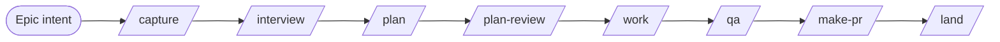
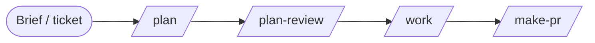
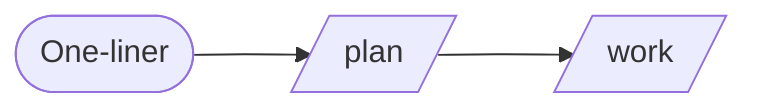

# Pipeline variations - worked routes through the menu

The default pipeline is a menu, not a rail ([root README](https://github.com/gmickel/flow-next/blob/main/README.md#the-pipeline-is-a-menu-not-a-rail)). This page owns the **stage axis**: which stages a given piece of work runs, shown as five worked examples from a full epic down to a docs chore.

> Adjacent, not the same: [`running-lean.md`](running-lean.md) is about which **layers** (subsystems) you switch on at all and what each costs to keep on. This page is about which **stages** one piece of work passes through. [`$flow-next-guide`](../../skills/flow-next-guide/SKILL.md) is the router that answers the question live for one specific situation - this page is the reference it rhymes with, not a second router.

**The variants below are worked examples, not tiers to pick from a list.** They illustrate routes the smallest-sufficient rule produces for five common shapes of work. Your change composes its own route; these show the reasoning, so you can reproduce it, not memorize it.

## The selector is risk and unknowns, not size

Size and complexity correlate with ceremony, but neither is the criterion. The question each stage answers is: **what don't we know yet, and what does it cost to be wrong?**

- A five-line change to auth handling deserves more ceremony than a five-hundred-line refactor of well-understood code.
- Every stage exists either to **convert an unknown into a known** - interview burns down requirement unknowns, plan-review burns down design risk, QA burns down runtime-behavior risk - or to **bound the cost of being wrong**: gates, receipts, and review make a bad outcome visible and cheap instead of silent and compounding.
- When a stage has no unknown left to convert and no risk left to bound, it is ceremony. Skip it - and record the skip (see [What holds on every route](#what-holds-on-every-route)).

Three questions pick the route:

1. **What's unknown?** Requirements unclear → capture + interview. Design contested → plan-review. Runtime behavior unproven → QA. Nothing unknown → straight to work.
2. **What breaks if we're wrong?** High blast radius (auth, data, money, public API) justifies review stages even on a small diff. Low blast radius on a large diff may need none beyond the standard review contract.
3. **Who else needs the record?** A team consuming handover objects, a tracker audience, or an autonomous loop that must re-anchor from files all pull toward the fuller spec surface. Solo, present, at the keyboard pulls lean.

## Before the pipeline: discovery is upstream, often already done

[`$flow-next-prospect`](../../skills/flow-next-prospect/SKILL.md) (ranked candidates) and [`$flow-next-chart`](../../skills/flow-next-chart/SKILL.md) (decision-map discovery for one oversized, unclear idea) are **upstream of every variant, not stages of any of them**. In most organizations their work already happened under another name: a roadmap, a product brief, a groomed backlog item *is* prospect/chart output. Reach for them only when no shaped intent exists yet - when you cannot state the outcome in a sentence.

The pipeline proper starts where shaped intent exists: at **capture** (turn the intent into a spec) or directly at **plan** (when the intent is already sharp enough to decompose).

## The variants

| Variant | Driving signal | Route |
|---|---|---|
| [Epic](#epic) | Many requirement unknowns, high blast radius, multi-task scope | capture → interview → plan → plan-review → work → qa → make-pr → land |
| [Feature, requirements known](#feature-requirements-known) | Design risk remains; requirements already clear | plan → plan-review → work → make-pr |
| [Small task](#small-task) | Low risk, one implementation context, no real unknowns | plan → work (or `work "idea text"`) |
| [Bug or defect](#bug-or-defect) | The unknown is the *cause*; the risk is regression | work + regression test as the R-ID |
| [Docs or chore](#docs-or-chore) | Near-zero risk, fully known | direct change → triage-skip receipt → PR |

### Epic

**Signal:** a large intent with many requirement unknowns and real blast radius - the kind of work several people will touch and an autonomous loop may finish.



The pattern that works in practice: **capture the entire epic, then let the machinery scope it.** Capture proposes whether the input is one spec or a dependency-sorted set (the epic-split proposal), and source-tags every criterion `[user]` / `[paraphrase]` / `[inferred]`. Then **interview sharpens** exactly what is soft - the `[inferred]` lines, the requirement someone should pressure-test - rather than re-litigating the whole spec. Plan decomposes into waved tasks, plan-review burns down design risk before code exists, work executes in fresh-context workers, QA drives the live app when there is one, and land babysits the PRs to merged. Every stage earns its place because every stage has an unknown to convert or a risk to bound.

### Feature, requirements known

**Signal:** requirements are already clear - a good brief or ticket exists, or the team already argued this out - but design risk remains.



Capture and interview are skipped because their unknown is already converted: the requirements exist. Plan turns the brief into R-IDs and tasks; plan-review is kept because the design is where the remaining risk lives. What still holds: R-IDs, gates, review, receipts - the full evidence chain from plan onward.

### Small task

**Signal:** low risk, fits one implementation context, nothing genuinely unknown.



```bash
$flow-next-plan "rename the config key"   # minimal spec + one task
$flow-next-work fn-N
```

Or skip the explicit plan call entirely: `$flow-next-work "rename the config key"` accepts idea text and mints the minimal spec + task itself, and `$flow-next-work fn-N.M` runs one task of an existing spec without looping to the next. Spec-less is a UX affordance, not a data model - a spec always exists underneath, which is why the contracts still hold: `flowctl done` demands evidence JSON on this route exactly as on the slowest one, the green receipt gates completion, and the review contract the change needs still applies.

### Bug or defect

**Signal:** the unknown is not the requirements - it's the **cause**. The risk is regression.


The sharpening tool for a defect is **reproduction, not conversation** - an interview is usually the wrong instrument here. Reproduce the bug as a failing test and make that test the R-ID: the requirement *is* "this no longer happens, provably." Entry is `$flow-next-work "fix: <report>"` for a direct fix, or `$flow-next-capture` when the diagnosis conversation itself carries decisions worth locking down (a root-cause discussion that ruled out approaches is spec material). What still holds: the regression test, review, receipts.

### Docs or chore

**Signal:** near-zero risk, fully known - lockfile bumps, docs-only edits, release chores, regenerated files.


The change is made directly; `flowctl triage-skip --base <ref>` deterministically verdicts qualifying diffs (docs-only, lockfile-only, release-chore, generated-only) and **writes a receipt with `mode: triage_skip`** ([`spec-template.md`](spec-template.md#trivial-diff-skip)). That receipt is the whole point: the review pass is skipped, and the skip is recorded, never silent.

## What holds on every route

Skipping a stage never skips the **evidence, consent, or review contract** that stage would have provided - the contract just gets satisfied by a cheaper mechanism or recorded as deliberately not needed:

- **Evidence:** `flowctl done` requires evidence JSON (commits, test commands) on every variant. There is no route where a task closes on narration.
- **Gates and receipts:** green receipts, review receipts, and QA verdict receipts gate the same transitions regardless of how much ceremony preceded them.
- **Recorded skips:** every orchestrated stage records `ran`, `skipped(reason)`, or `failed(reason)` in the receipts it already writes - read back with `flowctl usage --stages <spec-id>`. A stage you deliberately left off is an explicit entry with your reason attached, not a silent absence ([`running-lean.md`](running-lean.md#a-lean-run-still-leaves-a-record)).
- **Review:** the review path scales with the risk (a cross-model backend, an in-host pass, or a triage-skip receipt) but some review artifact exists on every route. The dial from a cross-model backend down to `host` or `none`, and what each setting keeps running, is priced in [`running-lean.md`](running-lean.md#turning-the-dial-none-and-host).

That set - gates, receipts, evidence, review - is the verification spine (the docs-site page *Verification Spine* is its long-form treatment). The variants differ in which unknowns they pay to convert; none of them touches the spine.

The capture and plan closers apply this doc's rule at the decision point: each prints one `Recommended next:` line judged against the risk-and-unknowns selector above, right where the route is chosen.

## See also

- [`../../../README.md`](https://github.com/gmickel/flow-next/blob/main/README.md#the-pipeline-is-a-menu-not-a-rail) - the menu-not-a-rail doctrine and the composition moves (chain, prompt-into, reorder, parallelize).
- [`../skills/flow-next-guide/SKILL.md`](../../skills/flow-next-guide/SKILL.md) - `$flow-next-guide`, the live router: one situation in, the smallest sufficient route out.
- [`../skills/flow-next-capture/workflow.md`](../../skills/flow-next-capture/workflow.md#phase-6-suggested-next-step-r16) - capture's Phase 6 closer, which judges the just-written spec against this doc's rule and prints its `Recommended next:` line.
- [`../skills/flow-next-plan/references/next-steps-menu.md`](../../skills/flow-next-plan/references/next-steps-menu.md) - plan's interactive menu, which applies this doc's rule to the plan-review-vs-work decision.
- [`running-lean.md`](running-lean.md) - the layer axis: which subsystems to run at all, priced.
- [`teams.md`](teams.md) - the full nine-step lifecycle and the handover objects the epic variant produces.
- [`architecture.md`](architecture.md) - what `.flow/` holds regardless of route.
