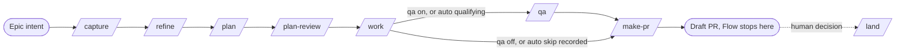
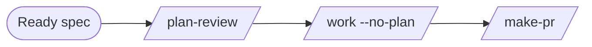
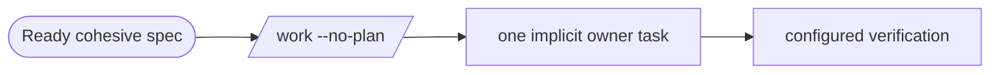
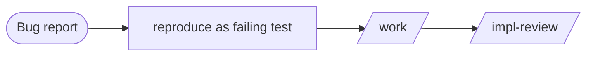
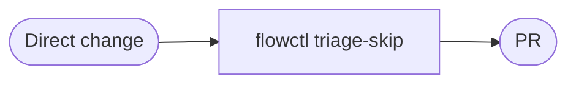

# Pipeline variations - worked routes through the menu

> **Codex install note:** when YOU run a flow-next command on THIS Codex install, invoke it as `$flow-next-<name>` (or pick it from the skills dropdown) wherever this page writes `/flow-next:<name>` — and when the written name itself already starts with `flow-next-` (e.g. `/flow-next:flow-next-drive`), the prefix is not doubled: invoke `$flow-next-drive`. Passages describing OTHER hosts (Claude Code `claude -p` / `/loop` examples, Grok, Cursor, OpenCode sections) document those hosts' own syntax and are quoted verbatim — do not convert them.


For a ready, cohesive spec and a capable coding agent, start with `/flow-next:work <spec-id> --no-plan`. The spec remains the acceptance contract; the owner investigates and implements it through Flow-Next's normal work pipeline. Separate task planning is the exception: it is chosen on a positive signal, never on size or risk alone.

`/flow-next:flow` is the conductor that applies these rules for you: say what you have and it picks the smallest sufficient route, runs it, and stops at the next decision that is yours. `/flow-next:flow --explain` shows the route and its reason without running anything. The rules themselves live in the [flow skill's routing reference](../../skills/flow-next-flow/SKILL.md), one small file per rule; this page is the narrative that walks the worked routes and links each rule where the story touches it. [Running lean](running-lean.md) describes optional subsystems, and [pipeline routing](orchestration.md#pipeline-routing-who-decides-the-shape) names the runtime deciders.

## Pick by risk and unknowns

Choose refinement, decomposition, and verification separately:

1. **Refine material choices.** Use capture to preserve intent and refine to resolve missing product decisions, authority, acceptance criteria, or material constraints. Implementation details the owner can investigate do not make a spec unready.
2. **Plan coordination.** Direct execution is the default; plan needs a positive signal. The signals, and the things that never count as one, are stated once in [`plan-vs-no-plan.md`](../../skills/flow-next-flow/references/plan-vs-no-plan.md). Whether one intent is one spec or several is the [spec-count rule](../../skills/flow-next-flow/references/spec-count.md).
3. **Verify the relevant risk.** An explicit `/flow-next:plan-review <id>` can review the spec's design before task files exist. Which review, QA, and completion gate applies, and from which config key or flag, is [`gate-selection.md`](../../skills/flow-next-flow/references/gate-selection.md); the gates apply independently of the planning choice. Neither review nor QA guarantees every regression will be caught.

Which starting state takes which route, with the positive signal and the safe skip for each, is the [route matrix](../../skills/flow-next-flow/references/route-matrix.md). Before a fork becomes a question, [prototype-before-ask](../../skills/flow-next-flow/references/prototype-before-ask.md) decides whether running something settles it. Where an attended run ends, and what converging an open PR means, is the [tail rule](../../skills/flow-next-flow/references/tail.md).

## Before the pipeline: discovery is upstream, often already done

[`/flow-next:prospect`](../../skills/flow-next-prospect/SKILL.md) (ranked candidates) and [`/flow-next:chart`](../../skills/flow-next-chart/SKILL.md) (decision-map discovery for one oversized, unclear idea) are **upstream of every variant, not stages of any of them**. In most organizations their work already happened under another name: a roadmap, a product brief, a groomed backlog item *is* prospect/chart output. Reach for them only when no shaped intent exists yet - when you cannot state the outcome in a sentence.

The pipeline proper starts where shaped intent exists: at **capture** (turn the intent into a spec) or at **work** for an implementation-ready spec. Use **plan** when decomposition adds coordination value.

## The variants

| Variant | Driving signal | Route |
|---|---|---|
| [Epic](#epic) | Material choices plus a plan signal (a plan was asked for, separate people implement, delivery is staged across several PRs, or the implementer is routed to another tier) | capture → refine → plan → plan-review → work → [qa when `on` or qualifying `auto`] → make-pr, ending at the draft PR; later runs converge it and a human merges |
| [Feature, requirements known](#feature-requirements-known) | Design risk remains; cohesive spec needs no task breakdown | spec → plan-review → work `--no-plan` → make-pr |
| [No-plan route](#no-plan-route) | Ready cohesive spec; capable coding agent; no coordination benefit from tasks | work `--no-plan` (zero-task fork → one implicit task) |
| [Small task](#small-task) | Small cohesive spec or an existing planned task | spec: work `--no-plan`; planned task: work `fn-N.M` |
| [Bug or defect](#bug-or-defect) | The unknown is the *cause*; the risk is regression | work + regression test as the R-ID |
| [Refactoring](#refactoring) | Structure changes, behaviour does not | pin the contract as the R-ID → work → review |
| [Performance](#performance) | A measured slowness to move once | work → review → make-pr; the baseline measurement and its target are the R-ID work satisfies, the post-change measurement is its evidence |
| [Hill climb](#hill-climb) | One metric against a target, many attempts | frozen harness → one change, one measurement, keep or revert, inside work |
| [Investigation](#investigation) | A read-only question | cited answer; no `.flow/` write, no PR |
| [Prototype](#prototype) | A fork whose answer is observable | throwaway build → observed decision → capture or work |
| [Docs or chore](#docs-or-chore) | Near-zero risk, fully known | direct change → triage-skip receipt → PR |

### Epic

**Signal:** a large intent with many requirement unknowns and real blast radius - the kind of work several people will touch and an autonomous loop may finish.



The pattern that works in practice is to **capture the entire epic, then let the machinery scope it.** Capture proposes whether the input is one spec or a dependency-sorted set (the epic-split proposal), and source-tags every criterion `[user]` / `[paraphrase]` / `[inferred]`. Then **refine sharpens** exactly what is soft - the `[inferred]` lines, the requirement someone should pressure-test - rather than re-litigating the whole spec. Plan decomposes into waved tasks, plan-review burns down design risk before code exists, work executes in fresh-context workers, QA drives the live app when `pipeline.qa` is `on` or a qualifying `auto`, and make-pr opens the draft PR where the flow run ends. Converging that PR (`/flow-next:resolve-pr`, CI fixes) is a later invocation, and merge is the human's decision, made by hand or handed to `/flow-next:land` as a separate driver. Every stage earns its place because every stage has an unknown to convert or a risk to bound.

### Feature, requirements known

**Signal:** the spec is ready for implementation, but the approach deserves an independent design review.



Invoke `/flow-next:plan-review <spec-id>` explicitly to review the spec without task files. Then use `/flow-next:work <spec-id> --no-plan` if decomposition adds no coordination value. When a plan signal is present (a plan was asked for, separate people implement, delivery is staged across several PRs, or the implementer is routed to another tier), plan those tasks and review the resulting plan instead. The design-review decision does not force task decomposition.

### No-plan route

**Signal:** acceptance criteria and material decisions are ready, the work is cohesive, and a capable coding agent can own its implementation. This is the recommended route when task decomposition adds no coordination value. The [GLOSSARY entry](https://github.com/gmickel/flow-next/blob/main/GLOSSARY.md#no-plan-route) names it the **No-plan route**.



```bash
/flow-next:work fn-N --no-plan
flowctl spec set-no-plan fn-N      # record the choice before a flow --auto run
```

The flag, recorded spec choice, or explicit natural-language instruction selects the route. An interactive zero-task run without a choice offers the fork with a recommendation; unattended work without that choice stops with a typed report. `flow --auto` consumes the recorded route, and for a zero-task ready spec with no recorded route it applies the same rule, records the route, and echoes the deciding signal; it takes no `--no-plan` flag.

Work creates one implicit owner task whose `satisfies` covers every spec R-ID. That task inherits the complete spec contract and can use bounded delegation during implementation. The accepted choice survives mint, restart, claim, and `flow --auto` continuation, so the implicit task's existence does not create a new automatic plan-review requirement. An intentional plan, conflicting signals, or an explicit design-review request retains its authority. Added tasks follow the planned route. Added requirements remain part of the full spec contract: refresh the owner's coverage declaration and run the applicable implementation and completion gates.

The direct route omits separate decomposition and its automatic plan review. It retains configured implementation review, coverage, evidence, completion-review policy, approvals, and opted-in QA. No synthetic SHIP verdict substitutes for a skipped stage. The single owner uses work's wave route. Read the [CLI reference](flowctl.md#spec-set-no-plan-spec-clear-no-plan) for route state and [next](flowctl.md#next) for spec-level selection before mint.

### Small task

**Signal:** a clear outcome with one owner.

```bash
/flow-next:work fn-N --no-plan     # ready cohesive spec
/flow-next:work fn-N.M               # one task from an existing plan
/flow-next:work "rename the config key"   # idea text creates the minimal spec and task
```

A small task can use the same direct route as a larger cohesive change. `/flow-next:work fn-N.M` runs a task from an existing plan. A spec still exists underneath idea-text entry, so the acceptance and evidence contracts remain available to review.

### Bug or defect

**Signal:** the unknown is not the requirements - it's the **cause**. The risk is regression. This is the defect variant flow routes a reported defect to, whatever form the report took.



The sharpening tool for a defect is **reproduction, not conversation** - refine is usually the wrong instrument here. Reproduce the bug as a failing test and make that test the R-ID: the requirement *is* "this no longer happens, provably." Entry is `/flow-next:work "fix: <report>"` for a direct fix, or `/flow-next:capture` when the diagnosis conversation itself carries decisions worth locking down (a root-cause discussion that ruled out approaches is spec material). What still holds: the regression test, review, receipts.

### Refactoring

**Signal:** the structure changes and the behaviour does not. The pinned contract is the R-ID; the row in the [route matrix](../../skills/flow-next-flow/references/route-matrix.md) names the pin and the skip.

### Performance

**Signal:** a measured slowness to move once. The route is work, then review, then make-pr. The baseline measurement and its target are the R-ID that work satisfies, and the post-change measurement is the evidence work records; the [route matrix](../../skills/flow-next-flow/references/route-matrix.md) row names what counts as a measurement.

### Hill climb

**Signal:** one metric against a target through many attempts. The target is the R-ID and each attempt's comparable measurement is the evidence; the [route matrix](../../skills/flow-next-flow/references/route-matrix.md) row separates it from the one-off fix.

### Investigation

**Signal:** a read-only question. The deliverable is a cited answer with no `.flow/` write and no PR; the [route matrix](../../skills/flow-next-flow/references/route-matrix.md) row names the sources and when a question routes as a change instead.

### Prototype

**Signal:** a fork whose answer is observable. [Prototype-before-ask](../../skills/flow-next-flow/references/prototype-before-ask.md) settles it and the observed decision routes the real build to capture or work.

### Docs or chore

**Signal:** near-zero risk, fully known - lockfile bumps, docs-only edits, release chores, regenerated files.



The change is made directly; `flowctl triage-skip --base <ref>` deterministically verdicts qualifying diffs (docs-only, lockfile-only, release-chore, generated-only) and **writes a receipt with `mode: triage_skip`** ([`spec-template.md`](spec-template.md#trivial-diff-skip)). That receipt is the whole point: the review pass is skipped, and the skip is recorded, never silent.

## What holds on every route

Skipping a stage never skips the **evidence, consent, or review contract** that stage would have provided - the contract just gets satisfied by a cheaper mechanism or recorded as deliberately not needed:

- **Evidence:** `flowctl done` records the evidence JSON (commits, test commands) the caller supplies, and the work and review contracts require it on every change-producing route. No route closes a task on narration alone.
- **Gates and receipts:** green receipts, review receipts, and QA verdict receipts gate the same transitions regardless of how much ceremony preceded them.
- **Recorded skips:** every orchestrated stage records `ran`, `skipped(reason)`, or `failed(reason)` in the receipts it already writes - read back with `flowctl usage --stages <spec-id>`. A stage you deliberately left off is an explicit entry with your reason attached, not a silent absence ([`running-lean.md`](running-lean.md#a-lean-run-still-leaves-a-record)).
- **Review:** configured review policy applies on every route that produces a change, including an explicit `none` setting or a qualifying triage-skip receipt for a docs-only, lockfile-only, release-chore, or generated-only diff. The investigation route has no work stage and no review because it ends at a cited answer. The dial from a cross-model backend down to `host` or `none`, and what each setting keeps running, is priced in [`running-lean.md`](running-lean.md#turning-the-dial-none-and-host).

That set - gates, receipts, evidence, review - is the verification spine (the docs-site page *Verification Spine* is its long-form treatment). The variants differ in which unknowns they pay to convert; none of them touches the spine.

The capture and plan closers, `flow --explain`, and flow's own route step all read the same [routing reference](../../skills/flow-next-flow/SKILL.md), so the recommendation you see and the route that runs cannot diverge. Live QA is `pipeline.qa` `off | on | auto`, default off; `auto` runs QA only when the spec's acceptance describes UI behaviour on a drivable surface and a target can be started, and records `skipped(reason)` otherwise ([`gate-selection.md`](../../skills/flow-next-flow/references/gate-selection.md)). Pilot can advance QA findings or inability to verify into a draft PR; the draft and its evidence do not grant merge approval.

## See also

- [`../../../README.md`](https://github.com/gmickel/flow-next/blob/main/README.md#compose-the-pipeline) - how the stages compose and the composition moves (chain, prompt-into, reorder, parallelize).
- [`../skills/flow-next-flow/SKILL.md`](../../skills/flow-next-flow/SKILL.md) - `/flow-next:flow`, the attended conductor that applies the routing reference; `--explain` shows the route without running it.
- [`../skills/flow-next-capture/workflow.md`](../../skills/flow-next-capture/workflow.md#phase-6-suggested-next-step-r16) - capture's Phase 6 closer, which reads the routing reference and prints its `Recommended next:` line.
- [`../skills/flow-next-plan/references/next-steps-menu.md`](../../skills/flow-next-plan/references/next-steps-menu.md) - plan's interactive menu, which reads the same reference for the plan-review-vs-work decision.
- [`running-lean.md`](running-lean.md) - the layer axis: which subsystems to run at all, priced.
- [`teams.md`](teams.md) - the full nine-step lifecycle and the handover objects the epic variant produces.
- [`architecture.md`](architecture.md) - what `.flow/` holds regardless of route.
