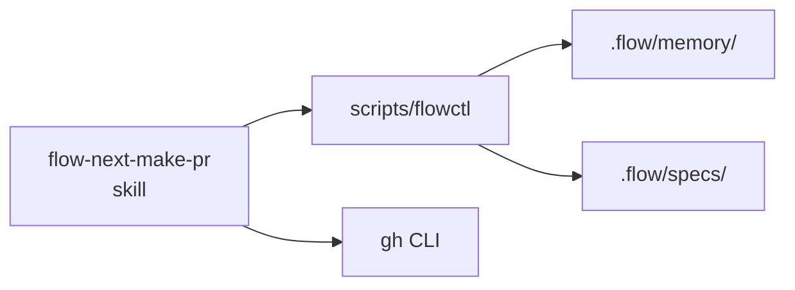
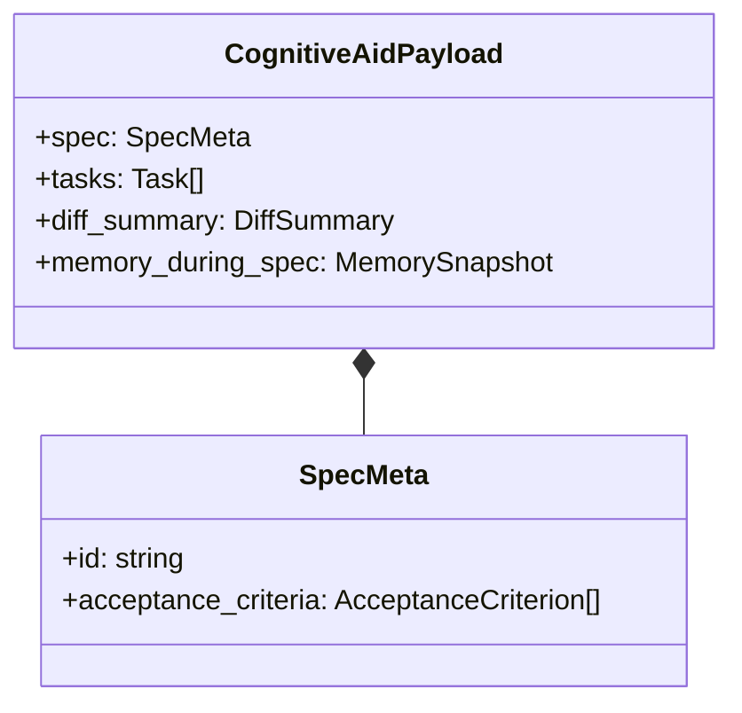
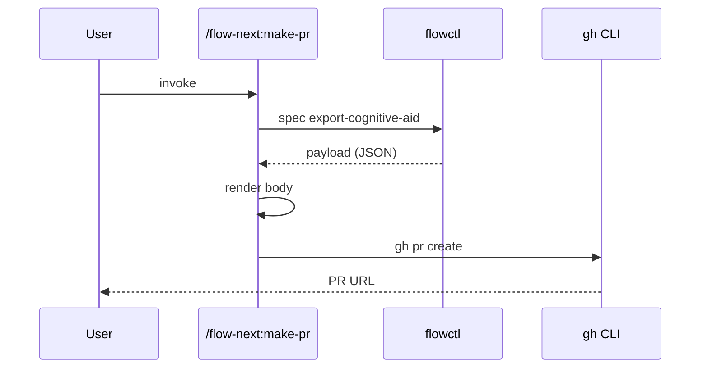
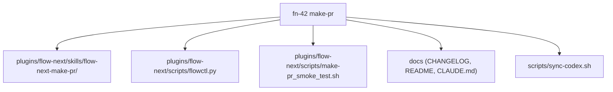

# Mermaid rendering rules — `## Structural changes` codefences

Reference for Phase 3 of `/flow-next:make-pr`. The host agent reads this file once before emitting any mermaid codefence, then validates each rendered diagram against the §6 checklist. Rules here exist because mermaid silently breaks rendering on a small set of recurring inputs — quoting / reserved words / emoji / cycle — and the host agent does not get a parser error from the forge; the diagram simply renders as a code block of mermaid source instead of as a diagram. **Quiet degradation, not loud failure.** Defensive escaping up front is cheaper than re-rendering after a reviewer flags "the diagram didn't render."

The ref file is structured for fast lookup during emission, not for narrative reading. Sections are ordered so the agent can skim top-down: reserved words first (most common silent break), then escapes (second most common), then shape selection (when in doubt), then the final validation checklist (run before emitting).

**Contents:** [§1 reserved words](#1-reserved-words) · [§2 special-character escapes](#2-special-character-escapes) · [§3 shape selection](#3-shape-selection) · [§4 hard caps + allocation](#4-hard-caps) · [§5 prose-summary rule](#5-prose-summary-precedes-diagram-rule-r13) · [§6 pre-emission validation](#6-pre-emission-validation-checklist) · [§7 Phase-3 hallucination guardrails](#7-hallucination-guardrails-phase-3-specifics) · [§8 diff-fenced structural sketches](#8-diff-fenced-structural-sketches-alternate-emission)

---

## 1. Reserved words

Mermaid's parser treats the following identifiers as keywords. Using one as a node id without quoting silently breaks rendering. **Always quote or rename.**

| Reserved word | Why it breaks | Safe alternative |
|---------------|---------------|------------------|
| `end` | Closes a `subgraph` block; bare `end` as a node id is consumed as block terminator | Rename to `endpoint`, `done`, `finish`, or quote: `end["end"]` |
| `default` | Reserved by `classDiagram` for defaults | Rename to `defaultCase`, `fallback` |
| `subgraph` | Starts a subgraph block | Never use as an id; rename |
| `class` | Reserved by `classDiagram` for class declarations | Rename to `kls`, `category` |
| `state` | Reserved by `stateDiagram` | Rename or quote |
| `direction` | Reserved by mermaid for `direction` directives | Rename to `dir`, `orient` |
| `click` | Reserved by mermaid for click handlers | Rename to `clk`, `select` |
| `style` | Reserved for inline styling | Rename to `styl`, quote |
| `o` (single letter) | Special connector glyph in some shapes | Rename to `obj`, `node_o`, quote |
| `x` (single letter) | Special connector glyph (cross) | Rename to `xnode`, `xref`, quote |

**Rule of thumb:** any single-letter id (`a`, `b`, `c`) is fine for examples but a real diagram should use semantic ids — `auth`, `db`, `worker`. The reserved words above are the failure modes; everything else is preference.

---

## 2. Special-character escapes

Labels containing the characters below MUST be quoted. Bare labels with these characters parse incorrectly and either render as truncated text or break the diagram entirely.

| Character | Why it breaks | Quote pattern |
|-----------|---------------|---------------|
| `(` `)` | Mermaid uses parentheses for round-shape syntax: `A(label)` | `A["Label with (parens)"]` |
| `:` | Mermaid uses colon in `classDiagram` member separators and in `sequenceDiagram` lines | `A["Module: section"]` |
| `&` | Reserved for HTML entity prefix in some contexts | `A["Auth & sessions"]` |
| `@` | Used in some link-syntax forms | `A["worker@v2"]` |
| `/` | Path separator confuses some parsers in node ids | `A["src/auth/login.ts"]` |
| `#` | Comment marker in some mermaid contexts | `A["#priority"]` |
| `;` | Statement separator in mermaid | `A["read; write"]` |
| `"` | Closes the quote prematurely | Use HTML entity `#quot;` (decimal) |
| `<` `>` | HTML-injection guard | `A["A &lt; B"]` or escape via `#60;` / `#62;` |

**HTML-entity fallback (decimal codes only — hex codes do NOT render):**

```
"  →  #quot;
#  →  #35;
<  →  #60;
>  →  #62;
&  →  #38;
```

The leading `#` plus decimal digits and trailing `;` is mermaid's documented escape syntax. Hex (`#x22;`) silently fails — always use decimal.

**Quoting always-on rule:** when in doubt, wrap labels in `"..."`. There is no penalty for over-quoting; there is silent rendering failure for under-quoting. The host agent should default to quoted labels for every multi-word node, not just ones containing special characters.

---

## 3. Shape selection

The host agent picks shape from the four documented below:

| Shape | When |
|-------|------|
| `flowchart LR` | Module-level dependency changes (default for trigger 1). Function-shape additions in `public_exports_changed[]`. |
| `classDiagram` | Type / class additions or removals (when `public_exports_changed[]` includes class symbols — e.g. `class Foo`, `class Bar(Base)`). |
| `sequenceDiagram` | New API endpoint or protocol flow (route handlers added — paths in `diff_summary.files[]` matching `routes/`, `handlers/`, `api/`, route-definition keywords in changed-file content). |
| `graph TB` | High-level "spec touches these N areas" overview (default for trigger 5; default when collapsing 4+ diagrams to one). |

**Rule of thumb:** if you can't decide between `flowchart LR` and `graph TB`, pick `flowchart LR` for "A depends on B" stories and `graph TB` for "spec touched these areas" stories. The reader's mental model is different — left-to-right reads as flow, top-to-bottom reads as decomposition.

### Shape decision matrix

The four shapes the skill emits, with one canonical example per shape so the host agent doesn't have to invent syntax from memory:

### 3a. `flowchart LR` — module-level dependency changes

**When:** trigger 1 fires (`cross_module_changes[]` non-empty). New or removed import edges between modules.

**Example:**

````markdown

````

**Notes:** `LR` (left-to-right) reads naturally for "A depends on B" stories. Use `<br/>` for two-line labels in shape brackets; use `\n` only if the surrounding label is quoted. Edge labels go between the arrow ends: `A -->|"reads"| B`.

### 3b. `classDiagram` — type/class additions or removals

**When:** trigger 2 fires AND `public_exports_changed[]` includes class symbols (function additions usually go in `flowchart` instead — `classDiagram` is heavyweight).

**Example:**

````markdown

````

**Notes:** `*--` is composition; `<|--` is inheritance; `-->` is association. **No inheritance cycles** — mermaid silently breaks rendering when `A <|-- B <|-- A`. The host agent verifies the inheritance graph is a DAG before emitting (rule 6 of §6).

### 3c. `sequenceDiagram` — new API endpoint or protocol flow

**When:** trigger 2 fires AND the new public exports include route handlers / RPC endpoints / protocol surfaces.

**Example:**

````markdown

````

**Notes:** `participant X as "Display name"` aliases for readability. `->>` is solid arrow (request); `-->>` is dashed arrow (response). Self-arrows (`S->>S`) document internal state changes.

### 3d. `graph TB` — high-level "spec touches these N areas" overview

**When:** trigger 5 fires (>15 files in >3 distinct modules). The diagram is structural overview, not dependency map — show *what* changed, not *how* things connect.

**Example:**

````markdown

````

**Notes:** `TB` (top-to-bottom) reads naturally for "spec → areas". Group by module, not by file — a leaf labeled `skill (4 files)` beats five sibling leaves. Group-when-it-helps; don't merge if grouping loses load-bearing detail.

---

## 4. Hard caps

| Cap | Value | Why |
|-----|-------|-----|
| Diagrams per PR | 3 | More is clutter; reviewer tunes out |
| Nodes per diagram | 12 | GitHub renderer handles more, but readability collapses past ~12 |
| Edges per diagram | 25 | Same readability cliff |
| Characters per codefence | 12,000 | GitHub truncates above; safe margin (real limit ≈25K but truncation behavior is renderer-dependent) |

When trigger conditions would emit more than 3 diagrams, **collapse to one high-level overview** (`graph TB`). When a single diagram would exceed 12 nodes, **group by module / abstraction** (e.g. "5 scout agents" → one node labeled `scouts (5)`). Do not silently truncate — that loses signal; explicit grouping preserves it.

**Allocation rule when triggers exceed 3 diagrams:**

```
Triggers 1+2 fire (cross-module + public exports) → emit 1 flowchart LR combining both
Triggers 3+4 fire (new dir + removed dir) → emit 1 graph TB showing both as additions/removals
Trigger 5 fires alone → emit 1 graph TB overview
Triggers 1+2+3 fire → 1 flowchart LR + 1 graph TB (still under cap)
Triggers 1+2+3+5 fire → 1 graph TB overview only (cap collapses 4 candidate diagrams to one)
```

The collapse-to-one rule prefers `graph TB` when the alternative is more than 3 separate diagrams — overview beats fragmented detail. When the collapse would drop a structural concern the reviewer needs, a diff-fenced structural sketch (§8) may carry that concern instead — sketches are outside the 3-diagram cap.

**Node-cap grouping rule:** when a flowchart or classDiagram would have >12 nodes, group siblings by abstraction. `flowchart LR` example:

````
Bad (15 nodes):
  skill --> agent_A
  skill --> agent_B
  skill --> agent_C
  skill --> agent_D
  skill --> agent_E
  ... (11 more)

Good (3 nodes):
  skill --> scouts["scouts (5)"]
  skill --> workers["workers (3)"]
  skill --> validators["validators (2)"]
````

The grouped label keeps the fan-out signal without burying it in 15 visually-similar nodes.

---

## 5. Prose-summary-precedes-diagram rule (R13, load-bearing)

Every mermaid codefence is preceded by a one-paragraph prose summary in plain language describing the structural change. The diagram is **supplementary**; the prose is **load-bearing**.

This is for two distinct readers:

1. **Forges that don't render mermaid.** Some self-hosted Gitea / Bitbucket installs / older GitHub Enterprise versions don't render mermaid codefences. The prose ensures the structural change still lands.
2. **Reviewers who skim diagrams.** A diagram is a glance, not a read. The prose tells the reviewer what they're looking at and why; the diagram lets them verify it visually. Together, both surfaces serve different cognitive modes.

Prose is not a caption ("Figure 3: Module dependencies"). It is a self-contained explanation. If you removed the diagram, the prose alone should still convey the structural change.

**Pattern (the full section shape — one prose paragraph per codefence):**

```markdown
## Structural changes

[Paragraph 1: 3-5 sentences in plain language describing what changed structurally
and why it matters. Anchored to file paths from `diff_summary.files[]`. No jargon.]

​```mermaid
[diagram 1]
​```

[Paragraph 2 (only if more than one diagram): same shape — plain-language structural
description, anchored to paths.]

​```mermaid
[diagram 2]
​```
```

**Prose rules:**

- **Three to five sentences.** Shorter = doesn't justify a diagram; longer = the diagram itself becomes redundant.
- **Plain language.** No jargon ("the IoC container ratifies the dependency injection contract" — no). The reader includes reviewers who didn't write the spec.
- **Anchored.** Every file path mentioned in the prose appears in `diff_summary.files[]`. Same hallucination guardrail as Critical changes (rule 1 of §2.5).
- **Self-contained.** If you removed the diagram, the prose alone should still convey the structural change.
- **Not a caption.** Don't write "Figure 1: Module dependencies." Write the explanation directly.
- **Never quote diff content.** Same rule as the rest of the body — paths, churn, modules; no code.

When `--no-mermaid` is set the section is omitted entirely (R14, §3.0); prose summaries are NOT emitted standalone — they exist to frame the diagrams, not replace them. (See §3.0 for the rationale.)

---

## 6. Pre-emission validation checklist

The host agent runs this checklist on every codefence before committing it to the body. If any rule fails, **re-render with the issue corrected** rather than emit a broken diagram.

1. **Quotes balanced.** Every `"` opens and closes; HTML entities (`#quot;`) used inside quoted labels.
2. **No bare `end` (or other reserved word from §1) as a node id.** Reserved words are quoted or renamed.
3. **No emoji in labels.** Mermaid silently breaks rendering on emoji in some renderers (notably older GitHub Enterprise). Use words: "tick" not "✓", "warning" not "⚠️".
4. **No MathJax / LaTeX syntax.** `$x$`, `\frac{a}{b}`, `\(...\)` all silently break. If math is genuinely required, render externally and link.
5. **No relative or internal-anchor links.** Mermaid `click` directives need absolute URLs or omit the link entirely. `click A "../foo.md"` silently fails on most forges; use `click A "https://github.com/owner/repo/blob/main/foo.md"` or omit.
6. **classDiagram: no inheritance cycles.** `A <|-- B <|-- A` and longer cycles silently break rendering. Verify the inheritance graph is a DAG before emitting.
7. **flowchart / graph: subgraph names MUST NOT collide with any node id.** `subgraph "Docs" ... Docs[...]` triggers a "Setting Docs as parent of Docs would create a cycle" error and the diagram fails to render — GitHub shows an "Unable to render rich display" banner instead. **Validated empirically on PR #131 during fn-42 dogfood.** The cycle detector treats the inner node as a child of its same-named parent subgraph. Fix: rename the inner node (`DocSurfaces`, `DocFiles`) OR rename the subgraph (`"Documentation"`, `"Docs and CHANGELOG"`). Quoting the name does NOT help — both `"Docs"` and bare `Docs` collide with the node id `Docs`. Run the check by listing every `subgraph "<name>"` line and every `<id>[...]` / `<id>(...)` node id; the two sets must be disjoint.
8. **flowchart: arrow-character preference.** Use `-->` (solid arrow), `-.->` (dashed arrow), `==>` (thick arrow). Avoid ambiguous shapes like `--o` / `--x` unless the connector glyph is intentional — they look like typos in code review.
9. **Total chars ≤12K per codefence.** Count the characters between the opening `​```mermaid` and closing `​````. If above, collapse / group / split.

The checklist is the agent's last line of defense before silent rendering failure. **Run it on every codefence, every time.** A 30-second checklist run is cheaper than a reviewer comment that says "the diagram didn't render."

Run it *before* committing a codefence to the body. Do NOT emit a known-broken diagram and hope the reviewer catches it — mermaid breaks silently (the codefence renders as code, not as a diagram), so the reviewer's "the diagram looks weird" feedback is the only signal.

**Re-render loop:** if validation fails, the agent identifies which rule failed, applies the fix from the rule's section above (e.g. rule 1 says "quote labels containing parens" — agent re-renders with `A["Label with (parens)"]` instead of `A(Label with parens)`), then re-runs the checklist. Loop until all 8 rules pass. **Do not emit a partial fix and proceed.**

---

## 7. Hallucination guardrails (Phase 3 specifics)

The §2.5 hallucination guardrails apply to Phase 3 with these specific reinforcements:

- **No invented modules.** Every node in a diagram representing a module must correspond to a path in `diff_summary.modules_touched[]` or to a path in `diff_summary.files[]`. **Never** invent a "Helper module" that doesn't appear in the diff.
- **No invented edges.** Every edge in `flowchart`/`classDiagram` must correspond to a real signal: an entry in `cross_module_changes[]` (for "A imports B"), or a real composition relationship visible in `public_exports_changed[]` content, or a route → handler relationship visible in the diff. **Never** infer a `A --> B` edge from "it would make sense if A used B."
- **No invented symbol names.** Class members in `classDiagram` come from `public_exports_changed[].added[]` only. Never derive from spec language.
- **No "for clarity" embellishment.** If a diagram has 6 real nodes and the agent thinks "adding 2 more would explain it better" — don't. The 6 are what changed. Adding context nodes that didn't change in this diff dilutes the signal.

When in doubt: **fewer nodes, fewer edges, more honest.** A diagram with 4 nodes and 3 edges that all trace to the diff is a better cognitive aid than one with 12 nodes where 6 of them are inferred context.

---

## 8. Diff-fenced structural sketches (alternate emission)

Mermaid is not the only shape `## Structural changes` may emit. A **diff-fenced structural sketch** — diff syntax applied to a file tree or a call tree — is licensed as an alternate to (or complement of) a diagram in exactly two situations, and carries the same signal with no silent-rendering-failure risk: a ` ```diff ` fence renders as colored text on every forge and in every terminal.

**When a sketch is licensed:**

1. **The collapse-to-one rule (§4) would fire** — more than 3 candidate diagrams, so the cap forces a single `graph TB` overview and detail the reviewer needs gets dropped. Emit the overview plus a sketch (or a sketch alone) instead of losing the concern.
2. **A trigger fires marginally** — the diagram a trigger would produce has fewer than 4 nodes. A 2- or 3-node mermaid graph costs a render round-trip to say what one small text sketch says outright.

Outside those two situations, mermaid stays the default emission for `## Structural changes`; a sketch is not a general substitute.

**Shapes:** file tree (where the change lands) or call tree (what the control flow gains or loses). Match the shape to the topic; do not invent a third form here.

File-layout change:

````markdown
```diff
 src/
 |-- ingest/
+|   `-- dedupe.ts        # drops repeated events
 |-- index/
-`-- query.ts
+`-- query/
+    |-- parser.ts
+    `-- ranker.ts
```
````

Call-tree change:

````markdown
```diff
 startMission
   resolveFleet
     claimSeat
+    verifyAuth
     openSession
-  streamEvents
+  streamEvents
+    replayBacklog
```
````

**Rules a sketch inherits unchanged:**

- **§7 hallucination guardrails.** Every path in a sketch comes from `diff_summary.files[]` (or `diff_summary.modules_touched[]`); every call edge traces to `cross_module_changes[]` or to a real relationship visible in the diff. No invented nodes, no "for clarity" context lines. Fewer lines, more honest.
- **§5 prose-summary-precedes-diagram (R13).** A sketch is a visual: the same 3-5 sentence plain-language prose paragraph precedes it, anchored to real paths, self-contained without the sketch.
- **Never quote diff content.** Paths, tree shape, and call names only — no code lines lifted from the diff.

**Cap interaction:** sketches do **not** count against the 3-diagram mermaid cap in §4 — that cap exists for mermaid render clutter. Judgment still applies: one or two sketches, never a wall of them.

**`--no-mermaid`:** unchanged semantics. The flag short-circuits Phase 3 entirely (§3.0 of `workflow.md`), so `## Structural changes` is omitted as a whole section — no diagrams, no prose, **and no sketches**. `--no-mermaid` means "no structural-changes section," not "diagrams off, text on."

**§6 does not apply.** The pre-emission checklist targets mermaid parser failures; a diff fence has none. The guardrails above are the whole contract for a sketch.
