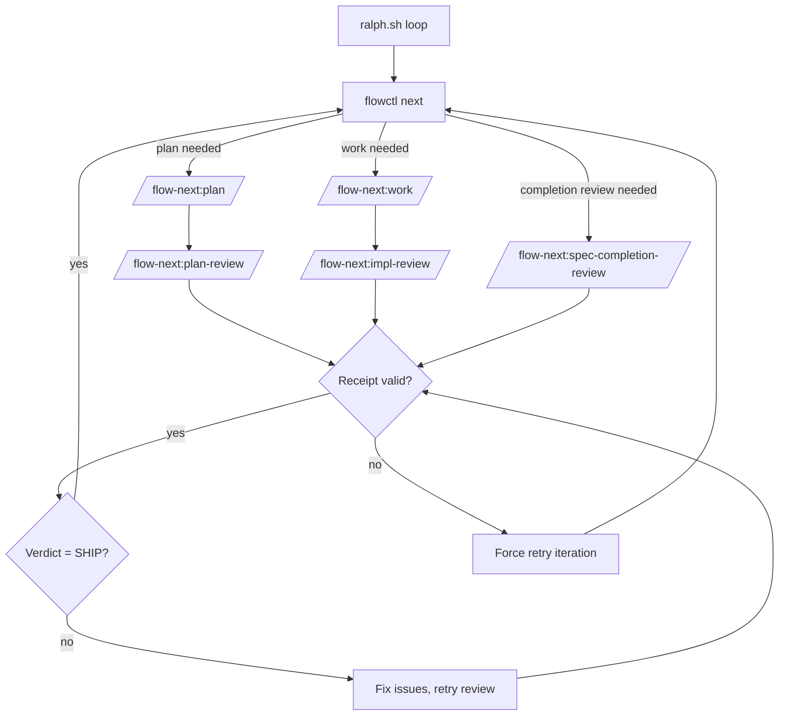

# Ralph — Autonomous Loop

Ralph is Flow-Next's repo-local **hardened** autonomous harness. It exists because long-lived autonomous sessions accumulate failed attempts and stale assumptions — Ralph instead starts a *fresh* session per iteration, re-anchors, and gates every transition on receipts. It consumes **fully planned** specs only (it never plans), applies multi-model review gates, and produces production-quality code overnight.

> **TL;DR**: External shell loop → fresh Claude session per task → cross-model review gates → receipt-based proof-of-work → iterate until SHIP.
>
> **Which loop do I want?** The default autonomy path is the in-session **pilot + land pipeline** (`/loop 10m /flow-next:pilot` to build, `/loop 30m /flow-next:land` to ship) — zero scaffold, transcript verdicts, host-driven. Reach for Ralph when a run outlasts a session or prose guardrails aren't enough: Ralph owns the loop in a shell script with hook-enforced guardrails. The two are alternative drivers for the same pipeline and are **never nested**. See [Host-driven loop vs Ralph](#host-driven-loop-vs-ralph).

---

## Table of Contents

- [Quick Start](#quick-start)
- [Architecture](#architecture)
  - [How It Works](#how-it-works)
  - [Why Ralph vs ralph-wiggum](#why-ralph-vs-ralph-wiggum)
  - [Host-driven loop vs Ralph](#host-driven-loop-vs-ralph)
- [Quality Gates](#quality-gates)
  - [Multi-Model Reviews](#1-multi-model-reviews)
  - [Plan Review Gate](#plan-review-gate)
  - [Receipt-Based Gating](#2-receipt-based-gating)
  - [Review Loops Until SHIP](#3-review-loops-until-ship)
  - [Memory Capture](#4-memory-capture-opt-in)
- [Configuration Reference](#configuration-reference)
- [Review Backends](#review-backends)
  - [RepoPrompt](#repoprompt-integration)
  - [Codex CLI](#codex-integration)
- [Run Artifacts](#run-artifacts)
- [Controlling Ralph](#controlling-ralph)
- [Testing & Debugging](#testing--debugging)
- [Safety & Isolation](#safety--isolation)
  - [Docker Sandbox](#docker-sandbox)
  - [DCG (Destructive Command Guard)](#dcg-destructive-command-guard)
  - [Guard Hooks](#guard-hooks)
- [Troubleshooting](#troubleshooting)
- [Morning Review Workflow](#morning-review-workflow)

---

## Quick Start

Ralph is **fully opt-in**. Fresh plugin installs register **zero hooks** and spawn no guard process in any session. Enabling Ralph is `/flow-next:ralph-init` (or setup's Ralph **Yes** path): the host agent scaffolds `scripts/ralph/` and merges fingerprinted guard entries into project settings. Claude Code's project-hooks trust prompt is the consent gate; setup asks with default **No**. Until that ceremony completes, non-Ralph sessions pay nothing. The zero-overhead claim is literal for users who never opt in.

### 1. Initialize (scaffold + register hooks)

```bash
# Inside Claude Code
/flow-next:ralph-init

# Or from terminal
claude -p "/flow-next:ralph-init"
```

Creates `scripts/ralph/` with:

| File | Purpose |
|------|---------|
| `ralph.sh` | Main loop |
| `ralph_once.sh` | Single iteration (testing) |
| `ralphctl.py` | Run control: pause / resume / stop / status (not in flowctl core) |
| `config.env` | All settings |
| `hooks/ralph-guard` (+ `.py`) | Project-local guard invoked by registered hooks |
| `runs/` | Artifacts and logs |

Also merges host-appropriate hook entries into project settings (Claude: `.claude/settings.json`; Droid: `.factory/hooks.json`; Codex: `.codex/hooks.json` shell+Stop subset; Cursor: scaffold only). Fingerprint: command string contains `scripts/ralph/hooks/ralph-guard`. Idempotent re-run; never clobbers unrelated hooks. See [platforms.md](platforms.md) for per-host detail.

**Upgrade:** After a flow-next upgrade that removed plugin-level hooks, existing Ralph users must re-run `/flow-next:ralph-init` so project hooks re-register and `ralphctl.py` lands under `scripts/ralph/`.

### 2. Configure

Edit `scripts/ralph/config.env`:

```bash
PLAN_REVIEW=codex   # rp, codex, or none
WORK_REVIEW=codex   # rp, codex, or none
```

### 3. Test

```bash
scripts/ralph/ralph_once.sh
```

> **Always test first.** Runs one iteration then exits. Observe before committing to a full run.

### 4. Run

```bash
scripts/ralph/ralph.sh
```

Ralph spawns Claude sessions via `claude -p`, loops until done, and applies review gates.

**Watch mode** — see activity in real-time:

```bash
scripts/ralph/ralph.sh --watch           # Tool calls only
scripts/ralph/ralph.sh --watch verbose   # Include model responses
scripts/ralph/ralph.sh --config alt.env  # Use alternate config file
```

### 5. Monitor (Optional)

```bash
bun add -g @gmickel/flow-next-tui
flow-next-tui
```

Real-time TUI for task progress, streaming logs, and run state.


### Uninstall

Run manually in terminal:

```bash
rm -rf scripts/ralph/
```

---

## Architecture

### How It Works

```
┌─────────────────────────────────────────────────────────────┐
│  scripts/ralph/ralph.sh                                      │
│  ┌────────────────────────────────────────────────────────┐  │
│  │  while flowctl next returns work:                      │  │
│  │    1. claude -p "/flow-next:plan" or :work             │  │
│  │    2. check review receipts                            │  │
│  │    3. if missing/invalid → retry                       │  │
│  │    4. if SHIP verdict → next task                      │  │
│  └────────────────────────────────────────────────────────┘  │
└─────────────────────────────────────────────────────────────┘
```



### Why Ralph vs ralph-wiggum

Anthropic's official ralph-wiggum uses a Stop hook to keep Claude in the same session. Flow-Next inverts this for production-grade reliability.

| Aspect | ralph-wiggum | Ralph |
|--------|--------------|-------|
| **Session** | Single, accumulating | Fresh per iteration |
| **Loop** | Stop hook, same session | External bash, new `claude -p` |
| **Context** | Grows until full | Clean slate every time |
| **Failed attempts** | Pollute future work | Gone with session |
| **Re-anchoring** | None | Every iteration |
| **Quality gates** | Tests only | Multi-model reviews |
| **Stuck detection** | `--max-iterations` | Auto-block after N failures |
| **Auditability** | Session transcript | Logs + receipts + evidence |

**The core problems with ralph-wiggum:**

1. **Context pollution** — Failed attempts mislead future iterations
2. **No re-anchoring** — Claude loses sight of the spec as context fills
3. **Single model** — Claude grades its own homework
4. **Binary outcome** — Completion promise or max iterations

**Ralph's solution:** Fresh context + multi-model review gates + receipt-based proof-of-work.

### Host-driven loop vs Ralph

**Pilot + land are the default autonomy path** — `/flow-next:pilot` builds (ready spec → draft PR, in-session, host `/loop` / `/goal` owns repetition) and `/flow-next:land` ships (draft PR → merged + released). The pilot build span is `plan → plan-review → work → make-pr`, with an **optional live-QA stage** (`pipeline.qa`, default **off**) inserted at the all-tasks-done juncture: `plan → plan-review → work → **qa** → make-pr`. Ralph is the **hardened harness** for the work segment: it consumes specs that are already **fully planned** (its loop iterates plan-review → work → impl-review → completion review — it never runs the planning fan-out), trades in-session convenience for fresh-session isolation + hook-enforced guardrails, and needs no host loop primitive at all (cron-able on a headless server). Reach for it when a run outlasts a session (`/loop` jobs expire after 7 days) or when prose guardrails aren't enough.

**Optional QA stage (`pipeline.qa`, fn-72, default off).** With it on (`flowctl config set pipeline.qa on`), pilot runs one `/flow-next:qa` live pass over the complete build at all-tasks-done, before make-pr — the app is already up on the dev's machine during `work`, so this catches obvious runtime breakage before a human opens the PR. It **augments, never replaces**, CI/staging/manual QA: it reduces human work agentically and **surfaces problems to humans** rather than gating them out. Autonomy-safe by construction — it never prompts, the gate routes on `qa_outcome` (not the Ralph-guard `verdict` projection), `SHIP`/`NA`/`BLOCKED` advance cleanly, and `NEEDS_WORK` **still advances** to the draft PR (findings surfaced in the PR body's Live QA section + the bug-memory track + a tracker-sync comment when the bridge is active). QA never hard-blocks the loop; merge stays the human's + land's decision. With the gate off, pilot's stage set is byte-for-byte unchanged.

**Backlog mode (`pilot.autonomy=backlog`, fn-68, default off).** By default pilot's consent boundary sits *before* the loop: it only selects from the **already-ready** queue (the fn-58 `ready` gate / tracker board state) and assumes specs are triaged, dep-clear, and unambiguous. Everything in front of that gate — enumerating the whole open backlog, triaging raw items, checking deps, deciding what's next, and unblocking the things that need a human — is manual prompting. Backlog mode (`flowctl config set pilot.autonomy backlog`, or per-run `--backlog` / `--auto`) makes pilot a **standing floor scheduler for the entire open backlog**: each tick enumerates everything open (flow specs via `flowctl ready --all` **plus** tracker issues at the promoted lane, unioned in by the skill), selects the top **dep-ordered** actionable item, **triages** it agentically, and — if it is a workable written spec — advances it one stage along the same `plan → plan-review → work → [qa] → make-pr` pipeline. This is the one place the consent boundary moves: from *before* the loop to **inside the loop, on block**. When it cannot safely proceed it **surfaces a precise async question** (the question valve) into the spec's `## Open Questions` + a tracker comment via tracker-sync, parks the item (`ASKED`), and moves on — "stuck" becomes a question, not a stall, and never an interactive prompt. The load-bearing boundaries hold unchanged: it **never authors a spec** (a thin/missing spec is surfaced as a "run `/flow-next:capture` or `/flow-next:interview`" gap — autonomous scope-invention from a one-line ticket is exactly the slop the valve guards against), **never sets the `ready` flag** (promotion is the human's board act — un-promoted backlog items are skipped silently, never nagged), and **never merges** (land stays human-gated). Readiness is the human's **explicit signal**, never an agent-inferred completeness score; the agent's spec-read can only *withhold* (kick a promoted-but-thin item back with a question), never *force*. It is a **leftward extension of the same single-tick conductor** — one `/loop`/`/goal` target, one verdict grammar, one mental model, the host primitive still owning repetition — not a new skill, not a loop runner. A per-tick **decision log** (`flowctl pilot-log`, stored under `.flow/pilot-runs/`, never a ralph-guard receipt path) records each action + host-reported token cost, yielding the factory-efficiency readout (% moved with no question / one async answer / parked, cost per change) and the self-improvement substrate. The backlog-mode SELECT/TRIAGE/ASK workflow lives in its own reference file under the pilot skill so `SKILL.md`'s core single-tick contract stays thin. With the gate off, pilot behavior is **byte-for-byte unchanged** and the backlog-mode reference is never even read. (Verdict grammar: backlog mode adds `ASKED <id> (<n>)` and keeps `NO_WORK` / `DEFERRED_TO_LAND` verbatim — see the [`/flow-next:pilot` skill page](../skills/flow-next-pilot/SKILL.md) for the full grammar and `references/backlog-mode.md`.) The cloud-orchestration role (scheduler, hosted environments, the production monitor→triage loop) belongs to the **control plane (mergefoundry)**, not pilot — backlog mode is the governed, in-repo per-tick conductor it would invoke.

| Aspect | Ralph | Pilot |
|--------|-------|-------|
| Scope | fully **planned** spec → work → reviews (never plans) | ready spec → plan → reviews → work → [opt-in qa] → draft PR (opt-in **backlog mode** widens selection to the whole open backlog: triage → that same span) |
| Loop owner | External `ralph.sh` | Host `/loop` / `/goal` |
| Session | Fresh per iteration | In-session ticks |
| Proof-of-work | Receipts under `.flow/review-receipts/` | `PILOT_VERDICT` lines echoed to the transcript |
| Guard hooks | ralph-guard / DCG | None (`FLOW_AUTONOMOUS`, not `FLOW_RALPH`) |
| Stuck handling | Auto-block after N failures | Two-strike `spec unready` |
| Best for | Overnight unattended scale | In-session backlog draining |

Never nest them. Pilot hard-errors when invoked under `FLOW_RALPH` / `REVIEW_RECEIPT_PATH`; Ralph and pilot are alternative drivers for the same pipeline.

Both drivers deliberately stop at a **draft PR**. The third loop, [`/flow-next:land`](../skills/flow-next-land/SKILL.md), babysits those PRs the rest of the way — CI tri-state fix loop, reviewer patience window, resolve-pr convergence, gated explicit merge, spec close, release-follow — and ends each tick with a terminal `LAND_VERDICT` line. Land refuses to nest under the Ralph harness too (same `FLOW_RALPH` / `REVIEW_RECEIPT_PATH` guard).

Driver recipes:

- Claude Code `/loop` v2.1.72+ (loops expire after 7 days): `/loop 10m /flow-next:pilot`
- Claude Code `/goal` v2.1.139+ (`/goal` validators are transcript-blind, so phrase the stop condition against the verdict grammar): `/goal keep running /flow-next:pilot until it prints PILOT_VERDICT=NO_WORK, or stop after 20 turns` — note `PILOT_VERDICT=DEFERRED_TO_LAND` is its own terminal (an all-done spec whose open PR land owns); route it to `/flow-next:land`, not a pilot re-run. In **backlog mode** the grammar also carries `PILOT_VERDICT=ASKED <id> (<n>)` — a durable park, not a stop: the loop simply continues to the next item next tick, and the human answers async in the spec / tracker.
- Codex `/goal`: opt-in `[features] goals = true`, CLI >= 0.128.0. No `$skill-in-goal` syntax — write a plain-text objective that names pilot behavior and `PILOT_VERDICT=<ADVANCED|ASKED|NO_WORK|DEFERRED_TO_LAND|BLOCKED|NEEDS_HUMAN>` (`DEFERRED_TO_LAND` routes to land, not a pilot re-run; `ASKED` — backlog mode only — is a park, the loop continues).
- Ship loop (after the build loop's draft PRs are open — babysitting waits on external CI/reviewer events, so use a cadence): `/loop 30m /flow-next:land`

**The full pipeline** runs pilot and land **concurrently** — pilot builds spec N while land babysits spec N−1's PR. Same-session (two `/loop` jobs, ticks serialize) works for small backlogs; the real assembly line is **two instances** (Claude Code / Codex), each in **its own clone or git worktree** — both loops mutate the working tree (pilot checks out spec branches, land checks out PR branches for CI fixes), so two loops sharing one checkout would trip each other's dirty-tree guards. GitHub is the shared state: land pushes the spec close after merging, pilot pulls the base branch before planning, and the strike ledgers are per-clone by design. The loops never contend: land touches only specs with all tasks done (in-flight specs stay pilot's), and pilot skips specs that already have an open PR.

The `rp` review backend runs headlessly through the CE-first CLI ladder as long as RepoPrompt CE is running on the same Mac (cold start: `open -ga "RepoPrompt CE"`; a stopped app fails fast). Discontinued Classic remains only the final executable fallback. On machines without the app (remote/CI), use `--review=codex`, `--review=copilot`, `--review=cursor`, or `--review=none`.

---

## Quality Gates

Ralph enforces quality through four mechanisms:

### 1. Multi-Model Reviews

A second model verifies code. Two models catch what one misses.

| Backend | Platform | Context | Recommended |
|---------|----------|---------|-------------|
| `rp` | macOS (GUI) | Full file context via Builder | Yes |
| `codex` | Cross-platform | Heuristic context from changed files | Fallback |
| `none` | Any | — | Not for production |

Two review types:

- **Plan reviews** — Verify architecture before coding starts
- **Impl reviews** — Verify implementation meets spec after coding

### Plan Review Gate

The plan review gate ensures specs are architecturally sound before any implementation begins. This catches design issues early when they're cheap to fix.

#### How It Works

```
┌─────────────────────────────────────────────────────────────┐
│  flowctl next --require-plan-review                         │
│  ┌────────────────────────────────────────────────────────┐ │
│  │  1. Find specs with plan_review_status = unknown       │ │
│  │  2. Return status=plan, spec=fn-1                      │ │
│  │  3. Ralph invokes /flow-next:plan-review fn-1          │ │
│  │  4. Skill loops until <verdict>SHIP</verdict>          │ │
│  │  5. flowctl spec set-plan-review-status fn-1 --status ship │
│  │  6. Next iteration: spec unlocked for work             │ │
│  └────────────────────────────────────────────────────────┘ │
└─────────────────────────────────────────────────────────────┘
```

#### Configuration

Both settings are required for plan reviews:

```bash
# config.env
REQUIRE_PLAN_REVIEW=1   # Gate: don't start work until plans reviewed
PLAN_REVIEW=codex       # Backend: rp, codex, or export
```

| `REQUIRE_PLAN_REVIEW` | `PLAN_REVIEW` | Behavior |
|-----------------------|---------------|----------|
| `0` | any | Plans auto-ship, work starts immediately |
| `1` | `rp` | Plans reviewed via RepoPrompt |
| `1` | `codex` | Plans reviewed via Codex CLI |
| `1` | `export` | Context exported for manual review |
| `1` | `none` | **Blocked forever** — no backend to review |

> **Common mistake:** Setting `REQUIRE_PLAN_REVIEW=1` without a `PLAN_REVIEW` backend. Ralph will block on every spec with no way to proceed.

#### The Review Cycle

When `flowctl next` returns `status=plan`:

1. **Checkpoint** — Save spec state before review
   ```bash
   flowctl checkpoint save --spec fn-1 --json
   ```

2. **Review** — Invoke the plan review skill
   ```bash
   /flow-next:plan-review fn-1 --review=codex
   ```

3. **Fix loop** — If `NEEDS_WORK`:
   - Parse reviewer feedback
   - Update spec via `flowctl spec set-plan`
   - Sync affected task specs via `flowctl task set-spec`
   - Re-review (same chat for RP, receipt continuity for Codex)
   - Repeat until `SHIP`

4. **Receipt** — Write proof-of-work
   ```json
   {"type":"plan_review","id":"fn-1","mode":"codex","timestamp":"..."}
   ```

5. **Unlock** — Set status to ship
   ```bash
   flowctl spec set-plan-review-status fn-1 --status ship
   ```

#### Recovery

If context compacts during review cycles:

```bash
flowctl checkpoint restore --spec fn-1 --json
```

This restores the spec/task state from before the review started.

#### Inspecting Plan Review Status

```bash
# Check all specs
flowctl specs --json | jq '.specs[] | {id, plan_review_status}'

# Check specific spec
flowctl show fn-1 --json | jq '.plan_review_status'

# Find specs needing review
flowctl next --require-plan-review --json
```

#### Plan Review vs Impl Review

| Aspect | Plan Review | Impl Review |
|--------|-------------|-------------|
| **When** | Before coding | After coding |
| **Reviews** | Spec + task markdown | Code changes |
| **Blocks** | All tasks in spec | Single task |
| **Focus** | Architecture, feasibility, scope | Correctness, security, tests |
| **Config** | `PLAN_REVIEW` + `REQUIRE_PLAN_REVIEW` | `WORK_REVIEW` |

### Spec-Completion Review Gate

The spec-completion review gate ensures implementation matches the spec before closing it. Runs after all tasks complete, checking for requirement gaps.

#### How It Works

```
┌─────────────────────────────────────────────────────────────┐
│  flowctl next --require-completion-review                    │
│  ┌────────────────────────────────────────────────────────┐ │
│  │  1. All tasks done, completion_review_status != ship   │ │
│  │  2. Return status=completion_review, spec=fn-1         │ │
│  │  3. Ralph invokes /flow-next:spec-completion-review fn-1 │ │
│  │  4. Skill loops until <verdict>SHIP</verdict>          │ │
│  │  5. flowctl spec set-completion-review-status fn-1 --status ship │
│  │  6. Next iteration: spec can close                     │ │
│  └────────────────────────────────────────────────────────┘ │
└─────────────────────────────────────────────────────────────┘
```

#### Configuration

```bash
# config.env
COMPLETION_REVIEW=codex       # Backend: rp, codex, or none
```

When `COMPLETION_REVIEW != none`, Ralph passes `--require-completion-review` to the selector. There is no separate `REQUIRE_COMPLETION_REVIEW` flag—the presence of a backend implies the gate is active.

| `COMPLETION_REVIEW` | Behavior |
|---------------------|----------|
| `rp` | Completion reviewed via RepoPrompt |
| `codex` | Completion reviewed via Codex CLI |
| `none` | No completion review, specs close immediately |

#### The Review Cycle

When `flowctl next` returns `status=completion_review`:

1. **Review** — Invoke the spec-completion-review skill
   ```bash
   /flow-next:spec-completion-review fn-1 --review=codex
   ```

2. **Fix loop** — If `NEEDS_WORK`:
   - Parse reviewer feedback (requirement gaps, missing functionality)
   - Implement missing requirements inline
   - Re-review (same chat for RP, receipt continuity for Codex)
   - Repeat until `SHIP`

3. **Receipt** — Skill writes proof-of-work to `receipts/completion-fn-1.json`
   ```json
   {"type":"completion_review","id":"fn-1","mode":"codex","verdict":"SHIP","timestamp":"..."}
   ```

4. **Unlock** — Set status to ship
   ```bash
   flowctl spec set-completion-review-status fn-1 --status ship
   ```

5. **Close** — Spec can now close normally

#### What Completion Review Catches

| Issue Type | Example |
|------------|---------|
| **Decomposition gaps** | Spec mentioned rate limiting, no task created |
| **Partial implementation** | Task marked done but only covers happy path |
| **Cross-task gaps** | Auth task done, logging task done, but no audit trail |
| **Missing doc updates** | Spec required README update, not done |

#### Completion Review vs Impl Review

| Aspect | Impl Review | Completion Review |
|--------|-------------|-------------------|
| **When** | After each task | After all tasks done |
| **Scope** | Single task acceptance | Entire spec |
| **Checks** | Code quality, tests | Spec compliance |
| **Focus** | "Is this task done right?" | "Did we deliver everything?" |
| **Config** | `WORK_REVIEW` | `COMPLETION_REVIEW` |

### 2. Receipt-Based Gating

Every review produces a receipt JSON:

```json
{
  "type": "impl_review",
  "id": "fn-1.1",
  "mode": "rp",
  "timestamp": "2026-01-09T..."
}
```

**No receipt = no progress.** Ralph retries until receipt exists.

This is at-least-once delivery. The agent is untrusted; receipts are proof-of-work.

**`/flow-next:qa` emits a `type: qa_verdict` receipt** (live-app QA pass). The Ralph guard validates only `verdict ∈ {SHIP, NEEDS_WORK, MAJOR_RETHINK}`, so the four QA outcomes are carried in a separate `qa_outcome` field while `verdict` holds the enum-compatible projection: `SHIP → SHIP`, `NEEDS_WORK → NEEDS_WORK`, **`BLOCKED → NEEDS_WORK`** (could not verify → no ship claim on a QA basis), **`N/A → SHIP`** (no driveable UI → live QA raises no objection). Written to the caller-supplied `--receipt` / `REVIEW_RECEIPT_PATH`, else `.flow/review-receipts/qa-<spec-id>.json`. In autonomous mode (`mode:autonomous` / `FLOW_AUTONOMOUS=1` — the signal the optional pilot QA stage passes) QA **never prompts**: undocumented target URL / required accounts / no reachable local app ⇒ a clean `BLOCKED` receipt and exit. It always reaches a verdict and always writes a valid receipt; it is **not a hard Ralph receipt-gate in v1** (`parse_receipt_path` is unextended — a `qa-*.json` path validates via the existing verdict-enum check; gating a future board-executor is deferred).

When QA runs as the **optional `pipeline.qa` pilot stage** (default off — see "Optional QA stage" above), the pilot gate reads `qa_outcome` (NOT the Ralph-guard `verdict` projection): `SHIP`/`NA`/`BLOCKED` advance cleanly, and `NEEDS_WORK` still advances to make-pr (draft), with the findings surfaced into the PR body's `## Live QA` section + the bug-memory track. The stage is idempotent — a `head_sha` field on the receipt makes it fresh-iff `id == <spec-id>` AND `head_sha == <spec-branch HEAD>` AND `qa_outcome` is terminal, so a single-tick pilot classifies `qa` at most once per branch head and never re-loops. The QA stage **augments, never replaces** CI/staging/manual QA.

### 3. Review Loops Until SHIP

Reviews block progress until approved:

```xml
<verdict>SHIP</verdict>
```

Fix → re-review → fix → re-review... until the reviewer approves — bounded by `MAX_REVIEW_ITERATIONS`.

**The cap is now deterministic (fn-90).** `MAX_REVIEW_ITERATIONS` (default 4) was previously prose-only — an instruction to the host LLM to "keep an iteration counter in agent context" that **reset to 0 on every fresh review invocation** (a new Ralph iteration, a new pilot tick, a human retry). That per-invocation reset was the review-loop-runaway root cause: the field-observed ~11× loop was ≈ 5–6 fresh invocations × ~3 in-agent rounds each. flowctl now owns a **cumulative round counter on spec state** (`plan_review_rounds` spec-scoped; `impl_review_rounds[<task-id>]` per-task; completion reviews reuse the plan counter) that **survives fresh invocations**. At the cap, the backend review command **refuses to dispatch** and exits with the dedicated code **`4`** (distinct from transport-failure `2`/`3`) plus an `ESCALATE:` marker. **Ralph MUST surface this as NEEDS_HUMAN — never a retry** (a retry loop on the cap re-creates the runaway one level up). Round-counting is deliberately biased toward safety: **every dispatch attempt counts, including a failed/malformed exec** (not only resolved SHIP/NEEDS_WORK rounds), so worst case is *early* human escalation. The counter resets only on a `SHIP` verdict or an explicit `flowctl spec reset-review-rounds <spec-id>` (re-plan) — never on a spec/code edit. Full semantics: [`flowctl.md` § Deterministic review cap](flowctl.md#codex-impl-review).

**Verdict tags:**

| Verdict | Meaning |
|---------|---------|
| `<verdict>SHIP</verdict>` | Approved, proceed |
| `<verdict>NEEDS_WORK</verdict>` | Fix issues, re-review |
| `<verdict>MAJOR_RETHINK</verdict>` | Fundamental problems |

> **Common failures:**
> - Plain text "SHIP" → review skill not used correctly
> - Interactive prompt (a/b/c) → backend misconfigured
> - No verdict → check iteration log

### 4. Memory Capture (Opt-in)

When enabled, NEEDS_WORK reviews auto-capture learnings:

```bash
flowctl config set memory.enabled true
```

Builds `.flow/memory/pitfalls.md` — things reviewers catch that models miss.

> **Note:** Memory config is in `.flow/config.json`, separate from Ralph's `config.env`.

---

## Configuration Reference

Edit `scripts/ralph/config.env`:

### Reviews

| Variable | Values | Default | Description |
|----------|--------|---------|-------------|
| `PLAN_REVIEW` | `rp`, `codex`, `none` | — | Plan review backend |
| `WORK_REVIEW` | `rp`, `codex`, `none` | — | Impl review backend |
| `COMPLETION_REVIEW` | `rp`, `codex`, `none` | — | Completion review backend |
| `REQUIRE_PLAN_REVIEW` | `0`, `1` | `0` | Block work until plan approved |

### Branches

| Variable | Values | Default | Description |
|----------|--------|---------|-------------|
| `BRANCH_MODE` | `new`, `current`, `worktree` | `new` | Branch strategy |

- `new` — One branch for entire run (`ralph-<run-id>`)
- `current` — Work on current branch
- `worktree` — Git worktrees (advanced)

### Limits

| Variable | Default | Description |
|----------|---------|-------------|
| `MAX_ITERATIONS` | `25` | Total loop iterations |
| `MAX_TURNS` | ∞ | Claude turns per iteration |
| `MAX_ATTEMPTS_PER_TASK` | `5` | Retries before auto-blocking |
| `MAX_REVIEW_ITERATIONS` | `3` | Fix+re-review cycles per review. **Enforced deterministically by flowctl (fn-90)** via a cumulative round counter on spec state that survives fresh invocations — at the cap the review command refuses (exit `4` + `ESCALATE:`). See § [Review Loops Until SHIP](#3-review-loops-until-ship). |
| `WORKER_TIMEOUT` | `3600` | Seconds before killing stuck worker |

### Scope

| Variable | Example | Description |
|----------|---------|-------------|
| `SPECS` | `fn-1,fn-2` | Limit to specific specs (empty = all). Legacy `EPICS=` is also accepted; the template resolves `SPECS_FILE`/`EPICS_FILE` and `SPECS`/`EPICS` in cascade so existing `config.env` files keep working. |

#### `EPICS_FILE` → `SPECS_FILE` (1.0 rename)

flow-next 1.0 renamed the config-env knob `EPICS_FILE` to `SPECS_FILE` (and the matching `EPICS` list to `SPECS`). The Ralph init template (`scripts/ralph/config.env`) writes `SPECS_FILE=` / `SPECS=` for fresh installs.

For existing repos with `config.env` files written by older templates, both names continue to work. `ralph.sh` resolves the canonical name first and falls back to the legacy name:

```bash
SPECS_FILE="${SPECS_FILE:-${EPICS_FILE:-}}"
SPECS="${SPECS:-${EPICS:-}}"
```

Externally-set env vars are preserved (the resolver does not clobber `SPECS_FILE` if the user/script set it explicitly). These environment aliases are a Ralph-template compatibility seam; unlike the removed `flowctl epic` command aliases, they remain supported for existing `config.env` files. To migrate, edit `scripts/ralph/config.env` and rename the keys; no other action is required.

### Permissions

| Variable | Default | Description |
|----------|---------|-------------|
| `YOLO` | `1` | Skip permission prompts |

> **Note:** `YOLO=1` is required for unattended runs. Set `YOLO=0` for interactive testing.

### Display

| Variable | Default | Description |
|----------|---------|-------------|
| `RALPH_UI` | `1` | Colored/emoji output |

### Codex-Specific

| Variable | Default | Description |
|----------|---------|-------------|
| `CODEX_SANDBOX` | `auto` | `read-only`, `workspace-write`, `danger-full-access`, `auto` |

> **Windows:** Use `auto` or `danger-full-access`. The `read-only` mode blocks all shell commands.

---

## Review Backends

### RepoPrompt Integration

When using `PLAN_REVIEW=rp` or `WORK_REVIEW=rp`:

```bash
eval "$(flowctl rp setup-review --repo-root . --summary "Review ...")"  # W= window, T= tab
flowctl rp chat-send --window "$W" --tab "$T" --message-file /tmp/review-prompt.md
```

> **Never call a RepoPrompt CLI directly in Ralph mode.** Use flowctl wrappers so CE-first discovery, window reuse, and failure semantics stay consistent.

Window selection is atomic inside `setup-review`. With RP 1.5.68+, `--create` auto-opens windows.

### Codex Integration

When using `PLAN_REVIEW=codex` or `WORK_REVIEW=codex`:

```bash
flowctl codex impl-review ...          # Run impl review
flowctl codex plan-review <id> --files "src/auth.ts,src/config.ts"
```

**Requirements:**

```bash
npm install -g @openai/codex && codex auth
```

**Advantages:**
- Cross-platform (Windows, Linux, macOS)
- Terminal-based (no GUI)
- Session continuity via `thread_id`

---

## Run Artifacts

Each run creates:

```
scripts/ralph/runs/<run-id>/
├── iter-001.log           # Raw Claude output
├── iter-002.log
├── progress.txt           # Append-only run log (key=value contract)
├── attempts.json          # Per-task retry counts
├── branches.json          # Branch info
├── PAUSE / STOP           # Optional sentinels (not state.json)
├── receipts/
│   ├── plan-fn-1.json        # Plan review receipt
│   ├── impl-fn-1.1.json      # Impl review receipt
│   └── completion-fn-1.json  # Completion review receipt
└── block-fn-1.2.md        # Written when task auto-blocked
```

**`progress.txt` contract:** `ralph.sh` writes one key per line (`iteration=`, `spec=`, `task=`, `promise=`, and on terminal write `completion_reason=` + `promise=COMPLETE`). `ralphctl.py` and the `flowctl status` soft-probe parse the same key=value lines (prose tails ignored). A run is active while `progress.txt` exists and is not terminal (`promise=COMPLETE` with `completion_reason=`).

### Tracker-sync conflicts never block

If the optional `/flow-next:tracker-sync` bridge is enabled (the discovery ceremony activates `tracker.perEvent.*` by default), a sync run **never blocks the Ralph loop**. Every run emits a receipt (`flowctl sync receipt`); a genuine body/status contradiction is **queued**, not raised. In autonomous mode an `always-ask` tiebreak (`tracker.conflictTiebreak`) resolves to *queue*, not prompt — same policy, surface-dependent delivery. The conflict lands in the **review deferred-findings sink** (`.flow/review-deferred/<branch>.md`), where the morning review already looks for deferred work — so tracker-sync needs **no `flowctl block`** and never stalls the run. Confident merges proceed unattended. See [`tracker-sync.md`](tracker-sync.md).

### HTML render lenses generate only — never poll

With the opt-in HTML artifact mode active (`artifacts.html.enabled`, OFF by default), autonomous runs may **generate** render lenses at the normal lifecycle touchpoints — plan regenerates `.flow/artifacts/<spec-id>/spec.html`, make-pr emits `pr.html` with its narrow `chore(flow): pr artifact <spec-id>` commit — but they **never open a Lavish session and never run `lavish-axi poll`**: an autonomous loop never blocks on a human. The guard is mechanical in the skill snippets (the non-interactive marker family — `FLOW_RALPH`, `FLOW_AUTONOMOUS`, `REVIEW_RECEIPT_PATH` — forces `LAVISH_OK=false`), not prose-only. Artifact generation failure is non-fatal (one stderr note, the run proceeds), all artifact messaging routes to stderr, and the make-pr `PR_URL=<url>` single-line stdout contract plus every receipt are untouched. See [`html-artifacts.md`](html-artifacts.md).

### Codex implementation-delegation is consent-gated and non-blocking

The opt-in `/flow-next:work` Codex delegation mode (`work.delegate` / `delegate:codex`) is **off by default** and stays safe under autonomous mode. In Ralph / headless there is **no live consent prompt** (a spawned worker subagent has no interactive consent path), so delegation proceeds **only when `work.delegateConsent` is already `true`** — pre-set deliberately before the run. Otherwise the loop runs standard in-session, unchanged; there is no live `AskUserQuestion`. Every delegation failure path **falls back without stalling**: a `codex exec` CLI failure or a partial result rolls back the scoped diff (never a bare `git clean`) and the worker finishes the task locally — the loop keeps moving. A **host-owned circuit breaker** disables delegation for the rest of the run after repeated failures, again falling through to standard mode rather than blocking. `work.delegateSandbox=yolo` (the default) has the **wider blast radius** — for unattended runs prefer `full-auto`, or leave consent off entirely. The independent-verification backstop still applies: with `REVIEW_MODE=none` the worker runs its own tests/lint on the delegated diff before `flowctl done`, so a delegated commit is never trusted on the strength of the Codex `verification_summary` alone. See [`codex-delegation.md`](../skills/flow-next-work/references/codex-delegation.md).

---

## Controlling Ralph

Run control lives in the repo-local CLI installed by ralph-init (extracted out of flowctl core in fn-114). Mechanism is **sentinels + `progress.txt`**, not a `state.json`.

### CLI Commands

```bash
flowctl status                              # Spec/task counts; soft-probes scripts/ralph/runs/ when present
./scripts/ralph/ralphctl.py pause           # Pause run
./scripts/ralph/ralphctl.py resume          # Resume run
./scripts/ralph/ralphctl.py stop            # Graceful stop
./scripts/ralph/ralphctl.py status          # Show run state
./scripts/ralph/ralphctl.py pause --run <id>
./scripts/ralph/ralphctl.py status --json
```

`flowctl status` only scans `scripts/ralph/runs/` when that directory exists (absent = zero cost; JSON still carries an empty `runs` array). Control commands are **not** on `flowctl` after fn-114.

### Sentinel Files

```bash
# Pause
touch scripts/ralph/runs/<run-id>/PAUSE

# Resume
rm scripts/ralph/runs/<run-id>/PAUSE

# Stop (kept for audit)
touch scripts/ralph/runs/<run-id>/STOP
```

Ralph checks sentinels at iteration boundaries. Prefer `ralphctl.py` over hand-touching so multi-run selection and JSON output stay consistent.

### Task Retry/Rollback

```bash
flowctl start fn-1.2 --force  # Retry a blocked task now
flowctl task reset fn-1.2     # Reset task state to todo for a later run
```

---

## Testing & Debugging

### Single Iteration

```bash
scripts/ralph/ralph_once.sh
```

Runs one iteration then exits. Verify setup before full runs.

### Watch Mode

```bash
scripts/ralph/ralph.sh --watch           # Tool calls
scripts/ralph/ralph.sh --watch verbose   # Include responses
```

Real-time visibility without blocking autonomy.

### Custom Config

```bash
scripts/ralph/ralph.sh --config my-codex-config.env
scripts/ralph/ralph.sh --watch --config rp-reviews.env
```

Use alternate config files for different platforms or review backends without editing `config.env`. Useful for:
- Separate configs for RepoPrompt vs Codex reviews
- Platform-specific settings (macOS vs Linux vs Windows)
- Testing different `MAX_ITERATIONS` or `WORKER_TIMEOUT` values

### Verbose Logging

```bash
FLOW_RALPH_VERBOSE=1 scripts/ralph/ralph.sh
```

Detailed logs → `scripts/ralph/runs/<run>/ralph.log`

### Debug Environment Variables

Ralph inherits Claude Code's default model (Opus) for both the main session and worker subagents (`model: inherit`). Only set `FLOW_RALPH_CLAUDE_MODEL` if you want to override.

```bash
FLOW_RALPH_CLAUDE_MODEL=claude-opus-4-6  # only needed to override default
FLOW_RALPH_CLAUDE_DEBUG=hooks
FLOW_RALPH_CLAUDE_PERMISSION_MODE=bypassPermissions
```

---

## Safety & Isolation

### Docker Sandbox

Run Ralph inside Docker for isolation:

```bash
docker sandbox run claude "scripts/ralph/ralph.sh"
docker sandbox run -w ~/my-project claude "scripts/ralph/ralph.sh"
```

See [Docker sandbox docs](https://docs.docker.com/ai/sandboxes/claude-code/).

**Community sandbox setups:**

- [devcontainer-for-claude-yolo-and-flow-next](https://github.com/Ranudar/devcontainer-for-claude-yolo-and-flow-next) — VS Code devcontainer with Playwright, firewall whitelisting, RepoPrompt MCP bridge
- [agent-sandbox](https://github.com/novotnyllc/agent-sandbox) — Docker Sandbox (Desktop 4.50+) with seccomp/namespace isolation

### DCG (Destructive Command Guard)

[DCG](https://github.com/Dicklesworthstone/destructive_command_guard) blocks destructive commands before execution.

**What it blocks:**

| Command | Without DCG | With DCG |
|---------|-------------|----------|
| `git reset --hard` | Loses work | Blocked |
| `rm -rf ./src` | Deletes source | Blocked |
| `git push --force` | Overwrites history | Blocked |
| `git clean -f` | Deletes files | Blocked |

**Install:**

```bash
curl -fsSL "https://raw.githubusercontent.com/Dicklesworthstone/destructive_command_guard/master/install.sh?$(date +%s)" | bash -s -- --easy-mode
```

**Compatibility:** DCG uses fail-open design — timeouts allow commands. Flow-next uses safe git patterns and quoted heredocs that DCG handles correctly.

> **Note:** DCG will block `rm -rf .flow/` and `rm -rf scripts/ralph/` — this is correct behavior. Uninstall commands should be run manually, not via AI agents. Your specs and tasks are protected.

**Verify:**

```bash
dcg test 'git reset --hard HEAD'    # Should block
dcg test 'git checkout -b feature'  # Should allow
```

**Uninstall:**

```bash
rm ~/.local/bin/dcg
# Edit ~/.claude/settings.json to remove dcg hook
rm -rf ~/.config/dcg/
```

**More info:** [DCG GitHub](https://github.com/Dicklesworthstone/destructive_command_guard) · [Pack Reference](https://github.com/Dicklesworthstone/destructive_command_guard/blob/master/docs/packs/README.md)

### Guard Hooks

Ralph guard hooks enforce workflow rules deterministically. They are **not** part of the default plugin install.

> **Registration is opt-in.** Fresh installs ship zero hooks (no `plugins/flow-next/hooks/`). `/flow-next:ralph-init` (agent-driven prose) merges fingerprinted entries into project settings. Until that runs and the host trusts project hooks, no guard process ever starts. That is the zero-overhead guarantee for non-Ralph users.
>
> **Runtime gate:** After registration, the guard body still exits immediately unless `FLOW_RALPH=1` (set by the harness). Debug log writes only when `RALPH_GUARD_DEBUG=1` (uses `tempfile.gettempdir()`, never unconditional `/tmp`).

| Rule | Purpose |
|------|---------|
| No `--json` on chat-send | Preserve review text output |
| No `--new-chat` on re-reviews | Keep conversation context |
| Receipt written after SHIP; Stop blocked without it | Prevent skipping reviews |
| `setup-review` requires `--repo-root` + `--summary` | Ensure proper targeting |
| Direct `codex` / `copilot` blocked (use `flowctl` wrappers) | Receipt + session continuity |
| Canonical `FLOW_DELEGATE_CODEX=1 codex exec …` allowlist | fn-55 delegation carve-out only |
| No `--last` (codex) / no `--continue` (copilot) | Session continuity via receipt `session_id` |
| `flowctl done` structured success only | Exit code / `--json` status=done / exact completion line (no word sniff) |
| `flowctl done` requires `--summary-file` + `--evidence-json` | Structured completion |
| Receipt schema + ordering (`type`/`id`/`verdict`; no write before review) | Honest Ralph gate |
| Impl receipt requires prior successful `flowctl done` for that task | Done-before-receipt ordering |
| Bash **and** file tools block receipt-path writes pre-review | Close Edit/Write/Create/ApplyPatch bypass |
| File tools on protected workflow files blocked | Ralph must not self-modify guard/flowctl/hooks |
| Dual-platform tool names | Shell: `Bash`\|`Execute`; files: `Edit`\|`Write`\|`Create`\|`ApplyPatch` |

**Where it lives (after ralph-init):**

```
scripts/ralph/hooks/ralph-guard(.py)   # Project-local logic (copied by ralph-init)
.claude/settings.json hooks            # Claude / Grok (trust prompt = consent)
.factory/hooks.json                    # Droid (or settings fallback)
.codex/hooks.json                      # Codex subset only (shell + Stop)
```

Plugin source of the guard binary: `plugins/flow-next/scripts/hooks/ralph-guard.py` (copied into the project; not registered via a plugin-level `hooks.json`).

**Disable temporarily:** Unset `FLOW_RALPH` (hook may still invoke the wrapper; guard exits without enforcement).

**Disable permanently:** Setup Ralph **No** path or uninstall strips fingerprinted entries; optionally delete `scripts/ralph/` after asking (runs/receipts may matter). Re-run ralph-init to restore.

---

## Troubleshooting

### Plan Review Never Starts

**Symptoms:** Ralph exits with `NO_WORK` but specs have `plan_review_status: unknown`.

**Check config:**

```bash
grep -E "REQUIRE_PLAN_REVIEW|PLAN_REVIEW" scripts/ralph/config.env
```

**Common causes:**

| Config | Problem | Fix |
|--------|---------|-----|
| `REQUIRE_PLAN_REVIEW=0` | Plan gate disabled | Set to `1` |
| `PLAN_REVIEW=none` + `REQUIRE_PLAN_REVIEW=1` | No backend to review | Set `PLAN_REVIEW=codex` or `rp` |
| `PLAN_REVIEW` unset | Defaults to template placeholder | Set explicitly |

**Verify selector sees plan work:**

```bash
flowctl next --require-plan-review --json
```

Should return `status: "plan"` if specs need review.

### Plan Review Blocked Forever

**Symptoms:** Ralph loops on plan review, never progresses to work.

**Check:**

```bash
# What's the spec status?
flowctl show fn-1 --json | jq '.plan_review_status'

# Is there a receipt?
ls scripts/ralph/runs/*/receipts/plan-fn-1.json

# What verdict did we get?
grep -i verdict scripts/ralph/runs/*/iter-*.log | grep plan
```

**Common causes:**
- `PLAN_REVIEW=none` with `REQUIRE_PLAN_REVIEW=1` → blocked forever
- Review returns `NEEDS_WORK` repeatedly → plan has fundamental issues
- No verdict tag in response → backend misconfigured

**Fix:** Either set a review backend or disable the gate:

```bash
# Option A: Enable codex reviews
PLAN_REVIEW=codex

# Option B: Disable gate (plans auto-ship)
REQUIRE_PLAN_REVIEW=0
```

### Dependent Specs Not Starting

**Symptoms:** Spec A completes, but Spec B (depends on A) never starts.

**Check:**

```bash
# Is A actually closed?
flowctl show fn-1 --json | jq '.status'

# Does B depend on A?
flowctl show fn-2 --json | jq '.depends_on_specs'
```

**Common cause:** Race condition — selector runs before `maybe_close_specs()`. Fixed in v0.18.23+.

**Workaround for older versions:**

```bash
# Manually close the spec
flowctl spec close fn-1 --json

# Re-run Ralph
scripts/ralph/ralph.sh
```

### Review Gate Loops

**Symptoms:** Ralph keeps retrying the same task.

**Check receipts:**

```bash
ls scripts/ralph/runs/*/receipts/
```

**Check verdict:**

```bash
grep -i verdict scripts/ralph/runs/*/iter-*.log | tail -5
```

**Common causes:**
- No receipt file → review skill not invoked
- Wrong verdict format → plain text instead of XML tags
- Receipt exists but verdict is NEEDS_WORK → implementation has issues

### Auto-Blocked Tasks

After `MAX_ATTEMPTS_PER_TASK` failures:

1. Ralph writes `block-<task>.md` with context
2. Marks task blocked via `flowctl block`
3. Moves to next task

**To retry:**

```bash
flowctl start fn-1.2 --force
```

### RepoPrompt Issues

**"RepoPrompt CLI not found":**

```bash
# Install RepoPrompt CE, then verify the preferred candidate:
command -v rpce-cli
```

**Window not found:**

- Use `flowctl rp setup-review --repo-root "$PWD" --summary "review" --create`; it reuses a CE window already showing the repository and creates one only when necessary.
- If discovery fails, open RepoPrompt CE on the repository and retry. A selected CE connection/command failure does not fall back to Classic.

**Alternative:** Switch to Codex backend.

### Codex Issues

**"codex not found":**

```bash
npm install -g @openai/codex
codex auth
```

**Windows "blocked by policy":**

```bash
# In config.env:
CODEX_SANDBOX=auto
```

The `read-only` sandbox blocks all commands on Windows.

**Ralph requires Git Bash on Windows.** The harness (`ralph.sh`) and its guard hooks are bash scripts, so Ralph mode runs under Git Bash (or WSL), never native `cmd.exe`/PowerShell. The shared resolver (`scripts/ralph/pick-python.sh`) probes both functionality and Python 3.11+, so a Microsoft Store `python3` alias stub (present on `PATH` but exits 9009) and working-but-too-old interpreters are skipped; no native `.cmd` guard is provided because the bash harness could not use one. Install a supported python.org Python (or use the `py` launcher), or set `PYTHON_BIN` to a supported interpreter. (The plain `flowctl.cmd` shim covers non-Ralph PowerShell/cmd use — see [platforms.md](platforms.md).)

### Run Inspection

```bash
# Progress
cat scripts/ralph/runs/*/progress.txt

# Latest iteration
tail -100 scripts/ralph/runs/*/iter-*.log | tail -1

# Blocked tasks
ls scripts/ralph/runs/*/block-*.md
```

---

## Morning Review Workflow

After overnight runs, review and merge the work.

### 1. Check Completion

```bash
# Run status
cat scripts/ralph/runs/*/progress.txt | tail -5

# Blocked tasks
ls scripts/ralph/runs/*/block-*.md 2>/dev/null

# Pending tasks
flowctl ready --json
```

**Partial run?** Review `block-*.md`, fix issues, re-run `ralph.sh` (resumes from pending).

### 2. Review Changes

```bash
# Summary
cat scripts/ralph/runs/*/progress.txt

# All reviews passed
ls scripts/ralph/runs/*/receipts/

# Commits
git log --oneline
```

### 3. Review by Spec

Commits include task IDs (`feat(fn-1.1): ...`):

```bash
git log --oneline --grep="fn-1"
git log --oneline --grep="fn-2"
```

### 4. Merge

**All good:**

```bash
git checkout main
git merge ralph-<run-id>
# Or: gh pr create
```

**One spec is bad — cherry-pick good ones:**

```bash
git checkout main
git cherry-pick <fn-1-commits>
git cherry-pick <fn-2-commits>
# Skip fn-3
```

**One spec is bad — revert and merge:**

```bash
git checkout ralph-<run-id>
git revert <fn-3-commits>
git checkout main
git merge ralph-<run-id>
```

### 5. Find Commit SHAs

```bash
git log --oneline --grep="fn-1"
flowctl show fn-1.1 --json | jq '.evidence.commits'
```

---

## References

- [flowctl CLI](flowctl.md)
- [Flow-Next README](../../../README.md) (repo root — canonical)
- [flow-next-tui](../../../flow-next-tui/README.md)
- Test scripts: `plugins/flow-next/scripts/ralph_e2e_*.sh`
