# Teams & Spec-Driven Development with Flow-Next

This page maps the AI-native software development lifecycle (SDLC) to Flow-Next commands. If your team is asking *"where does our Agile fit when we adopt this?"*, start here.

The vocabulary on this page — *handover objects*, *Delegate / Review / Own*, *lifecycle steps [1]–[9]* — comes from the [AI-x-SDLC Starter-Kit methodology guide](https://github.com/gmickel/AI-x-SDLC-Starter-Kit/blob/main/guides/methodology.md). That document is the *theory*. This page is the *implementation* — the same lifecycle, mapped to concrete `flowctl` commands and `.flow/` artefacts.

> **Solo dev?** You can skip most of this page. The single-developer flow is `prospect → capture → plan → work → make-pr`, covered in the [main README](../README.md). This page is for teams running multiple humans + multiple agents against the same repo.

---

## Table of Contents

- [Lifecycle map](#lifecycle-map)
- [Handover objects](#handover-objects)
- [Roles and ownership](#roles-and-ownership)
- [Stage-by-stage walkthrough](#stage-by-stage-walkthrough)
- [Delegate / Review / Own per phase](#delegate--review--own-per-phase)
- [Team patterns](#team-patterns)
  - [Spec-as-PR](#spec-as-pr)
  - [Parallel work from one spec](#parallel-work-from-one-spec)
  - [Frozen-at-handover](#frozen-at-handover)
  - [Symmetric interview](#symmetric-interview)
  - [Decision records](#decision-records)
  - [Strategy alignment](#strategy-alignment)
- [Multi-developer coordination](#multi-developer-coordination)
- [Autonomous mode (Ralph) in a team](#autonomous-mode-ralph-in-a-team)
- [What flow-next does *not* replace](#what-flow-next-does-not-replace)
- [Adoption ladder](#adoption-ladder)
- [Where to go next](#where-to-go-next)

---

## Lifecycle map

The starter-kit methodology defines a nine-step lifecycle from rough idea to merged code. Each step has a concrete Flow-Next surface:

```mermaid
flowchart LR
    Idea([💡 Idea]) --> Prospect[/flow-next:prospect/]
    Prospect --> Capture[/flow-next:capture/]
    Idea --> Capture
    Capture --> Interview[/flow-next:interview/]
    Interview --> PlanReview[/flow-next:plan-review/]
    PlanReview --> Plan[/flow-next:plan/]
    Plan --> Work[/flow-next:work/]
    Work --> ImplReview[/flow-next:impl-review/]
    ImplReview -->|SHIP| SpecCompletionReview[/flow-next:spec-completion-review/]
    ImplReview -->|NEEDS_WORK| Work
    SpecCompletionReview --> MakePR[/flow-next:make-pr/]
    MakePR --> ResolvePR[/flow-next:resolve-pr/]
    ResolvePR --> Merged([🚀 Merged])

    Merged -.maintenance.-> Audit[/flow-next:audit/]
    Audit -.-> Memory[(.flow/memory/)]
```



The map is not strictly linear. `/prospect` is optional. `/capture` and `/interview` are interchangeable entry points depending on whether the spec emerged from conversation (`/capture`) or needs structured discovery (`/interview`). The implementation review loop (`/work` ↔ `/impl-review`) iterates until SHIP. Maintenance (`/audit`) runs out-of-band against `.flow/memory/`.

---

## Handover objects

The methodology calls a *handover object* a named, reviewable artefact that carries the full context of a step so the next person doesn't have to re-derive it. Six handovers exist between idea and merge. Flow-Next produces a concrete artefact for each.

| # | Handover | Flow-Next artefact path | Produced by | Verified by |
|---|----------|-------------------------|-------------|-------------|
| 1 | Business spec (PO → tech lead) | `.flow/specs/<spec-id>.md` | `/flow-next:capture` or `/flow-next:interview` | `/flow-next:plan-review` |
| 2 | Full spec (tech lead → developer) | `.flow/specs/<spec-id>.md` (after `--strategy --docs` interview pass) | `/flow-next:interview` | `/flow-next:plan-review` |
| 3 | Implementation plan (spec → tasks) | `.flow/tasks/<spec-id>.M.md` | `/flow-next:plan` | `/flow-next:plan-review` |
| 4 | Working implementation (tasks → code) | task `done_summary` + evidence commits | `/flow-next:work` (worker subagent) | `/flow-next:impl-review` |
| 5 | Cross-model code review | `.flow/review-receipts/<branch>.json` | `/flow-next:impl-review` | `/flow-next:spec-completion-review` |
| 6 | PR-as-cognitive-aid | rendered PR body (9 input streams) | `/flow-next:make-pr` | human reviewer + `/flow-next:resolve-pr` |

All six properties of a real handover object hold:

1. **Reviewable on its own.** A spec without code, a plan without an implementation, a PR body without a diff — each artefact stands alone as a reviewable unit.
2. **Cross-model reviewed.** `/flow-next:plan-review` and `/flow-next:impl-review` run a *different* model (RepoPrompt / Codex / Copilot) over the artefact before handover. See the [main README — Cross-Model Reviews](../README.md#cross-model-reviews).
3. **Verifiable against the prior artefact.** R-IDs in the spec are tracked through `satisfies: [R1, R3]` frontmatter on tasks and through commit-message references; `/flow-next:make-pr` emits an R-ID coverage table that maps every R# to the satisfying task and evidence commit.
4. **Frozen at handover.** Spec acceptance criteria are numbered `**R1:**`, `**R2:**`, ... and **never renumbered** after the first review cycle (deletions leave gaps). Anyone reading R5 in a six-month-old commit is reading the same R5 today.

The artefact chain is the conversation that did not happen. Pre-agentic Agile relied on standups, refinement, design reviews, and hallway conversation to keep a 2–3 week implementation aligned. Flow-Next runs that implementation in a few hours per task — those touchpoints are gone, and the artefact chain replaces them.

---

## Roles and ownership

| Role | Triggers | Reviews | Notes |
|------|----------|---------|-------|
| **Product Owner / PM** | `/flow-next:capture`, `/flow-next:interview` (business layer) | `.flow/specs/<id>.md` after capture; `/flow-next:plan-review` output | The PO drafts the spec from a `prospect`-promoted candidate or directly from conversation via `capture`. |
| **Tech lead / Senior eng** | `/flow-next:interview` (technical layer, `--strategy --docs`), `/flow-next:plan` | Tasks under `.flow/tasks/`; review-backend choice (`flowctl review-backend`) | Owns the technical layer of the spec, the plan, and which review backend gates `/work`. |
| **Implementing eng (human or agent)** | `/flow-next:work`, `/flow-next:impl-review` | Per-task `done_summary` + evidence | Re-anchors before each task (re-reads spec + git state). Worker subagent gets fresh context per task. |
| **Reviewer** | `/flow-next:resolve-pr` (after PR review threads land) | PR body produced by `/flow-next:make-pr`, the diff itself | Reads the cognitive-aid body first; uses R-ID coverage + Critical Changes + Where to Look as the reading order. |
| **Maintainer / on-call** | `/flow-next:audit`, `/flow-next:memory-migrate` | `.flow/memory/` entries | Periodic review of stale memory; Keep / Update / Consolidate / Replace / Delete per entry. |

In a *one-pizza pod* (3–5 people), one human can carry several roles simultaneously — PO drafts and is also the reviewer. The role table above tells you *which command corresponds to which hat*, not how many humans you need.

---

## Stage-by-stage walkthrough

### [1] Idea / rough prose

> *"We should add a contact form. Or maybe rate-limit the existing one. Not sure yet."*

Two entry points:

- **`/flow-next:prospect [focus hint]`** — generates ranked candidate ideas grounded in the repo (recent files, open specs, memory, CHANGELOG, `STRATEGY.md`). Use when there is no specific idea yet, only a focus hint. See [main README — Prospecting](../README.md#prospecting).
- **`/flow-next:capture`** — synthesizes a free-form discussion into a spec. Use when the idea has already taken shape in conversation (often after `prospect promote`).

Both produce a spec at `.flow/specs/<id>.md`. Survives `rm -rf .flow/` only if `STRATEGY.md` / `GLOSSARY.md` / `knowledge/decisions/` already capture the rationale; otherwise the rationale lives in the spec body.

### [2] Business-layer spec — Handover #1

`/flow-next:capture` source-tags every acceptance criterion as `[user]` (verbatim from the user), `[paraphrase]` (rephrased), or `[inferred]` (the agent inferred it). The mandatory read-back loop shows the full draft + tally before writing — the `[inferred]` count tells the user how much of the spec the agent invented, and they can reject it.

For specs that emerge from a longer back-and-forth, run `/flow-next:interview` instead. The interview focuses on **business requirements** at this stage — the codebase is read-only context, not the subject of questions.

Hand the spec off to the tech lead by linking it. (For *Spec-as-PR*, see [Team patterns](#team-patterns) below — open the spec file on a feature branch as a draft PR before any code lands.)

### [3] Full spec — Handover #2

The tech lead runs `/flow-next:interview <spec-id> --strategy --docs`. This is the **same skill** as the business-layer interview — same tool, same structure, same review loop. The only thing that changes is the layer being completed. (See [Symmetric interview](#symmetric-interview).)

The `--strategy --docs` flags activate doc-aware mode: the interview pulls from `STRATEGY.md` (active tracks), `GLOSSARY.md` (canonical vocabulary), and `knowledge/decisions/` (load-bearing past choices). When the user's wording diverges from the canonical glossary term, the interview surfaces the conflict in a `## Glossary Conflicts` spec section rather than silently rewriting. Same shape for strategy: a `## Strategy Conflicts` section parallel to glossary, ≤1 strategy-conflict question per turn.

Run `/flow-next:plan-review <spec-id>` before handover. A different model (RepoPrompt / Codex / Copilot) reads the full spec and reports gaps, ambiguities, and hidden assumptions. The disagreement surface between the writing model and the review model is where the gaps live.

### [4] Implementation plan — Handover #3

`/flow-next:plan <spec-id>` reads the spec, scans the codebase via parallel scouts (repo-scout, context-scout, docs-scout, practice-scout, github-scout, ...), and decomposes the spec into ordered tasks with explicit dependencies.

Tasks are sized to fit one `/flow-next:work` iteration (~100k tokens of fresh context). If a task wouldn't fit, the planner splits it. R-IDs from the spec are propagated into per-task `satisfies: [R1, R3]` frontmatter — a task says exactly which acceptance criteria it advances.

Run `/flow-next:plan-review` again on the plan itself. The plan is a separate handover object from the spec; review it as a separate handover.

### [5] Working implementation — Handover #4

`/flow-next:work <spec-id>` loops over ready tasks. Each task runs in a **worker subagent with fresh context** (no token bleed from prior tasks). Before each task, the worker re-anchors: re-reads the spec, the task, and `git log` since branch base.

Per-task output: an evidence record (commits, tests, files touched) plus a `done_summary` block. The summary is the conversation the worker had with itself about *why* it made the choices it made — load-bearing for `/make-pr` to write the Decisions section without confabulating.

Branch strategy is a per-team choice:

| Choice | Best for | Trade-off |
|--------|----------|-----------|
| `--branch=current` | One spec at a time, single dev | No isolation between specs |
| `--branch=new` (default) | Multiple in-flight specs, single dev | One PR per spec |
| `--branch=worktree` | Parallel specs + parallel workers | Disk overhead; CI parallelism |

### [6] Cross-model code review — Handover #5

`/flow-next:impl-review` runs a different model over the diff against the spec. Default backend is configured at the team level via `flowctl review-backend`; per-task overrides via task frontmatter; per-invocation overrides via `--review` flag.

Backends: `rp` (RepoPrompt), `codex` (Codex CLI), `copilot` (GitHub Copilot CLI), `none`. Spec-form: `codex:gpt-5.5:high`, `copilot:claude-opus-4.5:high`, etc. See [main README — Review backends](../README.md#review-backends).

The review surfaces findings on five confidence anchors (0 / 25 / 50 / 75 / 100) and gates `<75` except P0 @ 50+. Findings classified `introduced` vs `pre_existing` — only `introduced` counts toward the verdict. Receipts at `.flow/review-receipts/<branch>.json` carry `unaddressed: [R-IDs]`, `suppressed_count`, `verdict_before_validate`, etc. The receipt is itself a handover artefact.

Opt-in flags for hardened review: `--validate` (validator pass on `NEEDS_WORK` to drop confirmed false positives), `--deep` (security + adversarial + performance passes), `--interactive` (per-finding Apply/Defer/Skip walkthrough).

### [7] Drift audit

`/flow-next:spec-completion-review <spec-id>` is the closing gate at end-of-spec. It verifies the *combined* implementation (across all tasks) satisfies the spec — was anything dropped? Were R-IDs left uncovered? Did the plan diverge from the spec along the way?

Configure as a required gate via `--require-completion-review` (in `flowctl next`). The work skill blocks spec-close until spec-completion-review returns SHIP. The fix loop happens internally — the skill keeps iterating until it passes or escalates.

### [8] PR-as-cognitive-aid — Handover #6

`/flow-next:make-pr <spec-id>` synthesizes nine input streams into a structured PR body:

1. Spec with R-IDs
2. Per-task `done_summary` + evidence commits
3. `decisions/` memory (architectural choices made during the spec)
4. `bug/` memory (workarounds + reasoning)
5. `architecture-patterns/` memory (new conventions)
6. Glossary changes (terms added/renamed)
7. Strategy alignment (which active tracks the spec served)
8. Deferred review findings (`.flow/review-deferred/<branch>.md`)
9. The `git diff` itself

Body sections: TL;DR · R-ID coverage table · Critical changes (high-churn / cross-module / public-interface / security-sensitive / behavior-visible) · Decisions · Memory · Glossary/strategy deltas · Open items · Where to look (reviewer-focus list).

Mermaid codefences emit when the diff crosses ≥2 modules (max 3 diagrams × 12 nodes; markdown codefence — GitHub / GitLab / Gitea render natively). Default `--draft` if open items > 0 or under Ralph; `--ready` overrides.

The PR body is the cognitive-aid handover. **Don't ask a human to skim a 10K-line diff** — ask the agent to produce a body that surfaces *where the human should focus*. See [main README — PR Creation](../README.md#pr-creation).

### [9] Human review + merge

The reviewer reads the PR body before the diff. Reading order:

1. **TL;DR** — does the change match what the team agreed to?
2. **R-ID coverage** — every acceptance criterion has a satisfying task and an evidence commit, or it's flagged as uncovered with a ⚠️.
3. **Critical changes** — focus the reading on these files first; the body explicitly tells the reviewer *which lines matter*.
4. **Decisions** — every load-bearing architectural choice has a decision record under `knowledge/decisions/` with trade-offs and alternatives.
5. **Where to look** — concrete `path:line` references the reviewer should read in the diff itself.

When review threads land, run `/flow-next:resolve-pr <PR#>`. The skill fetches threads, triages by validity, dispatches per-thread resolver agents (parallel on Claude Code, serial on Codex / Copilot / Droid), and replies + resolves via GraphQL. See [main README — PR Feedback Resolution](../README.md#pr-feedback-resolution).

### Maintenance — `/flow-next:audit`

After merge, the new code creates new memory entries (decisions, patterns, bugs). Old memory drifts. `/flow-next:audit` walks `.flow/memory/`, reviews each entry against current code, and decides Keep / Update / Consolidate / Replace / Delete per entry.

Memory garbage collection is itself a handover object — between *current* and *future* you. See [main README — Memory System](../README.md#memory-system).

---

## Delegate / Review / Own per phase

Adapted from the methodology guide's *Delegate → Review → Own* framework, with the Flow-Next surface for each phase:

| Phase | Delegate (agent first pass) | Review (human validates) | Own (human strategic) | Flow-Next surface |
|-------|------------------------------|--------------------------|------------------------|-------------------|
| **Plan** | Maps spec to codebase, identifies dependencies, surfaces ambiguities | Validates estimates, completeness, non-obvious risks | Prioritization, sequencing, tradeoffs | `/flow-next:plan` + `/flow-next:plan-review` |
| **Design** | Scaffolds, generates boilerplate, translates mockups | Components follow conventions, accessibility | Design system, UX patterns, architecture | Decision records under `knowledge/decisions/` |
| **Build** | Drafts implementations, tests, docs | Design choices, performance, security, domain alignment | New abstractions, cross-cutting changes, ambiguity | `/flow-next:work` (worker subagent) |
| **Test** | Generates cases, identifies edge cases, suggests failures | Tests aren't stubbed, runnable by agents, coverage | Coverage aligned with specs, adversarial thinking | Evidence requirements in spec; per-task evidence record |
| **Review** | Initial code review, catches P0/P1 before human | Architectural alignment, conventions, requirements match | Final review, merge decision | `/flow-next:impl-review` (cross-model) → `/flow-next:make-pr` |
| **Deploy** | Generates release notes, identifies breaking changes | Smoke validation, customer-facing copy | Production responsibility, incident response | `/flow-next:make-pr` → `/flow-next:resolve-pr` |
| **Maintain** | Reviews stale memory, drift, dead conventions | Per-entry classification | Direction of `STRATEGY.md`, what stays load-bearing | `/flow-next:audit` |

The pattern is the same in every row: **first pass is delegated to the agent, validation is the reviewing human's job, and strategic decisions stay with the owner**. Flow-Next is the structure that makes this concrete — every command in the right column corresponds to one of the three columns on the left.

---

## Team patterns

### Spec-as-PR

The strongest pattern emerging across teams running spec-driven development:

```
1. Create branch: feature/<slug>
2. Run /flow-next:capture or /flow-next:interview to write .flow/specs/<id>.md
3. Open PR with ONLY the spec — no code yet
4. Team reviews the spec (PM, eng, design)
5. Address comments, iterate via /flow-next:interview <spec-id>
6. Merge spec PR (spec is now frozen on main)
7. Implementation PRs reference the merged spec
```

**Why review the spec before code?** Reviewing a 50-line spec is higher-leverage than reviewing a 500-line implementation. Catching a wrong requirement at spec time costs minutes; in code review it costs hours; post-merge it costs days. (Vocabulary: see [methodology guide — Spec-as-PR](https://github.com/gmickel/AI-x-SDLC-Starter-Kit/blob/main/guides/methodology.md#spec-as-pr-the-team-review-workflow).)

Use `/flow-next:plan-review <spec-id>` to run a cross-model review *before* opening the PR — surface the gaps the writing model missed before human reviewers spend time on them.

### Parallel work from one spec

When the spec decomposes into independent tasks, multiple agents (or humans + agents) can implement them in parallel:

| Pattern | How |
|---------|-----|
| Decompose at spec level | `/flow-next:plan` writes per-task `requires: [task-ids]` frontmatter. Independent tasks are ready immediately; dependent tasks wait. |
| Module boundaries in spec | Spec sections name the module: "Auth API" and "Auth UI" become separate task clusters with the API contract between them. Each cluster runs in its own worker subagent (fresh context) without coordination overhead. |
| Cross-task evidence | Per-task `done_summary` is the breadcrumb the next task reads to re-anchor. No standup needed. |
| Worktree-per-cluster | `/flow-next:work --branch=worktree` isolates clusters at the filesystem level. Each cluster's worker has its own checkout — no merge conflicts during the build. |

The anti-pattern is two agents working on overlapping files from the same spec without coordination. The fix is **clearer boundaries in the spec itself**, not better merge conflict resolution. If the boundaries are unclear, run `/flow-next:interview <spec-id>` to add them.

### Frozen-at-handover

Spec acceptance criteria are numbered `**R1:**`, `**R2:**`, ... in creation order. **They are never renumbered.** Deletions leave gaps (`R1, R3, R5`); new criteria take the next unused number. Tasks reference R-IDs via `satisfies: [R1, R3]` frontmatter. Commits reference R-IDs in the message body. PRs render an R-ID coverage table mapping `R# → task → commit`.

The invariant: once a spec has been reviewed once, **R5 means the same thing forever**. A reviewer reading R5 in a six-month-old commit, a new team member reading R5 in the spec, and `/flow-next:make-pr` emitting "R5 — covered by fn-12.3" all refer to the same acceptance criterion.

This is what *frozen at handover* means in practice — the receiving party gets a stable artefact, and changes are visible (a new R-ID appears) rather than silent.

### Symmetric interview

`/flow-next:interview` is run by both the PO (business layer) and the tech lead (technical layer, with `--strategy --docs`). Same skill, same shape, same review loop. The only thing that changes is the layer being completed.

```
IDEA / ROUGH PROSE  (PO scribbles)
        │
        ▼
/flow-next:interview        ← business layer
   (full context: business docs, related tickets, prior specs)
        │
        ▼
/flow-next:plan-review      ← cross-model review of business spec
        │
        ▼
HANDOVER #1 — business spec → tech lead
        │
        ▼
/flow-next:interview --strategy --docs   ← technical layer
   (codebase + GLOSSARY.md + STRATEGY.md + knowledge/decisions/)
        │
        ▼
/flow-next:plan-review      ← cross-model review of full spec
        │
        ▼
HANDOVER #2 — full spec → developer
```

**One pattern to teach.** POs don't learn a "PO tool" and devs a "dev tool". Same prompt, same review loop, same template. Coaching cost halves.

(Detailed reasoning + adoption-velocity argument: see [methodology guide — Symmetric Interview](https://github.com/gmickel/AI-x-SDLC-Starter-Kit/blob/main/guides/methodology.md#the-symmetric-interview-pattern).)

### Decision records

When a load-bearing architectural choice is made during `/work` or `/interview`, the host agent prompts (under doc-aware mode) to write a decision record to `.flow/memory/knowledge/decisions/<slug>.md`. The record carries:

- `decision_status`: `proposed` | `accepted` | `superseded`
- `superseded_by`: id of the replacing decision (when superseded)
- `alternatives_considered`: prose listing what was on the table and why each alternative was rejected
- A 1–3 sentence body on trade-offs, irreversibility, and surprise factor

Decision records survive `rm -rf .flow/` because they live in the same memory tree as bug entries — they are the project's, not flow-next's. See [main README — Memory System](../README.md#memory-system).

`/flow-next:make-pr` reads decision records during the spec lifecycle and surfaces them in the PR body's Decisions section. Reviewers read decisions *first*, before the diff — that is the highest-leverage section for catching architectural drift.

### Strategy alignment

`/flow-next:strategy` writes a repo-root `STRATEGY.md` (peer of `GLOSSARY.md` / `README.md`, never under `.flow/`). Five required sections (`Target problem` / `Our approach` / `Who it's for` / `Key metrics` / `Tracks`) plus two optional (`Milestones` / `Not working on`).

Active tracks become an *advisory* signal flowing into downstream skills:

- `/flow-next:prospect` injects the active tracks into candidate generation; rejection taxonomy includes `out-of-scope-vs-strategy`.
- `/flow-next:plan` emits a `## Strategy Alignment` spec section listing which active tracks the plan serves; drift surfaces as a `## Strategy drift flagged for review` block.
- `/flow-next:interview` surfaces conflicts in a `## Strategy Conflicts` spec section parallel to `## Glossary Conflicts`.
- `/flow-next:capture` source-tags strategy-derived acceptance criteria as `[strategy:<track-name>]`; refuses to write a spec contradicting an active track without `--override-strategy` (which prompts for a decision record).
- `/flow-next:sync` plan-sync surfaces drift in a `## Strategy drift flagged for review` heading; `/flow-next:make-pr` surfaces a `## Strategy Alignment` block in the PR body.

**Read-only and advisory.** Downstream skills *never auto-supersede* an active track. They surface conflicts and ask the human. See [main README — Project Strategy](../README.md#project-strategy).

---

## Multi-developer coordination

What `.flow/` looks like with N developers in parallel:

- **Spec-level isolation.** Each spec is `fn-<N>-<slug>` with its markdown at `.flow/specs/fn-<N>-<slug>.md`, sidecar JSON at `.flow/specs/fn-<N>-<slug>.json`, and its own task tree under `.flow/tasks/fn-<N>-<slug>.M.json|md`. Two devs working on `fn-12-...` and `fn-15-...` never touch each other's files.
- **Task-level dependencies.** Within a spec, `requires: [task-ids]` frontmatter is the contract. A task is *ready* when all its requires have status `done`. `flowctl ready --spec fn-12-...` lists ready tasks.
- **Branch strategy.** Per-spec branch is the default (`--branch=new`). Worktrees scale to several specs in flight (`--branch=worktree`). Current-branch is for solo, single-spec work.
- **Worker isolation.** Each task runs in a worker subagent with fresh context. The worker reads only what it needs — it does not see the conversation in the spawning session, and it does not see the other tasks. This is what enables N tasks to run in parallel without context-bleed.
- **Memory tree as shared state.** `.flow/memory/` is the only multi-writer surface. The convention: bug entries are auto-written by Ralph on review-loop iteration; knowledge entries (`decisions/`, `architecture-patterns/`, `conventions/`) are written by humans or by `/work` with explicit confirmation. `/flow-next:audit` reconciles drift periodically.
- **`.flow/` lives in the repo.** Commit it. Code review it. The spec PRs and implementation PRs both touch `.flow/` — that's intentional. The team's `.flow/` evolves alongside the code.

**Conflict resolution:** when two specs evolve overlapping memory entries (same `<slug>` under `bug/runtime-errors/`, for example), the second writer creates the entry with a `related_to: [first-id]` frontmatter pointer rather than overwriting. `/flow-next:audit` later surfaces the pair for Consolidate.

---

## Autonomous mode (Ralph) in a team

Ralph is the *factory of agents* mode — the loop runs overnight against a queued spec, with cross-model review gates and receipt-based proof-of-work. See [docs/ralph.md](ralph.md).

In a team setting:

- **Ralph runs against one spec at a time** on its own branch (typically a worktree to avoid touching the dev's working tree).
- **`/flow-next:make-pr` is the terminus.** Ralph defaults to `--draft` so the human owns the merge decision. The PR body is the morning-review surface — read the cognitive-aid sections, scan the diff, merge or comment.
- **Ralph is *not* Spec-as-PR.** The spec must already exist (frozen, reviewed, merged) before Ralph runs against it. Otherwise Ralph drifts on every iteration as the spec moves under it.
- **Ralph is *not* a replacement for `/work`.** Use Ralph for well-scoped, mechanical-feeling specs (refactors, test backfills, lint cleanup, mechanical migrations). Use `/work` for design-heavy or architectural specs where the human stays in the loop.
- **Ralph fits the methodology's iterative-loop *vs* factory-of-agents distinction.** Iterative-loop = `/work` with a human at the keyboard. Factory = Ralph. The choice is per-spec, not per-team.

Ralph emits run logs to `scripts/ralph/runs/<run>/` — receipts, verbose logs, the Claude session jsonl. The morning-review workflow lives in [ralph.md — Morning Review Workflow](ralph.md#morning-review-workflow).

---

## What flow-next does *not* replace

To be clear about scope:

- **Domain experts** still feed the system with knowledge. Flow-Next captures and curates; it does not source domain knowledge.
- **Product thinkers** still shape the vision. `/flow-next:strategy` writes down the strategy, but humans decide what the strategy *is*.
- **Stakeholders** still review and redirect. The PR body makes review fast; it does not make stakeholders unnecessary.
- **Junior developers** still exist. Their growth path changes (curation and verification, not generation), but Flow-Next does not replace mentorship or pairing.
- **Prioritization meetings.** *Which spec do we work on next?* — humans. `/prospect` ranks candidates; humans pick.
- **Architectural meetings.** Load-bearing tradeoffs that span multiple specs. `/strategy` and `knowledge/decisions/` are the *artefact*; the discussion still happens between humans.
- **Incident response.** When something breaks in production, the loop is human-led with the agent as a tool. `/flow-next:diagnose` (when it ships) will be a structured aid, not a replacement.
- **Customer conversations.** Specs come from customer pain. Flow-Next is downstream of that.

The collaboration doesn't disappear. The *ceremony tax* does. Standups, refinement meetings, design reviews — those are replaced by the artefact chain. The conversations that remain are the ones humans should still own.

---

## Adoption ladder

Don't try to roll out all 18 commands at once. Layer them in.

### Week 1: Prove it works

Turn on three commands. Use them on one spec.

- `/flow-next:capture` — write the spec from a discussion the team had this week.
- `/flow-next:plan` — break the spec into tasks.
- `/flow-next:work` — implement.

Skip review for the first spec. Skip Ralph. The goal is to feel the lifecycle on a real piece of work.

### Month 1: Establish the pattern

Add cross-model review and the PR-as-cognitive-aid surface.

- Configure `flowctl review-backend` at the team level (`codex` or `copilot` is the lowest-friction starting point).
- Run `/flow-next:plan-review` after every `/plan`. Surface gaps before they reach `/work`.
- Run `/flow-next:impl-review` after every `/work` task. Use the SHIP/NEEDS_WORK gate to drive iteration.
- Use `/flow-next:make-pr` for every PR. The team gets used to reading the cognitive-aid body before the diff.

By the end of month 1, every spec has been through the full handover chain at least once.

### Quarter 1: Scale the model

Add the patterns that scale across multiple in-flight specs + multiple developers.

- Adopt **Spec-as-PR** as the team norm — every spec gets reviewed and merged before any code lands.
- Adopt **R-ID frozen-at-handover** as the team norm — never renumber, always reference, always trace.
- Run `/flow-next:strategy` and write the repo's `STRATEGY.md`. Let the active tracks flow into `/prospect`, `/plan`, and `/interview`.
- Start writing **decision records** under `knowledge/decisions/` for load-bearing choices. The PR body's Decisions section gets richer; review velocity goes up.
- Schedule periodic `/flow-next:audit` runs against `.flow/memory/`. Once a month is plenty for most teams.
- Pilot **Ralph** on a single mechanical spec (test backfill, lint migration, dependency bump). Watch the morning review. Decide whether to expand.

By the end of quarter 1, the team has crossed from *using a tool* to *running a methodology*.

---

## Where to go next

- **Theory.** [AI-x-SDLC-Starter-Kit methodology guide](https://github.com/gmickel/AI-x-SDLC-Starter-Kit/blob/main/guides/methodology.md) — *why* the lifecycle changes, the touch-point collapse, the productivity disconnect, the cultural-debt problem.
- **Command reference.** [Plugin README — Command Reference](../README.md#command-reference) — every command, every flag, every default.
- **Autonomous mode.** [docs/ralph.md](ralph.md) — Ralph architecture, configuration, morning review workflow.
- **CLI reference.** [docs/flowctl.md](flowctl.md) — every `flowctl` subcommand and JSON shape.
- **Memory schema.** [Plugin README — Memory System](../README.md#memory-system) — categories, frontmatter, audit lifecycle.
- **Glossary + strategy.** [Plugin README — Project Glossary](../README.md#project-glossary) and [Project Strategy](../README.md#project-strategy).
